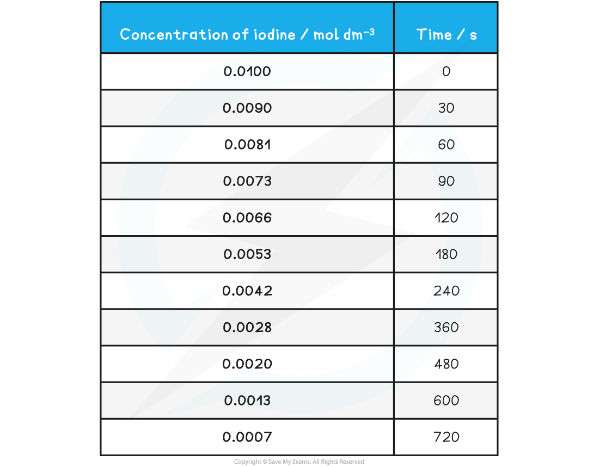
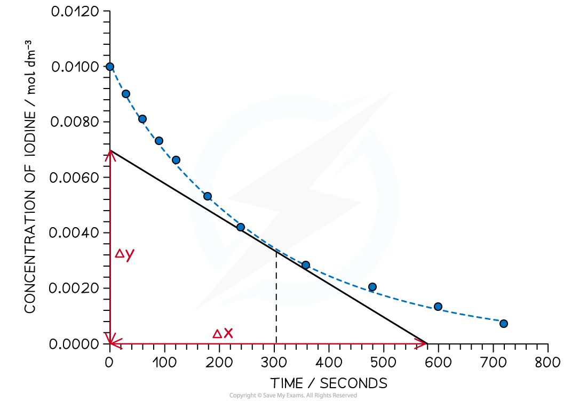

Continuous Monitoring Method
----------------------------

* <b>Continuous</b> <b>monitoring </b>involves collecting experimental data throughout the course of a reaction to plot a concentration-time graph
* Two of the most common ways to collect this data are by:

  + Measuring the volume / amount of gas evolved over time
  + Measuring the mass of reactants lost over time
* Another alternative method involves the use of colorimetry:

#### The iodination of propanone

* The iodination of propanone provides a suitable experiment in which the rate of reaction can be measured throughout the reaction by using a colorimeter
* The reaction is carried out using a catalyst of dilute sulfuric acid
* The iodine decolourises during the reaction as it turns into iodopropanone and hydrogen iodide:

CH3COCH3   +   I2  → CH3COCH2I   + HI

* The colorimeter measures colour absorbance which is proportional to the concentration of the coloured species
* Before the investigation begins it is necessary to  measure the absorbance of a set of standard solutions of iodine and obtain a calibration curve
* For example, here is a calibration curve for a transition metal ion that allows you to convert colorimeter readings into concentrations:

<i><b>A calibration curve showing the relationship between colour absorbance and concentration</b></i>

* The colorimeter uses very small volumes of solutions, so four burettes can be filled with solutions of 0.02 mol dm-3 iodine, 1.0 mol dm-3 propanone and 1.0  mol dm-3 sulfuric acid and distilled water
* By varying the volumes of solutions while maintaining a constant total volume with the use of distilled water, you can obtain a number of different concentrations
* The solutions are measured into a small beaker, leaving the iodine in a separate beaker - this starts the reaction, so it can be added when you start a timer or stop watch
* The iodine is added to the other liquids, the contents mixed and then quickly transferred into the cuvette (small receptacle) and the colorimeter / data logger started

<i><b>The set up for using a colorimeter and data logger to continuously measure the rate of reaction</b></i>

* A typical set of volume compositions could be as follows:

<b>Volume Compositions Table</b>

<b>Practical tip</b>

* Choose a filter that gives the strongest absorbance for the solution you are using - this will be the complementary colour to the colour of the solution under investigation

<b>Specimen results table for the iodination of propanone</b>

<i><b>Graph showing the change in concentration of iodine during the course of the reaction</b></i>

<b>Measuring rate</b>

* To find the rate of reaction at any point, a tangent is drawn and the gradient is determined
* The gradient gives the rate of reaction
* For example, in the graph above, the rate of reaction at 300 seconds can be found

  + A vertical line is drawn from the 300 s mark until it meets the curve, then a tangent is drawn
  + Gradient <math><semantics><mrow><mo>=</mo><mo> </mo><mfrac><mrow><mi>Δ</mi><mi>y</mi></mrow><mrow><mi>Δ</mi><mi>x</mi></mrow></mfrac><mo> </mo><mo>=</mo><mo> </mo><mfrac><mrow><mn>0</mn><mo>.</mo><mn>0069</mn></mrow><mn>580</mn></mfrac><mo> </mo><mo>=</mo></mrow><annotation>{"language":"en","fontFamily":"Times New Roman","fontSize":"18"}</annotation></semantics></math>1.19 x 10-5 mol dm-3 s-1

* The gradient is the rate of reaction at that point

#### Examiner Tips and Tricks

Whichever rates experiments you carry out, make sure you can

* describe the steps in the procedure
* name all the apparatus used
* draw data tables which include headings and units
* draw graphs showing labels, units and best fit lines
* determine an initial gradient or at any point in the curve