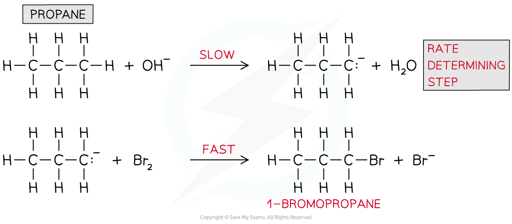

Deducing Rate-Determining Steps
-------------------------------

#### Rate-determining step & intermediates

* A chemical reaction can only go as fast as the slowest part of the reaction

  + So, the <b>rate-determining step </b>is the slowest step in the reaction
* If a reactant appears in the <b>rate-determining step</b>, then the concentration of that reactant will also appear in the <b>rate equation</b>
* For example, the rate equation for the reaction below is rate = <i>k </i>[CH3Br] [OH-]

<b>CH</b><b>3</b><b>Br + OH</b><b>-</b><b> → CH</b><b>3</b><b>OH + Br</b><b>-</b>

* This suggests that <b>both </b>CH3Br and OH- take part in the <b>slow rate-determining step</b>

#### Predicting the reaction mechanism

* The <b>overall reaction equation</b> and <b>rate equation</b> can be used to predict a possible reaction mechanism of a reaction

  + This shows the individual reaction steps which are taking place
* For example, nitrogen dioxide (NO2) and carbon monoxide (CO) react to form nitrogen monoxide (NO) and carbon dioxide (CO2)

  + The overall reaction equation is:

<b>NO</b><b>2</b><b> (g) + CO (g) → NO (g) + CO</b><b>2</b><b> (g)</b>

* The rate equation is:

<b>Rate = </b><i><b>k</b></i><b> [NO</b><b>2</b><b>]</b><b>2</b>

* From the rate equation it can be concluded that the reaction is <b>zero order</b> with respect to CO (g) and <b>second order</b> with respect to NO2 (g)
* This means that there are <b>two molecules</b> of NO2 (g) involved in the <b>rate-determining step</b> and <b>zero molecules</b> of CO (g)
* A possible reaction mechanism could therefore be:

<b>Step 1:</b>

<b>   2NO</b><b>2</b><b> (g) → NO (g) + NO</b><b>3</b><b> (g)</b>                   <b>slow </b>(rate-determining step)

<b>Step 2:</b>

<b>   NO</b><b>3</b><b> (g) + CO (g) → NO</b><b>2</b><b> (g) + CO</b><b>2</b><b> (g)</b>     <b>fast</b>

<b>Overall:</b>

<s><b> 2</b></s><b>NO</b><b>2</b><b> (g) + </b><s><b>NO</b></s><s><b>3</b></s><s><b> (g)</b></s><b> + CO (g) → NO (g) + </b><s><b>NO</b></s><s><b>3</b></s><s><b> (g)</b></s><b> + </b><s><b>NO</b></s><s><b>2</b></s><s><b> (g) </b></s><b>+ CO</b><b>2</b><b> (g)</b>

<b>   =     NO</b><b>2</b><b> (g) + CO (g) → NO (g) + CO</b><b>2</b><b> (g)</b>

#### Predicting the reaction order & deducing the rate equation

* The <b>order</b> of a reactant and thus the rate equation can be deduced from a reaction mechanism if the rate-determining step is known
* For example, the reaction of nitrogen oxide (NO) with hydrogen (H2) to form nitrogen (N2) and water

<b>2NO (g) + 2H</b><b>2</b><b> (g) → N</b><b>2</b><b> (g) + 2H</b><b>2</b><b>O (l)</b>

* The reaction mechanism for this reaction is:

<b>Step 1:</b>

<b>   NO (g) + NO (g) → N</b><b>2</b><b>O</b><b>2 </b><b>(g)</b>                      <b>fast</b>

<b>Step 2:</b>

<b>   N</b><b>2</b><b>O</b><b>2</b><b> (g) + H</b><b>2</b><b> (g) → H</b><b>2</b><b>O (l) + N</b><b>2</b><b>O (g) </b>    <b>slow </b>(rate-determining step)

<b>Step 3:</b>

<b>   N</b><b>2</b><b>O (g) + H</b><b>2</b><b> (g) → N</b><b>2</b><b> (g) + H</b><b>2</b><b>O (l)           fast</b>

* The second step in this reaction mechanism is the <b>rate-determining step</b>
* The rate-determining step consists of:

  + N2O2 which is formed from the reaction of <b>two NO molecules</b>
  + <b>One H</b><b>2</b><b> molecule</b>
* The reaction is, therefore, <b>second order </b>with respect to NO and <b>first order </b>with respect to H2
* So, the <b>rate</b> <b>equation</b> becomes:

<b>Rate = </b><i><b>k</b></i><b> [NO]</b><b>2</b><b> [H</b><b>2</b><b>]</b>

* The reaction is, therefore, <b>third order overall</b>

#### Identifying the rate-determining step

* The rate-determining step can be identified from a rate equation given that the reaction mechanism is known
* For example, propane (CH3CH2CH3) undergoes bromination under alkaline solutions
* The overall reaction is:

<b>CH</b><b>3</b><b>CH</b><b>2</b><b>CH</b><b>3</b><b> + Br</b><b>2</b><b> + OH</b><b>-</b><b> → CH</b><b>3</b><b>CH</b><b>2</b><b>CH</b><b>2</b><b>Br + H</b><b>2</b><b>O + Br</b><b>-</b>

* The reaction mechanism is:

<i><b>Reaction mechanism for the bromination of propane under alkaline conditions</b></i>

* The rate equation is:

<b>Rate = </b><i><b>k</b></i><b> [CH</b><b>3</b><b>CH</b><b>2</b><b>CH</b><b>3</b><b>] [OH</b><b>-</b><b>]</b>

* From the rate equation, it can be deduced that only CH3CH2CH3 and OH- are involved in the <b>rate-determining step</b> and not bromine (Br2)
* CH3CH2CH3 and OH- are only involved in the first step of the reaction mechanism, therefore the <b>rate-determining step </b>is:

  + CH3CH2CH3 + OH- <b>→</b> CH3CH2CH2- + H2O