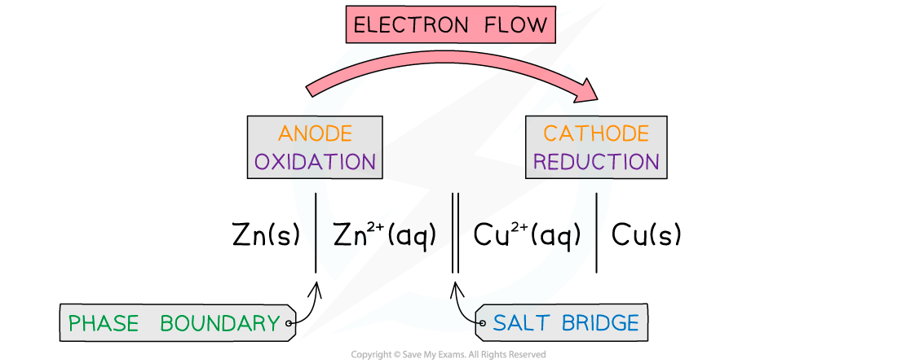

Conventional Cell Representation
--------------------------------

#### Conventional Representation of Cells

* As it is cumbersome and time-consuming to draw out every electrochemical cell in full, a system of notation is used which describes the cell in full, but does not require it to be drawn.
* An electrochemical cell can be represented in a shorthand way by a <b>cell diagram</b> (sometimes called cell representations or cell notations)

<i><b>The conventional representation of voltaic cells</b></i>

* By convention, the half cell with the greatest negative potential is written on the left of the salt bridge, so<i> E</i>θcell = <i>E</i>θright – <i>E</i>θleft

  + In this case, <i>E</i>θcell = +0.34 – -0.76 = +1.10 V.
* The left cell is being oxidized while the right is being reduced
* If there is more than one species in solution, and the species are on different sides of the half-equation, the different species are separated by a comma
* This method of representing electrochemical cells is known as the conventional representation of a cell, and it is widely used
* If both species in a half reaction are aqueous then an inert platinum electrode is needed which is recorded on the outside of the half cell diagram

#### Some Examples

* For the iron(II) and iron(III) half cell reaction a platinum electrode is needed as an electron carrier
* The half equation is

Fe3+(aq) + e<b>-</b> ⇌ Fe2+(aq)

* So the cell convention as a left hand electrode would be

Pt 丨Fe2+(aq), Fe3+(aq)

* Notice the order must be Fe(II) then Fe(III) as the left side is an oxidation reaction, so Fe(II) is oxidised to Fe(III) by the loss of an electron
* The platinum electrode is separated by the phase boundary (vertical solid line), but the iron(II) and iron(III) are separated by a comma since they are in the same phase
* Non-metals will also require a platinum electrode
* If chlorine is used as an electrode the reduction reaction is

C<i>l</i>2(g) + 2e<b>-</b> ⇌ 2C<i>l</i>-(aq)

* The conventional representation of the half reaction would be

C<i>l</i>2 (g), 2C<i>l</i>- (aq) | Pt

* Notice that the half cell reaction is balanced; however, it would be also correct to write it as

C<i>l</i>2 (g), C<i>l</i>- (aq) | Pt

* This is because conventional cell diagrams are not quantitative- they are just representations of the materials and redox processes going on

  + Most chemists tend to show them balanced anyway
* Combining these two half cells together gives

Pt  | Fe2+(aq), Fe3+(aq)  ∥  C<i>l</i>2 (g), 2C<i>l</i>- (aq) | Pt

* As you can see the overall cell diagram is not quantitative as the left side is a one electron transfer and the right side is a two electron transfer