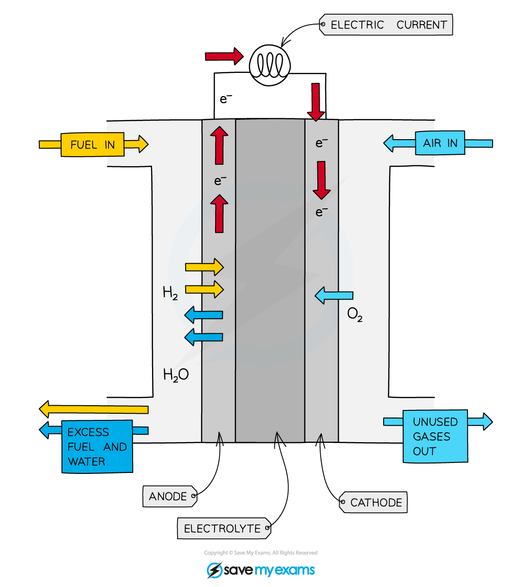

Fuel Cells
----------

* A fuel cell is an electrochemical cell in which a fuel<b> donates</b> electrons at one electrode and oxygen<b> gains</b> electrons at the other electrode
* These cells are becoming more common in the automotive industry to replace petrol or diesel engines
* As the fuel enters the cell it becomes oxidised which sets up a <b>potential difference</b> or voltage within the cell
* Different electrolytes and fuels can be used to set up different types of fuel cells

  + Methanol and other hydrogen rich fuels can be used in fuel cells but the hydrogen-oxygen fuel cell is the most common currently
* An important cell is the <b>hydrogen-oxygen</b> fuel cell which combines both elements to release energy and water

<i><b>Diagram showing the movement of hydrogen, oxygen and electrons in a hydrogen-oxygen fuel cell</b></i>

* The fuel cell consists of

  + a reaction chamber with separate inlets for hydrogen and oxygen gas
  + an outlet for the product - water
  + an electrolyte
  + two metal electrodes that are coated in platinum to catalyse the reactions at the electrodes
  + a semi-permeable membrane that separates the hydrogen and oxygen gases

#### The alkaline hydrogen-oxygen fuel cell

* The half equations occurring at each electrode are:

<b>Negative electrode:   H</b><b>2 </b><b>(g) + 2OH</b><b>–</b><b> (aq)  →  2H</b><b>2</b><b>O (l) +  2e</b><b>–</b><b>   </b><i><b>E</b></i><i><b>θ</b></i><i><b> </b></i><b>= -0.83 V</b>

<b>Positive electrode:   O</b><b>2 </b><b>(g) +  2H</b><b>2</b><b>O  +  4e</b><b>–</b><b> →  4OH</b><b>–</b><b> (aq)   </b><i><b>E</b></i><i><b>θ</b></i><b> = +0.40 V </b>

* The overall reaction is found by combining the two half equations and cancelling the common terms:

<b>2H</b><b>2 </b><b>(g) + 4OH</b><b>–</b><b> (aq) + O</b><b>2 </b><b>(g) +  2H</b><b>2</b><b>O   +  4e</b><b>–</b><b> →   4H</b><b>2</b><b>O (l) +  4e</b><b>–</b><b> + 4OH</b><b>–</b><b> (aq)</b>

<b> 2H</b><b>2 </b><b>(g) + O</b><b>2 </b><b>(g)  →   2H</b><b>2</b><b>O</b><b> </b><b>(l)           </b><i><b>E</b></i><b>θ</b><b> = +1.23 V</b>

#### The acidic hydrogen-oxygen fuel cell

* The half equations occurring at each electrode are:

<b>Negative electrode:   H</b><b>2 </b><b>(g) →  2H</b><b>+</b><b> (aq) +  2e</b><b>–</b><b>   </b><i><b>E</b></i><i><b>θ</b></i><i><b> </b></i><b>= 0.00 V</b>

<b>Positive electrode:   O</b><b>2 </b><b>(g) +  4H</b><b>+</b><b> (aq) +  4e</b><b>–</b><b> →  2H</b><b>2</b><b>O</b><b> </b><b>(l)   </b><i><b>E</b></i><i><b>θ</b></i><b> = +1.23 V </b>

* The overall reaction is found by combining the two half equations and cancelling the common terms:

<b>2H</b><b>2 </b><b>(g) + O</b><b>2</b><b> (g) + 4H</b><b>+</b><b> </b><b>(aq) +  4e</b><b>–</b><b> →   2H</b><b>2</b><b>O (l) +  4H</b><b>+</b><b> (aq) + 4e</b><b>–</b><b> </b>

<b> 2H</b><b>2 </b><b>(g) + O</b><b>2 </b><b>(g)  →   2H</b><b>2</b><b>O</b><b> </b><b>(l)           </b><i><b>E</b></i><b>θ</b><b> = +1.23 V</b>

<b>Benefits</b>

* Water is the only reaction product, so fuel cells present obvious environmental advantages over other types of cells
* The reaction is the same as hydrogen combusting in oxygen, but since the reaction takes place at room temperature without combustion, all the bond energy is converted into electrical energy instead of heat and light
* There are no harmful oxides of nitrogen produced, which are usually formed in high temperature combustion reactions where air is present
* Fuel cells have been used on space craft, where the product can be used as drinking water for astronauts

<b>Risks and problems</b>

* Hydrogen is a highly flammable gas and the production and storage of hydrogen carries safety hazards
* Very thick walled cylinders and pipes are needed to store hydrogen which has economic impacts
* The production of hydrogen is a by-product of the crude oil industry, which means it relies on a <b>non-renewable, finite resource</b>
* Until a cheap way is found to make hydrogen, its widespread use in fuel cells will be limited
* Hydrogen has high energy density, that is, the amount of energy contained in 1g of the fuel is high compared to other fuels, but because it is a gas, its energy density per unit volume is low which means larger containers are needed compared to liquid fuels

#### Examiner Tips and Tricks

One difference between fuel cells and other cells is that the cell operates continuously as long as there is a supply of hydrogen and oxygen; the energy is not stored in the cell.