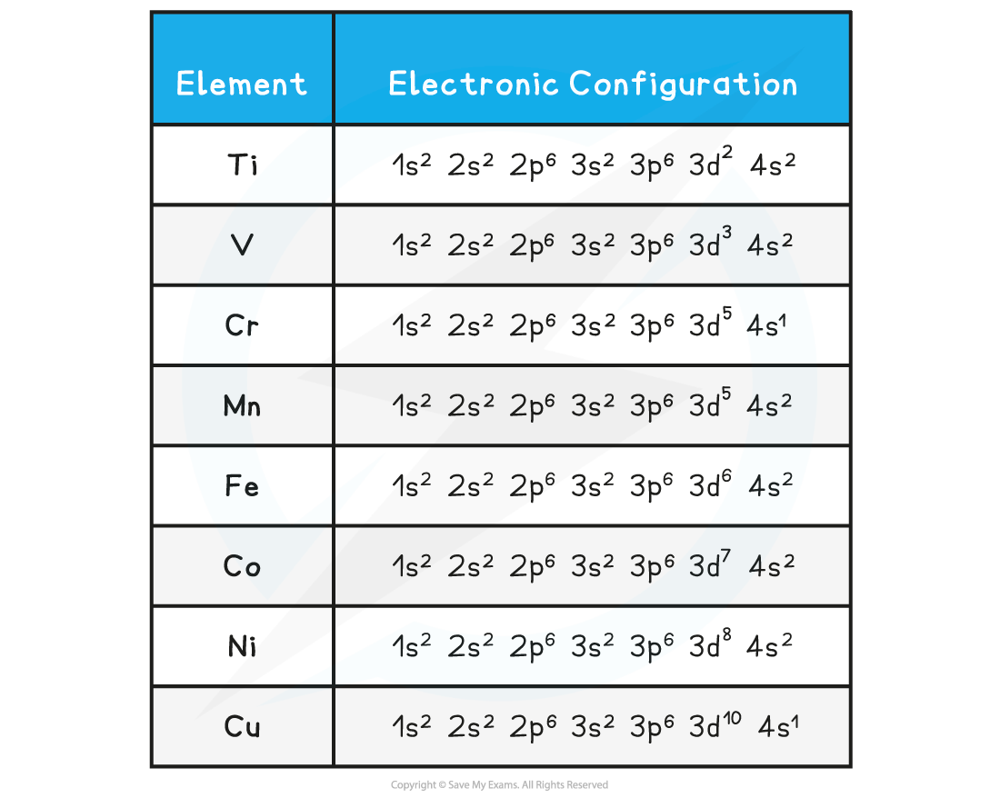

General Properties of Transition Metals
---------------------------------------

* Transition metals are elements with an incomplete d-subshell that can form at least one stable ion with an incomplete d-subshell
* This definition distinguishes them from d-block elements, because scandium and zinc do not fit the definition

  + Scandium only forms the ion <b>Sc</b><b>3+</b>, configuration <b>[Ar] 3d</b><b>0</b>
  + Zinc only forms the ion <b>Zn</b><b>2+</b>, configuration <b>[Ar] 3d</b><b>10</b>
* The elements of the first transition series are therefore titanium to copper

<i><b>The transition elements and the d-block elements</b></i>

#### Electron Configuration

* The full electronic configuration of the first d-series transition metals is shown in the table below
* Following the <b>Aufbau Principle</b> electrons occupy the lowest energy subshells first
* The 4s overlaps with the 3d subshell so the 4s is filled first
* Remember that you can abbreviate the first five subshells, 1s-3p, as<b> [Ar]</b> representing the configuration of argon( known as the argon core)

<b>Table showing the Electronic Configuration of the First d-series Transition Elements</b>

* From AS Chemistry you should recall two exceptions to the Aufbau Principle, chromium and copper
* In both cases an electron is promoted from the 4s to the 3d to achieve a half full and full d-subshell, respectively
* Chromium and copper have the following electron configurations, which are different to what you may expect:

  + Cr is [Ar] 3d5 4s1 <b>not</b> [Ar] 3d4 4s2
  + Cu is [Ar] 3d10 4s1 <b>not</b> [Ar] 3d9 4s2
* This is because the [Ar] 3d5 4s1 and [Ar] 3d10 4s1 configurations are <b>energetically more stable</b>

#### Worked Example

<b>Writing electronic configuration of transition element ions</b>

State the full electronic configuration of the manganese(III) ion

<b>Answer</b>

<b>Step 1:</b> Write out the electron configuration of the atom first:

Mn atomic number = 25

1s22s22p63s23p64s23d5

2 + 2 + 6 + 2 + 6 + 2 + 5 = 25 electrons

<b>Step 2:</b> Subtract the appropriate number of electrons starting from the 4s subshell

Mn(III) = 22 electrons

1s22s22p63s23p63d4

#### General properties

* Although the<b> transition elements</b> are metals, they have some properties unlike those of other metals on the periodic table, such as:

  + Variable <b>oxidation states</b>
  + Form <b>complex ions</b>
  + Form <b>coloured compounds</b>
  + Behave as <b>catalysts</b>

Variable Oxidation Number
-------------------------

* Like other metals on the periodic table, the transition elements will lose electrons to form positively charged ions
* However, unlike other metals, transition elements can form more than one positive ion

  + They are said to have <b>variable oxidation states</b>
* Because of this, Roman numerals are used to indicate the oxidation state on the metal ion
* For example, the metal sodium (Na) will only form Na+ ions (no Roman numerals are needed, as the ion formed by Na will always have an oxidation state of +1)

  + The transition metal iron (Fe) can form Fe2+ (Fe(II)) <b>and </b>Fe3+ (Fe(III)) ions

* When transition elements forms ions they lose electrons from the <b>4s</b> subshell first
* This is because when the orbitals are occupied, the repulsion between electrons pushes the<b> 4s</b> into a higher energy state so that it now becomes slightly higher in energy than the <b>3d</b> subshell

  + The <b>4s</b> is now the outer shell and loses electrons first
* The loss of the <b>4s</b> electrons means that <b>+2</b> is a common <b>oxidation state</b> in transition metals
* The reason why the transition metals have variable oxidation states all comes down to energy

<b>Table showing the Common Oxidation States of Transition Elements</b>

