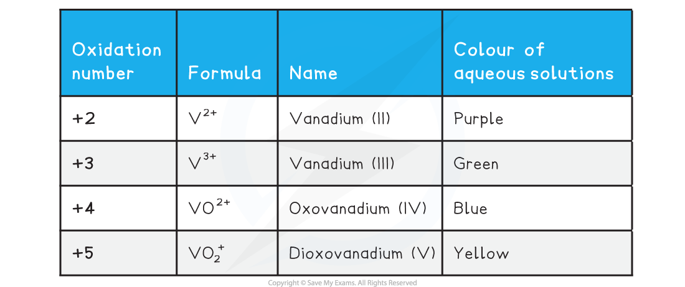
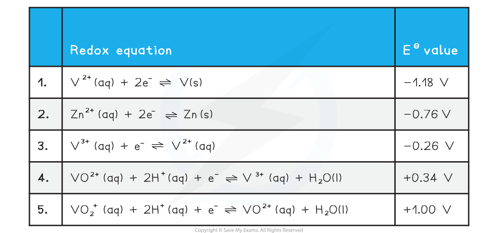

Colours & Oxidation States
--------------------------

* Vanadium is a transition metal which has variable oxidation states
* The table below shows the important ones you need to be aware of

* Addition of zinc to the vanadium(V) in acidic solution will reduce the vanadium down through each successive oxidation state

  + The colour would successively change from yellow to blue to green to violet
* The ion with the V at oxidation state +5 exists as a solid compound in the form of a VO3- ion

  + Usually as NH4VO3 known as ammonium vanadate(V)
  + It is a reasonably strong oxidising agent
  + Addition of acid to the solid will turn into the yellow solution containing the VO2+ ion.

Interconversions of Vanadium Ions
---------------------------------

* For vanadium we need to consider the following standard electrode potential values
* We will use zinc as our chosen oxidising agent
* The half equations are arranged from high negative EΘ at the top to high positive EΘ at the bottom

  + The best reducing agent is the top right species (V2+)
  + The best oxidising agent is the bottom left species (VO2+)

#### Reduction from +5 to +4

* The two half equations we need to consider are 2 and 5
* Vanadium is reduced from an oxidation number of +5 to +4 in half equation 5
* The EΘ value for half equation 2 is more negative than the EΘ for half equation 5

  + Zn is the best reducing agent
  + VO2+ is the best oxidising agent
* We can obtain the overall equation by reversing half equation 2 and combining with equation 5

  + When adding half equations remember to multiply them so each have the same number of electrons

<b>2VO</b><b>2</b><b>+ </b><b>(aq) + 4H</b><b>+ </b><b>(aq) + Zn (s) → 2VO</b><b>2+</b><b> (aq) + Zn</b><b>2+ </b><b>(aq) + 2H</b><b>2</b><b>O (l)</b>

#### Reduction from +4 to +3

* The two half equations we need to consider are 2 and 4
* Vanadium is reduced from an oxidation number of +4 to +3 in half equation 4
* The EΘ value for half equation 2 is more negative than the EΘ for half equation 5

  + Zn is the best reducing agent
  + VO2+ is the best oxidising agent
* We can obtain the overall equation by reversing half equation 2 and combining with equation 4

  + When adding half equations remember to multiply them so each have the same number of electrons

<b>2VO</b><b>2+</b><b> (aq)</b><b> </b><b>+ 4H</b><b>+ </b><b>(aq) + Zn (s) → 2V</b><b>3+</b><b> (aq) + Zn</b><b>2+ </b><b>(aq) + 2H</b><b>2</b><b>O (l) </b>

#### Reduction from +3 to +2

* The two half equations we need to consider are 2 and 3
* Vanadium is reduced from an oxidation number of +3 to +2 in half equation 3
* The EΘ value for half equation 2 is more negative than the EΘ for half equation 3

  + Zn is the best reducing agent
  + V3+ is the best oxidising agent
* We can obtain the overall equation by reversing half equation 2 and combining with equation 3

  + When adding half equations remember to multiply them so each have the same number of electrons

<b>2V</b><b>3+ </b><b>(aq) + Zn (s) → 2V</b><b>2+</b><b> (aq) + Zn</b><b>2+ </b><b>(aq)</b>

#### Reduction from +2 to 0

* The two half equations we need to consider are 1 and 2
* Vanadium is reduced from an oxidation number of +2 to 0 in half equation 1
* The EΘ value for half equation 1 is more negative than the EΘ for half equation 2

  + Zn is not electron releasing with respect to V2+
  + This means this reaction is not thermodynamically feasible

#### Predicting oxidation reactions

* The same method can be used to predict whether a given oxidising agent will oxidise a vanadium species to one with a higher oxidation number

#### Examiner Tips and Tricks

It is important to not get confused between the two oxo ions of vanadium VO2+ and VO2+