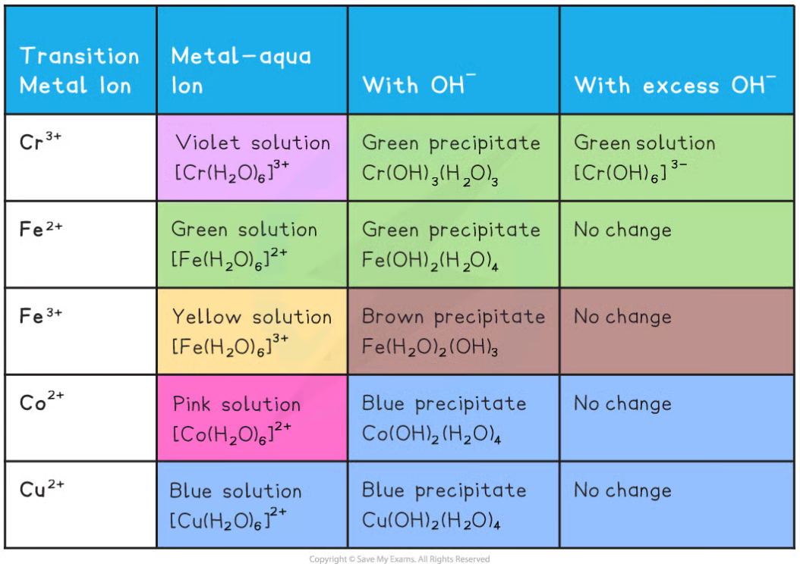

Reactions with Hydroxide & Ammonia
----------------------------------

* When transition metal ions in aqueous solution react with aqueous sodium hydroxide and aqueous ammonia they form precipitates
* However some of these precipitates will dissolve in an excess of sodium hydroxide or ammonia to form complex ions in solution

<b>The Reactions of Aqueous Transition Metal Ions with Aqueous Sodium Hydroxide</b>

* Examples of ionic equations for the reactions in the table above

  + [Fe(H2O)6]2+ (aq) + 2OH- (aq) → [Fe(H2O)4(OH)2] (s) + 2H2O (l)
  + [Cu(H2O)6]2+ (aq) + 2OH- (aq) → [Cu(H2O)4(OH)2] (s) + 2H2O (l)
  + [Fe(H2O)6]3+ (aq) + 3OH- (aq) → [Fe(H2O)3(OH)3] (s) + 3H2O (l)

<b>The Reactions of Aqueous Transition Metal Ions with Ammonia</b>

* Examples of ionic equations for the reactions in the table above

  + [Fe(H2O)6]2+ (aq) + 2NH3 (aq) → [Fe(H2O)4(OH)2] (s) + 2NH4+ (aq)
  + [Cu(H2O)6]2+ (aq) + 2NH3 (aq) → [Cu(H2O)4(OH)2] (s) +2NH4+ (aq)
  + [Fe(H2O)6]3+ (aq) + 3NH3 (aq) → [Fe(H2O)3(OH)3] (s) +3NH4+ (aq)
  + [Cu(H2O)4(OH)2]2+ (aq) + 4NH3 (aq) → [Cu(H2O)2(OH)4] (aq) + 2H2O (l) + 2OH- (aq)
* Solutions of metal aqua ions react as​ acids ​with aqueous ammonia, whilst some react further with excess ammonia​
* Initially, ammonia acts as a​ base​ to remove one H+ ion per ammonia molecule used
* With excess ammonia, some metal ions undergo ​ ligand substitution ​with NH3

#### Examiner Tips and Tricks

It is easiest to remember the formulas of the precipitates by remembering that the number of OH- ions substituted is the same as the value of the charge on the initial ion

Ionic Equations
---------------

#### Reaction with limited OH- and limited NH3

* The bases OH- and ammonia when in limited amounts form the same hydroxide precipitates.
* They form in deprotonation acid-base reactions
* For example, consider the reaction that occurs when aqueous sodium hydroxide is added to copper(II) sulfate solution

<b>[Cu(H</b><b>2</b><b>O)</b><b>6</b><b>]</b><b>2+ </b><b>(aq) + 2OH</b><b>-</b><b> (aq) → [Cu(H</b><b>2</b><b>O)</b><b>4</b><b>(OH)</b><b>2</b><b>] (s) + 2H</b><b>2</b><b>O (l) </b>

* This seems like a ligand substitution reaction - two hydroxide ions replacing two water molecules
* However this is actually a deprotonation reaction - two hydroxide ions removing hydrogen ions from two of the water ligands converting them into water molecules

  + The two ligands that have lost hydrogen ions are now hydroxide ligands

#### Reaction with excess OH-

* From above, we have seen how hydrated transition metal ions can be deprotonated by adding a base such as aqueous sodium hydroxide to form a metal hydroxide precipitate
* For example

<b>[Cr(H</b><b>2</b><b>O)</b><b>6</b><b>]</b><b>3+ </b><b>(aq) + 3OH</b><b>- </b><b>(aq) → [Cr(H</b><b>2</b><b>O)</b><b>3</b><b>(OH)</b><b>3</b><b>] (s) +3H</b><b>2</b><b>O (l) </b>

* When an excess of sodium hydroxide is added further deprotonation takes place

<b>[Cr(H</b><b>2</b><b>O)</b><b>3</b><b>(OH)</b><b>3</b><b>] (s) + 3OH</b><b>-</b><b> (aq) → [Cr(OH)</b><b>6</b><b>]</b><b>3-</b><b> (aq) + 3H</b><b>2</b><b>O (l) </b>

* In this reaction, chromium(III) hydroxide acts as an acid, as it is reacting with a base
* Chromium(III) hydroxide can also act as a base because it can react with acids as follows

<b>[Cr(H</b><b>2</b><b>O)</b><b>3</b><b>(OH)</b><b>3</b><b>] (s) + 3H</b><b>+ </b><b>(aq) → [Cr(H</b><b>2</b><b>O)</b><b>6</b><b>]</b><b>3+</b><b> (aq) </b>

* A metal hydroxide that can act as both an acid and a base is called an amphoteric hydroxide

  + This is an example of amphoteric behaviour

#### Reaction with excess NH3

* With excess NH3 ligand substitution reactions occur with Cu, Co and Cr and their precipitates dissolve
* The ligands NH3 and H2O are similar in size and are uncharged
* Ligand exchange occurs without a change of co-ordination number for Co and Cr
* For example, when excess aqueous ammonia is added to a copper(II) hydroxide precipitate it dissolves forming a deep blue solution

<b>[Cu(H</b><b>2</b><b>O)</b><b>4</b><b>(OH)</b><b>2</b><b>] (s) + 4NH</b><b>3</b><b> (aq) → [Cu(NH</b><b>3</b><b>)</b><b>4</b><b>(H</b><b>2</b><b>O)</b><b>2</b><b>]</b><b>2+ </b><b>(aq) + 2H</b><b>2</b><b>O (l) + 2OH</b><b>-</b><b> (aq)</b>

* This is a ligand substitution - four ammonia molecules replace two water molecules and two hydroxide ions
* In these reactions, NH3 is acting as a Lewis base donating an electron pair

#### Reaction with Cl-

* The chloride ligand undergoes substitution reactions with Cu, Co and Fe(III)
* The Cl– ligand is much larger in size than H2O and is charged
* This means that there is a change in:

  + Coordination number from 6 to 4
  + Shape from octahedral to tetrahedral
  + The overall charge on the complex
* For example, when excess / concentrated hydrochloric acid is added to a copper(II) hydroxide precipitate it forms a yellow solution

<b>[Cu(H</b><b>2</b><b>O)</b><b>6</b><b>]</b><b>2+</b><b> (aq) + 4Cl</b><b>–</b><b> (aq) → [CuCl</b><b>4</b><b>]</b><b>2– </b><b>(aq) + 6H</b><b>2</b><b>O (l) </b>

* This is a ligand substitution - four chloride ions replace six water molecules
* In these reactions, Cl<b>–</b> is acting as a Lewis base donating an electron pair
* Similar reactions occur with:

  + Pink [Co(H2O)6]2+ (aq) forming blue [CoCl4]2– (aq)
  + Yellow [Fe(H2O)6]3+ (aq) forming orange [FeCl4]– (aq)