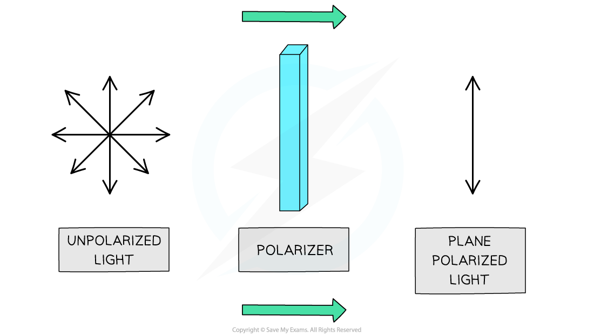
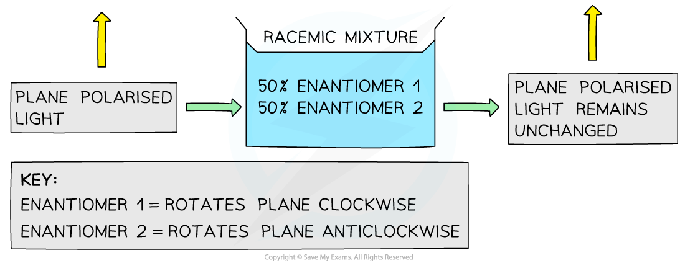

Chirality
---------

#### Optical isomers

* A carbon atom that has four different atoms or groups of atoms attached to it is called a <b>chiral carbon </b>or <b>chiral centre</b>

  + Chira comes from a Greek word meaning hand, so we talk about these molecules having a handedness
* The carbon atom is described as being <b>asymmetric</b>, i.e. there is no plane of symmetry in the molecule
* Compounds with one chiral centre (<b>chiral molecules</b>) exist as two optical isomers, also known as <b>enantiomers</b>
* Just like the left hand cannot be superimposed on the right hand, enantiomers are <b>non</b>-<b>superimposable</b>

  + Enantiomers are <b>mirror</b> <b>images</b> of each other

<i><b>A molecule has a chiral centre when the carbon atom is bonded to four different atoms or group of atoms; this gives rises to enantiomers</b></i>

#### Examiner Tips and Tricks

When drawing optical isomers, always draw mirror images including wedge and dashed bonds

The Nature of a Racemic Mixture
-------------------------------

#### Properties of optical isomers

* The chemical properties of optical isomers are generally identical, with one exception

  + Optical isomers interact with biological sensors in different ways

    - For example, one enantiomer of carvone smells of spearmint, while the other smells of caraway

      

<i><b>                         Carvone optical isomers have distinctive smells</b></i>

* Optical isomers have identical physical properties, with one exception

  + Isomers differ in their ability to rotate the plane of polarised light

<i><b>When unpolarised light is passed through a polariser, the light becomes polarised as the waves will vibrate in one plane only</b></i>

* The major difference between the two enantiomers is:

  + One enantiomer rotates plane polarised light in a <b>clockwise </b>manner and the other in an <b>anticlockwise </b>fashion
  + A common way to differentiate the isomers is to use (+) and (-), but there are other systems using d and l, D and L, or R and S
* The rotation of plane polarised light can be used to determine the identity of an optical isomer of a single substance

  + For example, pass plane polarised light through a sample containing one of the two optical isomers of a single substance
  + Depending on which isomer the sample contains, the plane of polarised light will be rotated either clockwise or anti-clockwise by a fixed number of degrees

<i><b>Each enantiomer rotates the plane of polarised light in a different direction</b></i>

* A <b>racemic mixture </b>(or <b>racemate</b>) is a mixture containing <b>equal amounts </b>of each enantiomer

  + One enantiomer rotates light clockwise, the other rotates light anticlockwise
* A racemic mixture is <b>optically inactive </b>as the enantiomers will cancel out each others effect

  + This means that the plane of polarised light will <b>not change</b>

    

<i><b>           Racemic mixtures are optically inactive</b></i>

<b>Racemic mixtures and drugs</b>

* In the pharmaceutical industry, it is much easier to produce synthetic drugs that are racemic mixtures than producing one enantiomer of the drug
* Around 56% of all drugs in use are chiral and of those 88% are sold as racemic mixtures
* Separating the enantiomers gives a compound that is described as <b>enantiopure</b>, it contains only one enantiomer
* This separation process is very expensive and time consuming, so for many drugs it is not worthwhile, even though only half the of the drug is pharmacologically active
* For example, the pain reliever ibuprofen is sold as a racemic mixture

<i><b>The structure of ibuprofen showing the chiral carbon that is responsible for the racemic mixture produced in the synthesis of the drug</b></i>

Optical Activity & Mechanisms
-----------------------------

* Optical activity can be used to suggest the mechanism of a chemical reaction
* This is particularly the case for <b>nucleophilic substitution</b>

  + Nucleophilic substitution can occur via an SN1 or SN2 mechanism

#### SN1 mechanism

* The SN1 mechanism is a <b>two-step</b> reaction

  + In the first step, the C-X bond breaks heterolytically and the halogen leaves the halogenoalkane as an X- ion
  + This leaves a <b>trigonal planar</b>, tertiary carbocation
  + In the second step, the planar, tertiary carbocation is attacked by the nucleophile
  + <b>The nucleophile is able to attack from either side of the planar carbocation, which results in the formation of a racemic mixture</b>
* Therefore, a reaction with an SN1 mechanism will produce a racemic mixture

  

  <b>                                                             </b><i><b>S</b></i><i><b>N</b></i><i><b>1 Optical Isomers Mechanism</b></i>

#### SN2 mechanism

* The SN2 mechanism is a <b>one-step</b> reaction

  + The nucleophile donates a pair of electrons to the δ+ carbon atom of the halogenoalkane to form a new bond
  + At the same time, the C-X bond is breaking and the halogen (X) takes both electrons in the bond
  + The halogen leaves the halogenoalkane as an X- ion
* For example, the nucleophilic substitution of bromoethane by hydroxide ions to form ethanol

<i><b>The </b></i><b>S</b><b>N</b><b>2 </b><i><b>mechanism of bromoethane with hydroxide causing an inversion of configuration</b></i>

* The bromine atom of the bromoethane molecule causes <b>steric hindrance</b>
* This means that the hydroxide ion nucleophile can only attack from the opposite side of the C-Br bond

  + Attack from the same side as the bromine atom is sometimes called frontal attack
  + While attack from the opposite side is sometimes called backside or rear-side attack
* As the C-OH bond forms, the C-Br bond breaks causing the bromine atom to leave as a bromide ion

  + As a result of this, the molecule has undergone an inversion of configuration
  + The common comparison for this is an umbrella turning inside out in the wind

<i><b>Inversion of configuration - umbrella analogy</b></i>

* Therefore, if a reaction with an SN2 mechanism starts with an enantiopure reactant then an enantiopure products will be formed