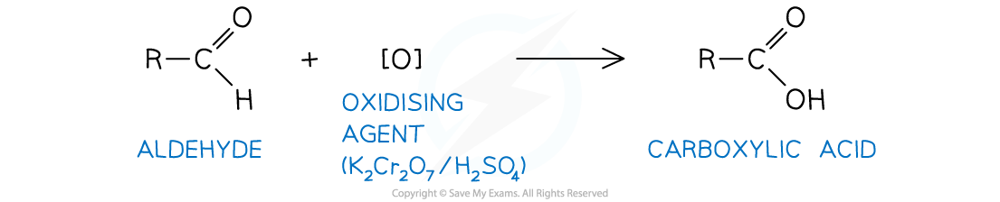
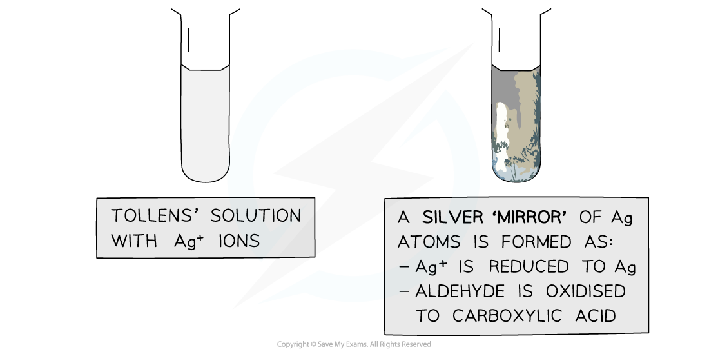
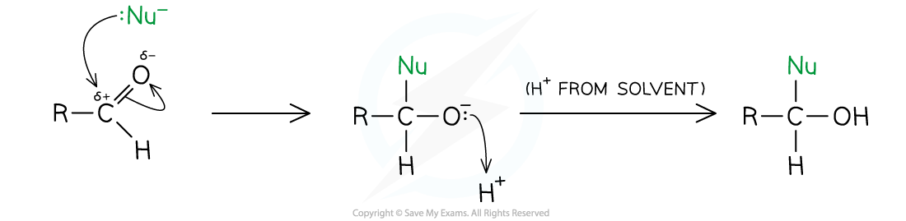
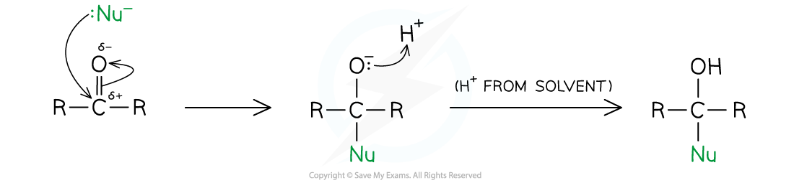
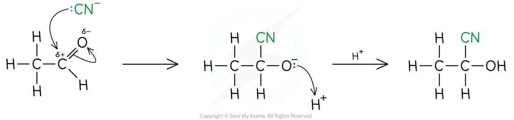
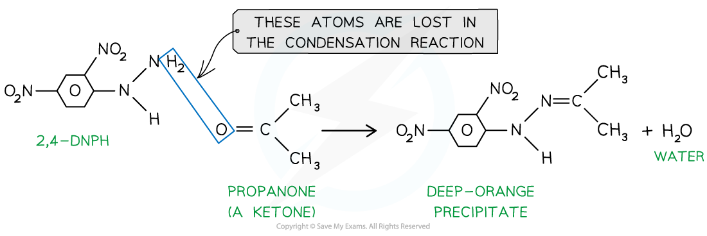

Reactions of Carbonyls
----------------------

* Carbonyl compounds can undergo a number of reactions, some of which allow you to distinguish between an aldehyde and a ketone

  1. <b>Oxidation </b>- with <b>acidified potassium dichromate(VI)</b> solution, <b>Tollens' reagent</b> or <b>Fehling's </b>/ Benedict's solution
  2. <b>Reduction </b>- with lithium tetrahydridoaluminate / lithium aluminium hydride in dry ether
  3. <b>Nucleophilic addition</b> - with HCN or acidified KCN
  4. Non-specific carbonyl testing

     1. <b>2,4-dinitrophenylhydrazine (2,4-DNPH)</b> - to identify a carbonyl compound
     2. <b>Iodoform </b>test - iodine in the presence of alkali

#### Acidified potassium dichromate(VI)

* Aldehydes can be oxidised to form carboxylic acids using acidified potassium dichromate(VI) solution

  + K2Cr2O7 (aq) with sulfuric acid, H2SO4

<i><b>General reaction of an aldehyde with an oxidising agent</b></i>

* Ketones are very resistant to being oxidised

  + This is because ketones do not have a readily available hydrogen atom, like aldehydes do
  + An extremely strong oxidising agent would be needed for oxidation of a ketone to take place
  + Such oxidation will likely oxidise a ketone in a destructive way, breaking a C-C bond
* Heating with acidified potassium dichromate can distinguish between an aldehyde and a ketone

  + The aldehyde would be oxidised, and you would see an orange to green colour change
  + The ketone would not be oxidised, so you would see no colour change

#### Tollens' reagent

* Tollens' reagent contains the silver(I) complex ion [Ag(NH3)2]+
* This is formed when aqueous ammonia is added to a solution of silver nitrate

  + Tollens' reagent is also known as ammoniacal silver nitrate
* If gently warmed with Tollens' reagent, an aldehyde will become oxidised
* The silver(I) complex ion solution, [Ag(NH3)2]+, is colourless
* As the aldehyde is oxidised, it causes the [Ag(NH3)2]+ ions to become reduced to solid metallic silver, Ag
* This is why a positive test result is called a "silver mirror"

<b>Positive Test Result:</b>

* When Tollens' reagent is gently warmed with an aldehyde, the silver mirror is formed

  + This is the positive test result
* When Tollens' reagent is gently warmed with a ketone, no silver mirror will be seen, as the ketone cannot be oxidised by Tollens' reagent, so no reaction takes place

  + This is a negative test result

<i><b>The Ag</b></i><i><b>+ </b></i><i><b>ions in Tollens’ reagent are oxidising agents, oxidising the aldehyde to a carboxylic acid and getting reduced themselves to silver atoms</b></i>

#### Fehling's Solution

* Fehling’s solution is a solution containing copper(II) ions dissolved in sodium hydroxide, which act as the oxidising agent

  + Benedict's solution is exactly the same as Fehling's solution but the copper(II) ions are dissolved in sodium carbonate
* If an aldehyde is warmed with Fehling's solution, the aldehyde will be oxidised and a colour change will take place
* Fehling's solution is blue, because of the copper(II) complex ions present
* During the reaction, as the aldehyde is oxidised to a carboxylic acid, the blue Cu2+ ions are reduced to Cu+ ions and a brick red precipitate is formed
* The brick red precipitate is copper(I) oxide
* If a ketone is warmed with Fehling's solution, no reaction takes place as the ketone will not be oxidised, so the solution will remain blue

<i><b>The copper(II) ions in Fehling’s solution are oxidising agents, oxidising the aldehyde to a carboxylic acid and getting reduced themselves to copper(I) ions in the Cu</b></i><i><b>2</b></i><i><b>O precipitate</b></i>

#### Examiner Tips and Tricks

You are expected to know all of the above methods which can be used to distinguish between an aldehyde and a ketone! However, Tollens' reagent is the most commonly used method, if trying to identify an unknown sample for example.

#### Reduction of Carbonyls

* Aldehydes are reduced to primary alcohols and ketones are reduced to secondary alcohols
* This is done with lithium tetrahydridoaluminate / lithium aluminium hydride, LiAlH4, in dry ether

  + The LiAlH4 generates a hydride ion nucleophile, :H-
  + The hydride ion reduces the carbonyl group in an aldehyde or a ketone

    - When this reaction takes place, it is an example of a nucleophilic addition reaction

#### 

<i><b>Reduction equation for an aldehyde</b></i>

#### 

<i><b>Reduction equation for a ketone</b></i>

#### Nucleophilic addition

* Many of the reactions which carbonyl compounds undergo are nucleophilic addition reactions
* The carbonyl group -C=O, in aldehydes and ketones is polarised
* The oxygen atom is more electronegative than carbon drawing electron density towards itself
* This leaves the carbon atom slightly positively charged and the oxygen atom slightly negatively charged
* The carbonyl carbon is therefore susceptible to attack by a nucleophile, such as the cyanide ion

<b>   </b>

<i><b>General Mechanism with an aldehyde</b></i>

<i><b>General Mechanism with a ketone</b></i>

* In both reactions, the nucleophile (Nu) attacks the carbonyl carbon to form a negatively charged intermediate which quickly reacts with a proton

#### Addition of HCN to carbonyl compounds

The nucleophilic addition of hydrogen cyanide to carbonyl compounds is a two-step process, as shown below

* In <b>step 1</b>, the cyanide ion attacks the carbonyl carbon to form a negatively charged intermediate
* In <b>step 2</b>, the negatively charged oxygen atom in the reactive intermediate quickly reacts with aqueous H+ (either from HCN, water or dilute acid) to form 2-hydroxynitrile compounds,

  + e.g. 2-hydroxypropanenitrile
* This reaction is important in organic synthesis, because it adds a carbon atom to the chain, increasing the chain length
* The products of the reaction are hydroxynitriles

  + The nitrile group is the priority functional group so it is attached to carbon 1 and results in the suffix -nitrile
  + The hydroxyl group is not the priority functional group so the hydroxyl group is named using the hydroxy- prefix, rather than the -ol suffix

#### 2,4-dinitrophenylhydrazine (2,4-DNPH)

* 2,4-dinitrophenylhydrazine (also known as 2,4-DNPH) is a reagent which detects the presence of carbonyl compounds (compounds with -C=O group)
* The carbonyl group of aldehydes and ketones undergoes a <b>condensation </b>reaction with 2,4-dinitrophenylhydrazine

  + A condensation reaction is a reaction in which two molecules join together and a small molecule (such as H2O or HCl) is eliminated
* The product formed when 2,4-DNPH is added to a solution that contains an aldehyde or ketone is a <b>deep-orange precipitate</b> which can be purified by recrystallisation
* The <b>melting</b> <b>point</b> of the formed precipitate can then be measured and compared to literature values to find out which specific aldehyde or ketone had reacted with 2,4-DNPH

<i><b>Ketones and aldehydes react with 2,4-DNPH in a condensation reaction</b></i>

<i><b>The test tube on the left shows a negative 2,4-DNPH test and the tube on the right shows a positive test</b></i>

#### Examiner Tips and Tricks

The 2,4-DNPH test is especially useful as other carbonyl compounds such as carboxylic acids and esters do not give a positive result

#### Iodoform test

* <b>Tri-iodomethane</b> (also called <b>iodoform</b>) forms a <b>yellow precipitate </b>with <b>methyl ketones</b>

  + Methyl ketones are compounds that have a CH3CO-group
  + <b>Ethanal</b> also contains a CH3CO- group and therefore also forms a yellow precipitate with iodoform
* The reagent is <b>heated </b>with an <b>alkaline </b>solution of <b>iodine</b>
* This reaction involves a <b>halogenation </b>and <b>hydrolysis </b>step

  + In the <b>halogenation </b>step, all three H-atoms in the -CH3 (methyl) group are replaced with iodine atoms, forming a -CI3 group
  + The intermediate compound is hydrolysed by an <b>alkaline </b>solution to form a sodium salt (RCO2- Na+) and a yellow precipitate of CHI3

<i><b>The reaction of ethanal with iodoform results in the formation of a yellow CHI</b></i><i><b>3</b></i><i><b> precipitate</b></i>

#### Alcohols and the iodoform test

* If an alcohol contains a R-CH(OH)-CH3 group it will also produce a yellow precipitate in this test

  + These include all methyl secondary alcohols (such as hexan-2-ol) and the primary alcohol ethanol
* Iodine in sodium hydroxide reacts to form iodate(I) ions which will oxidise the secondary alcohols to ketones