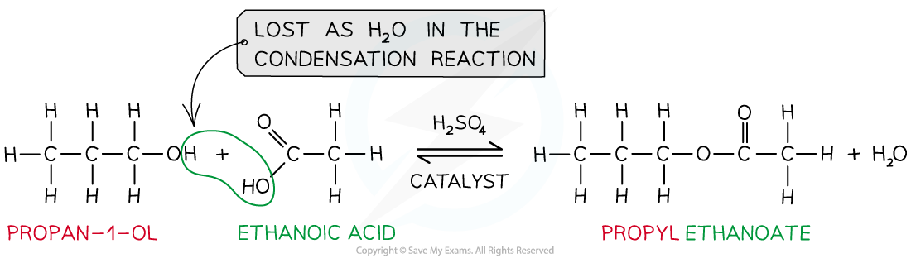

Reactions of Carboxylic Acids
-----------------------------

* In aqueous solution they are only slightly ionised, to give low concentrations of hydronium ions and alkanoate ions (often called carboxylate ions)

* This <b>partial ionisation</b> in solution means that carboxylic acids are <b>weak acids</b>
* This means that the position of the equilibrium lies to the left and that the concentration of H+ is much smaller than the concentration of the carboxylic acid
* However, the concentration of hydrogen ions is sufficient to react with an aqueous solution of sodium carbonate or sodium hydrogen carbonate to produce carbon dioxide
* These reactions are a useful test for the possible presence of a carboxylic acid:

  + Sodium carbonate: 2RCOOH + Na2CO3 → 2RCOO-Na+ + CO2 + H2O
  + Ionic equation with carbonates: 2RCOOH + CO32- → 2RCOO- + CO2 + H2O
  + Sodium hydrogen carbonate: RCOOH + NaHCO3 → RCOO-Na+ + CO2 + H2O
  + Ionic equation with hydrogen carbonates: RCOOH + HCO3- → RCOO- + CO2 + H2O

<i><b>Carboxylic acids are weak acids that do not fully dissociate in water, the position of the equilibrium lies to the left</b></i>

#### Reaction with LiAlH4

* Carboxylic acids can undergo reduction when they react with a reducing agent such as <b>lithium tetrahydridoaluminate, </b>LiAlH4, suspended in dry ether at room temperature
* A carboxylic acid will be reduced to a primary alcohol, for example

<b>CH</b><b>3</b><b>CH</b><b>2</b><b>COOH (l) + 4[H] → CH</b><b>3</b><b>CH</b><b>2</b><b>CH</b><b>2</b><b>OH (l) + H</b><b>2</b><b>O (l)</b>

* Addition of water at the end will destroy any excess lithium tetrahydridoaluminate

#### Reaction with bases

* Carboxylic acids can form salts with metals, alkalis and carbonates.
* In the reaction with <b>metal oxides</b> a metal salt and water are produced

  + For example in reaction with magnesium the salt magnesium ethanoate is formed:

<b>2CH</b><b>3</b><b>COOH (aq) + MgO (s) → (CH</b><b>3</b><b>COO)</b><b>2</b><b>Mg (aq) + H</b><b>2</b><b>O (l) </b>

* In the reaction with <b>alkalis</b> a salt and water are formed in a neutralisation reaction

  + For example in reaction with potassium hydroxide the salt potassium ethanoate is formed:

<b>CH</b><b>3</b><b>COOH (aq) + KOH (aq) → CH</b><b>3</b><b>COOK (aq) + H</b><b>2</b><b>O (l)</b>

* In the reaction with <b>carbonates</b> a metal salt, water and carbon dioxide gas are produced

  + For example in reaction with potassium carbonate the salt potassium ethanoate is formed:

<b>2CH</b><b>3</b><b>COOH (aq) + K</b><b>2</b><b>CO</b><b>3</b><b> (s) → 2CH</b><b>3</b><b>COOK (aq) + H</b><b>2</b><b>O (l) + CO</b><b>2</b><b> (g)</b>

#### Reaction with phosphorus(V) chloride

* Carboxylic acids react with solid phosphorus(V) chloride to form an acyl chloride
* For example, propanoic acid will react with phosphorus(V) chloride to form propanoyl chloride, phosphorus trichloride oxide and hydrogen chloride

<b>CH</b><b>3</b><b>CH</b><b>2</b><b>COOH (l) + PCl</b><b>5</b><b> (s) → CH</b><b>3</b><b>CH</b><b>2</b><b>COCl (l) + POCl</b><b>3</b><b> (l) + HCl (g)</b>

* In this reaction, steamy fumes of HCl are produced
* The liquid products can be separated by fractional distillation

#### Reaction with alcohols

* When carboxylic acids react with alcohols an ester is formed
* <b>Esters </b>are compounds with an -COOR functional group and are characterised by their <b>sweet </b>and <b>fruity</b> smells
* They are prepared from the <b>condensation </b>reaction between a <b>carboxylic acid </b>and <b>alcohol </b>with <b>concentrated H</b><b>2</b><b>SO</b><b>4</b><b> </b>as <b>catalyst</b>

  + This is also called <b>esterification</b>
* The first part of the ester’s name comes from the alcohol and the second part of the name comes from the carboxylic acid

  + E.g. Propanol and ethanoic acid will give the ester propyl ethanoate

<i><b>Esters are formed from the condensation reaction between carboxylic acids and alcohols</b></i>