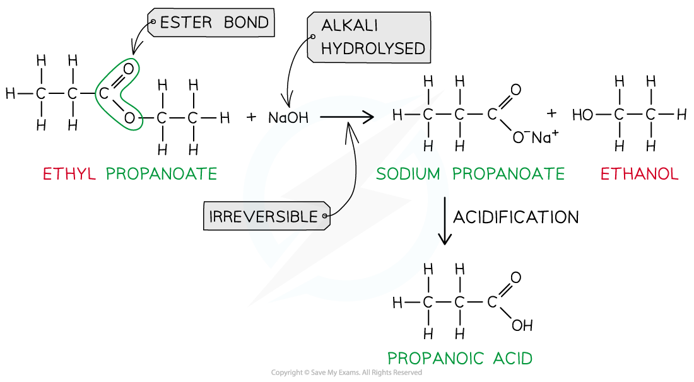
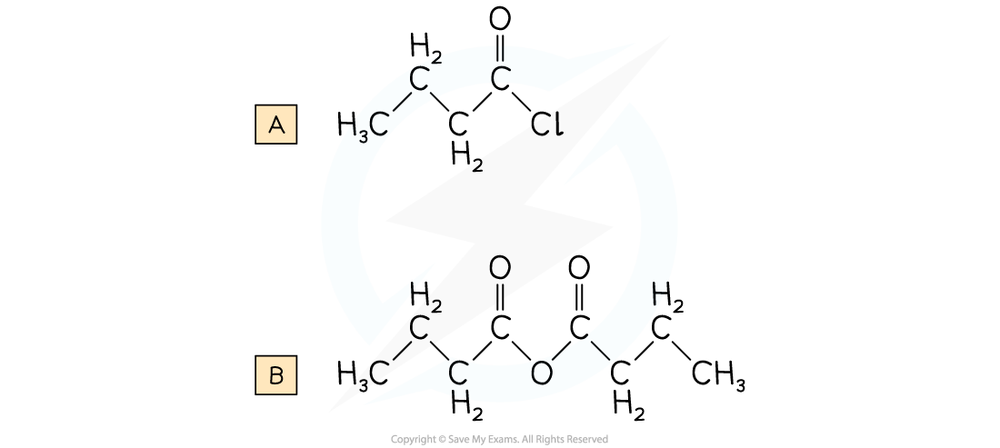

Hydrolysis of Esters
--------------------

#### Hydrolysis of Esters - Acid

* The reverse of the esterification reaction is called <b>hydrolysis</b>
* Ester hydrolysis is a useful reaction for creating biodegradable plastics
* Esters can be <b>hydrolysed </b>to reform the carboxylic acid and alcohol or salts of carboxylic acids by using either <b>dilute acid </b>(e.g. sulfuric acid) or<b> alkali </b>(e.g. sodium hydroxide) and <b>heat</b>
* When an ester is <b>heated under reflux </b>with <b>acid </b>an equilibrium mixture is established, meaning that the hydrolysis reaction is not complete<b> </b>

<i><b>Ester hydrolysis by dilute acid is a reversible reaction forming carboxylic acid and alcohol</b></i>

#### Hydrolysis of Esters - Alkaline

* However, <b>heating </b>the ester <b>under reflux </b>with <b>dilute alkali</b> (e.g. sodium hydroxide) is an <b>irreversible </b>reaction as the ester is fully hydrolysed and the reaction goes to completion
* The carboxylic acid produced reacts with excess alkali to form a<b> carboxylate salt</b> and <b>alcohol</b>
* The <b>sodium</b> <b>carboxylate</b> salt requires further <b>acidification</b> to turn into a <b>carboxylic</b> <b>acid</b>

  + The sodium carboxylate (-COO-) ion needs to get protonated by an acid (such as HC<i>l</i>) to form the carboxylic acid (-COOH)

<i><b>Ester hydrolysis by dilute alkali is an irreversible reaction forming a sodium carboxylate salt and alcohol</b></i>

<b>Table showing Differences in Hydrolysis of Esters</b>

#### Worked Example

Name the products and write equations for the following hydrolysis reaction:

1. Ethyl ethanoate with hot dilute sulfuric acid solution
2. Methyl propanoate by hot sodium hydroxide solution

<b>Answer:</b>

<b>Answer 1:</b> Ethanoic acid and ethanol

CH3COOCH2CH3 + H2O ⇌ CH3COOH + CH3CH2OH

<b>Answer 2:</b> Sodium propanoate and methanol

CH3CH2COOCH3 + NaOH → CH3CH2COONa + CH3OH

Acyl Chlorides & Esters
-----------------------

Acyl groups Acyl groups can be built into many molecules using acyl chlorides or acid anhydrides (known as acylating agents) Acyl chlorides are <b>derivatives of carboxylic acids</b> by substitution of the -OH group by a chlorine atom Acyl chlorides are named by identifying the parent hydrocarbon chain and adding the suffix -<i>oyl chloride</i> They can also be named by removing the -oic acid from the carboxylic acid and adding -<i>oyl chloride</i>

* Acid anhydrides are also <b>derivatives of carboxylic acids</b> formed by substitution of the -OH group by an alkanoate

  + Acid anhydrides are named by identifying the parent hydrocarbon chain and adding the suffix -<i>oic anhydride</i>
  + They can also be named by removing the -oic acid from the carboxylic acid and adding -<i>oic anyhydride</i>

<b>Ethanoic acid derivatives</b>

#### Worked Example

Draw the displayed formula for the following:

A. Butanoyl chloride

B. Butanoic anhydride

<b>Answer:</b>

* <b>Acyl chlorides </b>are <b>reactive </b>organic compounds that undergo many reactions such as <b>nucleophilic addition-elimination </b>reactions
* In nucleophilic addition-elimination reactions, the <b>nucleophilic addition</b> of a small molecule across the C=O bond takes place followed by <b>elimination</b> of a small molecule
* Examples of these nucleophilic addition-elimination reactions include:

  + <b>Hydrolysis</b>
  + Reaction with alcohols to form <b>esters</b>
  + Reaction with ammonia and primary amines to form <b>amides</b>

#### Hydrolysis

* The <b>hydrolysis </b>of acyl chlorides results in the formation of a <b>carboxylic acid </b>and <b>HC</b><i><b>l </b></i>molecule
* This is a <b>nucleophilic addition-elimination </b>reaction

  + A <b>water molecule </b>adds across the C=O bond
  + A hydrochloric acid (HCl) molecule is <b>eliminated</b>
* An example is the hydrolysis of propanoyl chloride to form propanoic acid and HCl

<i><b>Acyl chlorides are hydrolysed to carboxylic acids</b></i>

#### Formation of esters

* Acyl chlorides can react with <b>alcohols </b>to form esters
* The esterification of acyl chlorides is also a <b>nucleophilic addition-elimination </b>reaction

  + The alcohol adds across the C=O bond
  + A HCl molecule is eliminated

<i><b>Acyl chlorides undergo esterification with alcohols to form esters</b></i>

#### Formation of amides

* Acyl chlorides can form <b>amides </b>with <b>primary</b> <b>amines </b>and <b>concentrated</b> <b>ammonia</b>
* The nitrogen atom in ammonia and primary amine has a lone pair of electrons which can be used to attack the carbonyl carbon atom in the acyl chlorides
* The product is an<b> </b>amide (when reacted with ammonia) or<i><b> N-</b></i><b>substituted </b>amide (when reacted with primary amines)
* This is also an example of a <b>nucleophilic addition-elimination </b>reaction as

  + The amine or ammonia molecule adds across the C=O bond
  + A HCl molecule is eliminated

<i><b>Acyl chlorides undergo reactions with ammonia and primary amines to form amides</b></i>

Polyesters
----------

* Addition polymerisation has been covered in reactions of alkenes

  + They are made using monomers that have C=C double bonds joined together to form polymers such as polyethene
* Condensation polymerisation is another type of reaction whereby a polymer is produced by repeated condensation reactions between monomers
* Natural condensation polymers are all formed by <b>elimination of water</b>

  + Although the process of <b>condensation</b> polymerisation involves the <b>elimination of a small molecule</b>
* <b>Condensation polymers</b> can be identified because the monomers are linked by <b>ester</b> or <b>amide bonds</b>

#### Polyester

* Is formed by the reaction between <b>dicarboxylic acid monomers</b> and <b>diol monomers</b>
* Polyester is produced by linking these monomers with <b>ester bonds / links</b>

<i><b>This polymer structure shows an ester functional group linking monomers together</b></i>

#### Formation of polyesters

* A diol and a dicarboxylic acid are required to form a polyester

  + A diol contains 2 -OH groups
  + A dicarboxylic acid contains 2 -COOH groups

<i><b>The position of the functional groups on both of these molecules allows condensation polymerisation to take place effectively</b></i>

* When the polyester is formed, one of the -OH groups on the diol and the hydrogen atom of the -COOH are expelled as a water molecule (H2O)
* The resulting polymer is a polyester

  + In this example, the polyester is <b>poly(ethylene terephthalate)</b> or PET, which is sometimes known by its brand names of Terylene or Dacron

<i><b>Expulsion of a water molecule in this condensation polymerisation forms the polyester called (ethylene terephthalate) (PET)</b></i>

#### Formation of polyesters - hydroxycarboxylic acids

* So far the examples of making polyesters have focused on using 2 separate monomers for the polymerisation
* There is another route to making polyesters
* A single monomer containing both of the key functional groups can also be used
* These monomers are called hydroxycarboxylic acids

  + They contain an alcohol group (-OH) at one end of the molecule while the other end is capped by a carboxylic acid group (-COOH)

<i><b>Both functional groups that are needed to make the polyester come from the same monomer</b></i>