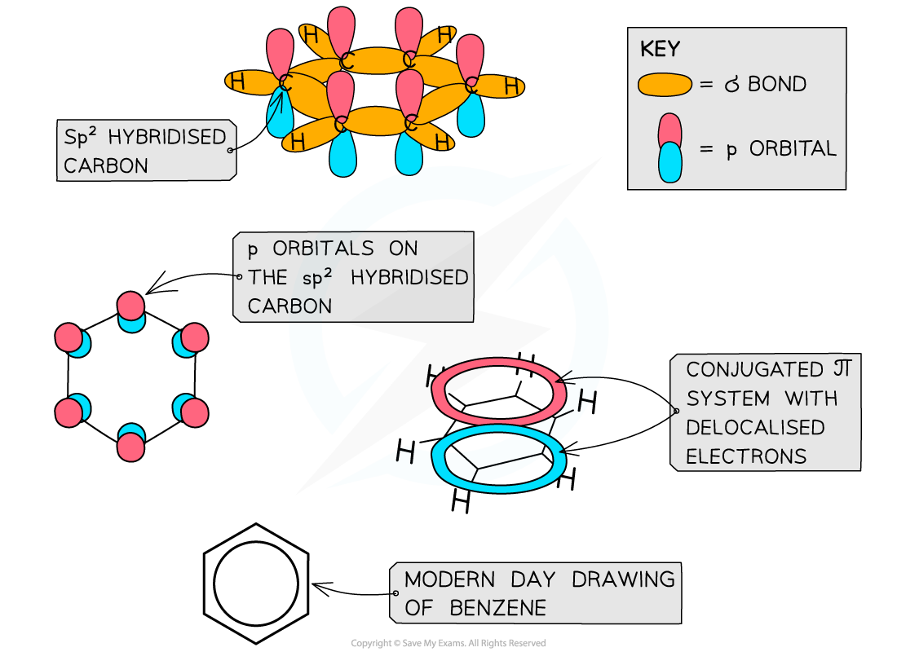

Models of Benzene
-----------------

#### Structure of Benzene

* The structure of benzene was determined many years ago, by a chemist called Kekule
* The structure consists of 6 carbon atoms in a hexagonal ring, with alternating single and double carbon-carbon bonds

  + This suggests that benzene should react in the same way that an unsaturated alkene does
  + However, this is not the case

<i><b>Like other aromatic compounds, benzene has a planar structure due to the sp</b></i><b>2</b><i><b> hybridisation of carbon atoms and the conjugated π system in the ring</b></i>

* Each carbon atom in the ring forms three σ bonds using the sp2 orbitals
* The remaining <b>p orbitals </b>overlap laterally with p orbitals of neighbouring carbon atoms to form a π system
* This extensive sideways overlap of p orbitals results in the electrons being delocalised and able to freely spread over the entire ring causing a π system

  + The π system is made up of two ring shaped clouds of electron density - one above the plane and one below it
* Benzene and other aromatic compounds are <b>regular </b>and <b>planar</b> compounds with bond angles of 120 o
* The delocalisation of electrons means that all of the carbon-carbon bonds in these compounds are identical and have both <b>single </b>and <b>double bond </b>character
* The bonds all being the same length is evidence for the delocalised ring structure of benzene

#### Evidence for delocalisation

* This evidence of the bonding in benzene is provided by data from enthalpy changes of hydrogenation and carbon-carbon bond lengths
* Hydrogenation of cyclohexene

  + Each molecule has one C=C double bond
  + The enthalpy change for the reaction of cyclohexene is -120 kJ mol-1

<b>C</b><b>6</b><b>H</b><b>10</b><b> + H</b><b>2</b><b> → C</b><b>6</b><b>H</b><b>12   </b><b>Δ</b><i><b>H</b></i><b>Θ</b><b> = -120 kJ mol</b><b>-1</b>

* Hydrogenation of beznene

  + The Kekule structure of benzene as cyclohexa-1,3,5-triene has three double C=C bonds
  + It would be expected that the enthalpy change for the hydrogenation of this structure would be three times the enthalpy change for the one C=C bond in cyclohexene

<b>C</b><b>6</b><b>H</b><b>6</b><b> + 3H</b><b>2</b><b> → C</b><b>6</b><b>H</b><b>12   </b><b>Δ</b><i><b>H</b></i><b>Θ</b><b> = 3 x -120 kJ mol</b><b>-1 </b><b>= -360 kJ mol</b><b>-1</b>

* When benzene is reacted with hydrogen, the enthalpy change obtained is actually far less exothermic, <b>Δ</b><i><b>H</b></i><b>Θ</b><b> = -208 kJ mol</b><b>-1</b>

Resistance to Bromination
-------------------------

* Alkenes tend to undergo bromination easily which can be observed in cyclohexene

<b>C</b><b>6</b><b>H</b><b>10</b><b> + Br</b><b>2</b><b> → C</b><b>6</b><b>H</b><b>10</b><b>Br</b><b>2</b><b> </b>

* As the π bond contains localised electrons, it produces an area of high electron density allowing it to repel the electron in the bromine molecule
* Therefore a dipole is introduced making one bromine atom δ+ and one δ- bromine atom
* The δ+ bromine is attracted to the π bond in the cyclohexane
* This then leaves a carbocation in the intermediate molecule which the negative bromide ion is attracted to, hence forming 1,2-dibromocyclohexane by electrophilic addition
* In benzene, there are no localised areas of high electron density, preventing it from being able to polarise the bromine moelcule
* In order for benzene to undergo electrophilic substitution with bromine, a halogen carrier must be present in the reaction e.g. AlBr3