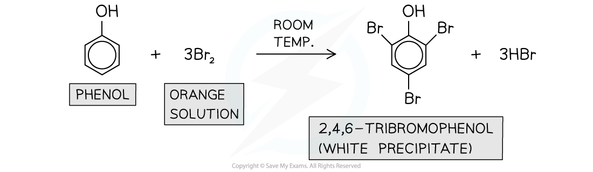

Bromination of Phenol
---------------------

#### Reactions of the aromatic ring in phenols

* Phenols react more readily with electrophiles compared to benzene
* This is because one of the lone pairs of electrons on the oxygen atom in -OH overlaps with the π bonding system
* This <b>increases the electron density</b> of the benzene ring making it more susceptible to electrophilic attack
* The -OH group in phenols is activating and directs incoming electrophiles to the <b>2, 4, and 6 positions</b>

#### Bromination

* Phenols also undergo electrophilic substitution reactions when reacted with bromine water at room temperature
* Phenol <b>decolourises</b> the <b>orange</b> bromine solution to form a <b>white precipitate </b>of 2,4,6-tribromophenol
* This is also known as the <b>bromination of phenol</b>

<i><b>Phenols undergo bromination when reacted with bromine water at room temperature</b></i>