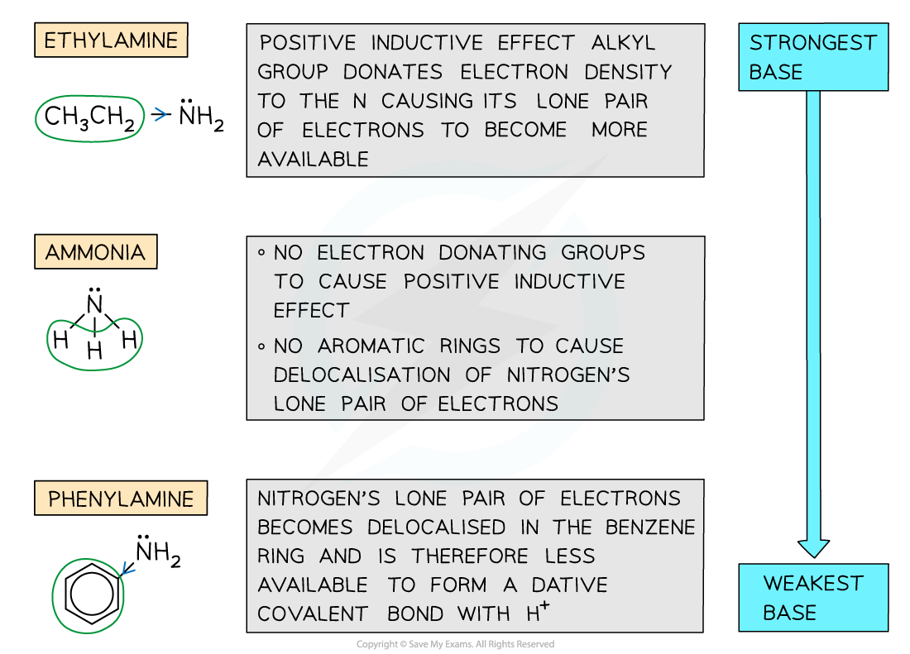

Amine Basicity
--------------

* The nitrogen atom in ammonia and amine molecules can <b>accept </b>a <b>proton </b>(H+ ion)
* They can therefore act as Bronsted-Lowry <b>bases</b> in aqueous solutions by <b>donating </b>its lone pair of electrons to a proton and form a <b>dative bond</b>

<i><b>The nitrogen atom in ammonia and amines can donate its lone pair of electrons to form a bond with a proton and therefore act as a base</b></i>

* The <b>strength</b> of amines depends on the <b>ability </b>of the lone pair of electrons on the nitrogen atom to accept a proton and form a dative covalent bond
* The <b>more readily</b> a proton is attracted, the <b>stronger the base</b> is
* Factors that may affect the <b>basicity </b>of amines include:

  + <b>Positive inductive effect</b> - Some groups such as <b>alkyl groups </b>donate electron density to the nitrogen atom causing the lone pair of electrons to become more available and therefore <b>increasing </b>the amine’s <b>basicity</b>
  + <b>Delocalisation</b> - The presence of aromatic rings such as the <b>benzene ring</b> causes the lone pair of electrons on the nitrogen atom to be <b>delocalised </b>into the benzene ring
  + The lone pair becomes <b>less available </b>to form a dative covalent bond with ammonia and hence <b>decreases </b>the amine’s <b>basicity</b>
* Primary aliphatic amines are stronger bases than ammonia as the alkyl groups are electron releasing and push electrons towards the nitrogen atom and so make it a stronger base
* Secondary amines are stronger bases than primary amines because they have more alkyl groups that are substituted onto the nitrogen atom in place of hydrogen atoms

  + Therefore more electron density is pushed onto the nitrogen atom (as the inductive effect of alkyl groups is greater than that of hydrogen atoms)

    

<i><b>Base strength of aromatic amines</b></i>

* Primary aromatic amines such as phenylamine do not form basic solutions because the lone pair of electrons on the nitrogen delocalise with the ring of electrons in the benzene ring
* This means the nitrogen is less able to accept protons
* Ethylamine (which has an electron-donating ethyl group) is <b>more basic</b> than <b>phenylamine </b>(which has an electron-withdrawing benzene ring)

<i><b>Ethylamine is more basic than phenylamine due to electron donating ethyl group which increases electron density on the nitrogen and makes it more attractive to protons</b></i>