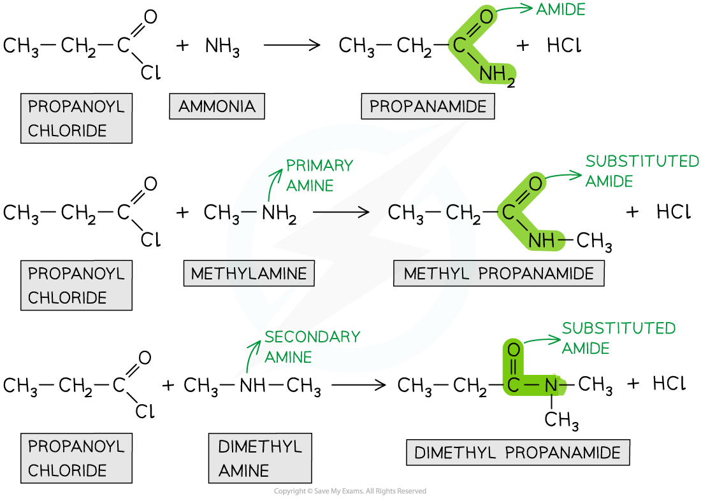
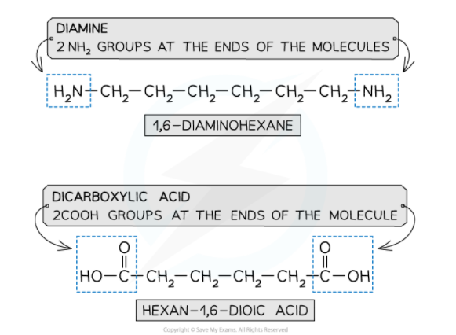
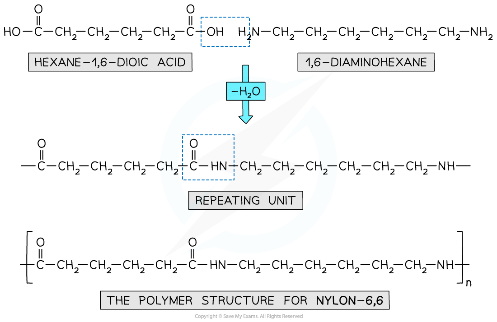
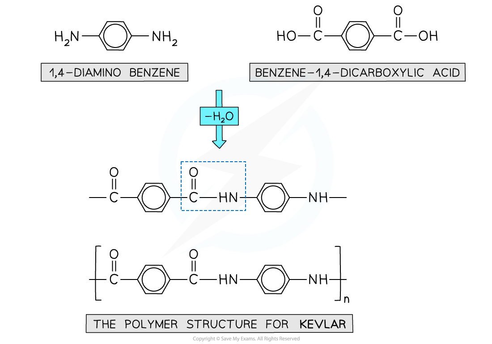

Amide Formation
---------------

* <b>Amides </b>are organic compounds with an -CONR2 functional group
* They can be prepared from the <b>condensation reaction </b>between an <b>acyl chloride </b>and <b>ammonia </b>or <b>amine</b>
* In a <b>condensation </b>reaction, two organic molecules <b>join together </b>and in the process <b>eliminate </b>a small molecule
* In this case, the acyl chlorides and ammonia or amine <b>join together </b>to form an <b>amide </b>and <b>eliminate </b>an HCl molecule

#### Condensation reaction

* The chlorine atom in acyl chlorides is <b>electronegative </b>and draws electron density from the carbonyl carbon
* The carbonyl carbon is therefore <b>electron-deficient </b>and can be attacked by <b>nucleophiles</b>
* The nitrogen atom in ammonia and amines has a lone pair of electrons which can act as a <b>nucleophile </b>and attack the carbonyl carbon
* As a result, the C-Cl bond is <b>broken </b>and an <b>amide </b>is formed
* Whether the product is a <b>substituted </b>amide or not, depends on the nature of the <b>nucleophile</b>

  + Primary and secondary amines will give a <b>substituted amide</b>
  + The reaction of acyl chlorides with ammonia will produce a <b>non-substituted amide</b>

<i><b>Acyl chlorides undergo condensation reactions with ammonia and amines to form amides</b></i>

* Note that ammonia is basic and the inorganic product is acidic, so there will be a reaction between the two molecules

<b>NH</b><b>3</b><b> + HCl → NH</b><b>4</b><b>Cl</b>

* We can therefore write the overall equation for the reaction of propanoyl chloride and ammonia as

<b>CH</b><b>3</b><b>CH</b><b>2</b><b>COCl + 2NH</b><b>3</b><b> → CH</b><b>3</b><b>CH</b><b>2</b><b>CONH</b><b>2</b><b> + NH</b><b>4</b><b>Cl</b>

Polyamide Formation
-------------------

#### Amide link

* Polyamides are also formed using condensation polymerisation

<i><b>An amide link - also known as a peptide link - is the key functional group in a polyamide</b></i>

#### Monomers

* A diamine and a dicarboxylic acid are required to form a polyamide

  + A diamine contains 2 -NH2 groups
  + A dicarboxylic acid contains 2 -COOH groups

    

<i><b>The monomers for making polyamides</b></i>

#### Formation of polyamides

<i><b>This shows the expulsion of a small molecule as the amide link forms</b></i>

* Nylon 6,6 is a synthetic polyamide
* Its monomers are 1,6-diaminohexane and hexane-1,6-dioic acid

  + The ‘6,6’ part of its name arises from the 6 carbon atoms in each of Nylon 6,6 monomers

<i><b>Nylon 6,6 is a synthetic polyamide made using diamine and dicarboxylic acid monomers</b></i>

#### Kevlar

* Kevlar is another example of a polymer formed through condensation polymerisation
* The polymer chains are neatly arranged with many hydrogen bonds between them
* This results in a strong and flexible polymer material with fire resistance properties
* These properties also lend Kevlar to a vital application in bullet-proof vests
* The monomers used to make Kevlar

  + 1,4-diaminobenzene
  + Benzene-1,4-dicarboxylic acid

<i><b>Kevlar is made using a diamine and dicarboxylic acid monomers</b></i>