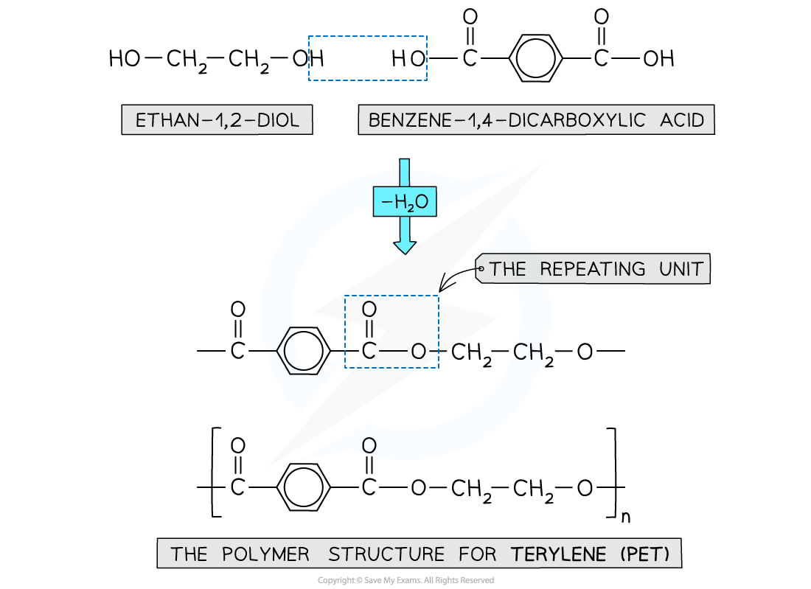
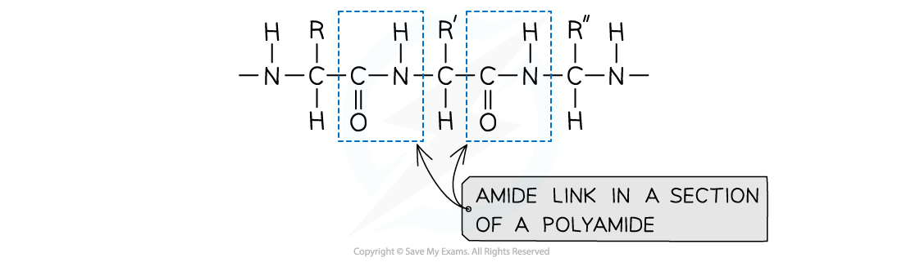
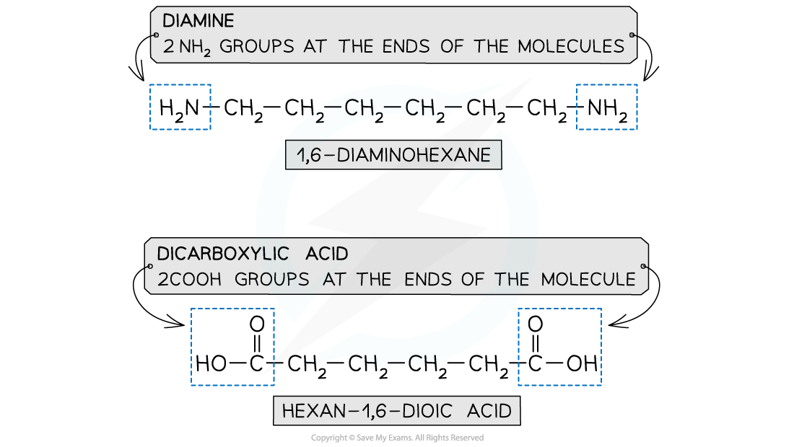
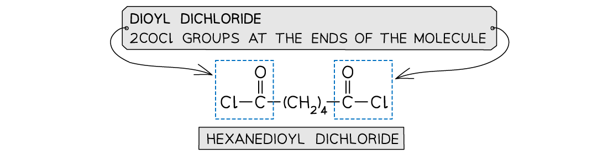
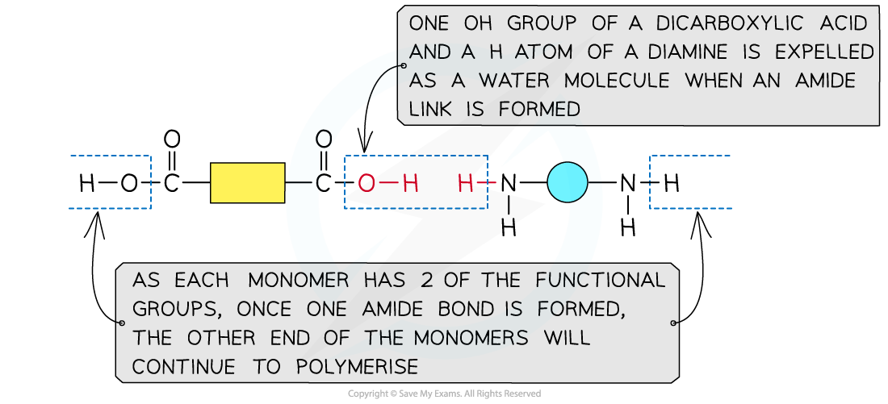
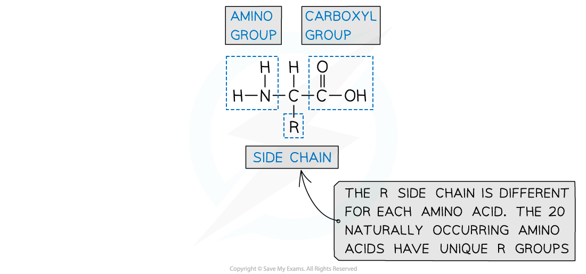
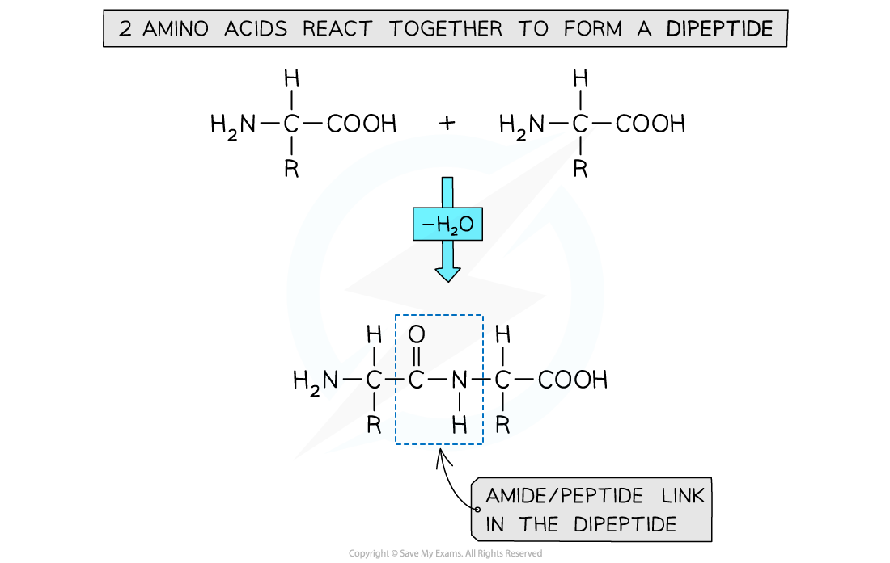
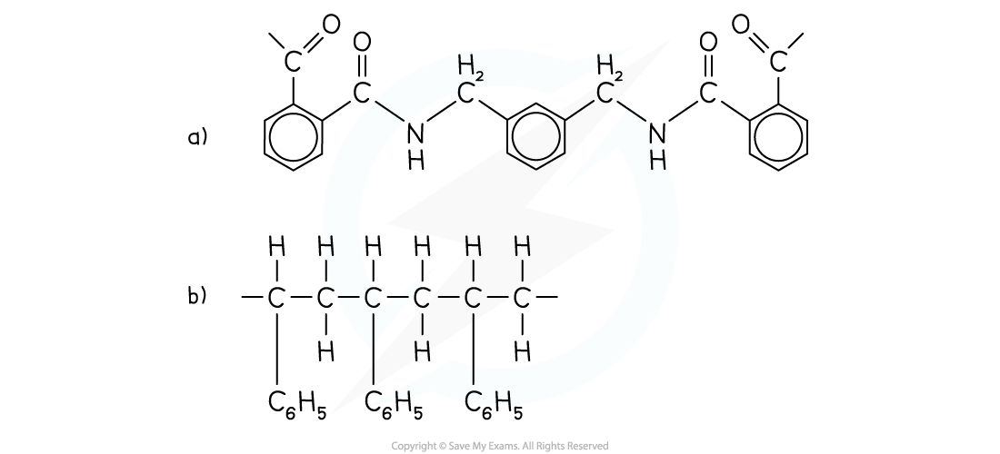
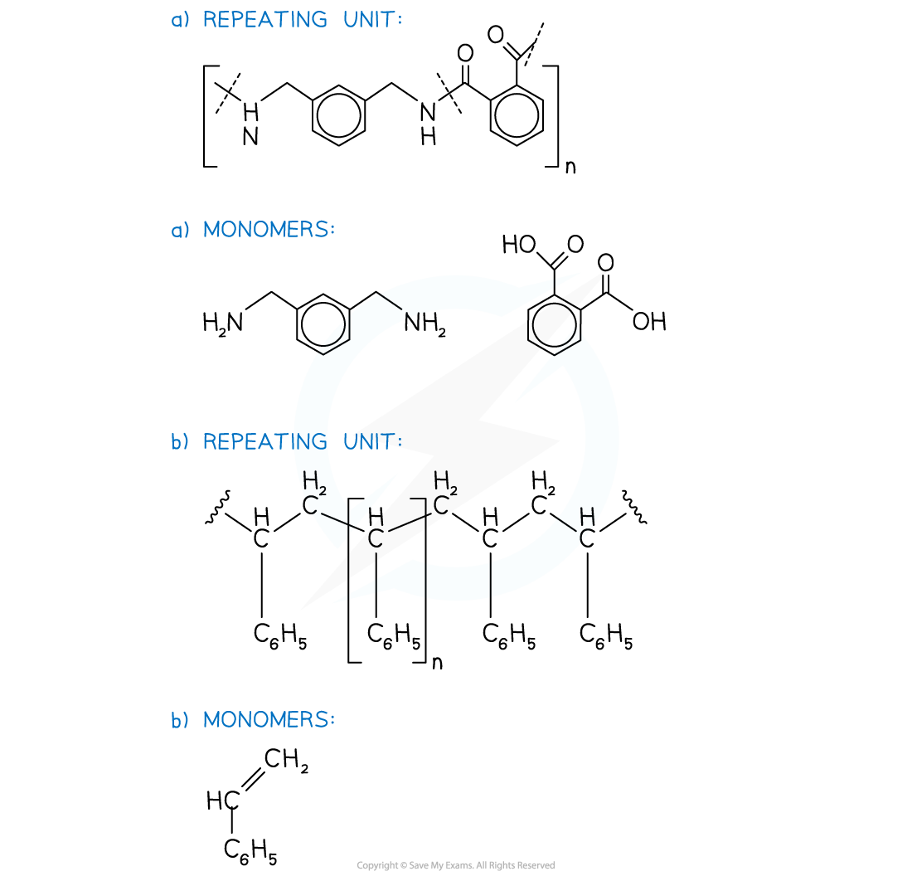

Condensation Polymers
---------------------

* Condensation polymerisation is another type of reaction whereby a polymer is produced by repeated condensation reactions between monomers
* Natural condensation polymers are all formed by the <b>elimination of water</b>

  + Although the process of <b>condensation</b> polymerisation involves the <b>elimination of a small molecule</b>
* <b>Condensation polymers</b> can be identified because the monomers are linked by <b>ester</b> or <b>amide bonds</b>
* Condensation polymers can be formed by:

  + dicarboxylic acids and diols
  + dicarboxylic acids and diamines
  + amino acids

#### Polyester

* Is formed by the reaction between <b>dicarboxylic acid monomers</b> and <b>diol monomers</b>
* Polyester is produced by linking these monomers with <b>ester bonds / links</b>

<i><b>This polymer structure shows an ester functional group linking monomers together</b></i>

#### Formation of polyesters

* A diol and a dicarboxylic acid are required to form a polyester

  + A diol contains 2 -OH groups
  + A dicarboxylic acid contains 2 -COOH groups

<i><b>The position of the functional groups on both of these molecules allows condensation polymerisation to take place effectively</b></i>

* When the polyester is formed, the H atom on the diol and the -OH group of the -COOH are expelled as a water molecule (H2O)
* The resulting polymer is a polyester

  + In this example, the polyester is <b>poly(ethylene terephthalate)</b> or PET, which is sometimes known by its brand names of Terylene or Dacron

<i><b>Expulsion of a water molecule in this condensation polymerisation forms the polyester called (ethylene terephthalate) (PET)</b></i>

#### Formation of polyesters - hydroxycarboxylic acids

* So far the examples of making polyesters have focused on using 2 separate monomers for the polymerisation
* There is another route to making polyesters
* A single monomer containing both of the key functional groups can also be used
* These monomers are called hydroxycarboxylic acids

  + They contain an alcohol group (-OH) at one end of the molecule while the other end is capped by a carboxylic acid group (-COOH)

<i><b>Both functional groups that are needed to make the polyester come from the same monomer</b></i>

#### Polyamides

* Polyamides are polymers where repeating units are bonded together by amide links
* The formula of an amide group is -CONH

  

  <i><b>An amide link - also known as a peptide link - is the key functional group in a polyamide</b></i>

#### Polyamide monomers

* A diamine and a dicarboxylic acid are required to form a polyamide

  + A diamine contains 2 -NH2 groups
  + A dicarboxylic acid contains 2 -COOH groups
* Dioyl dichlorides can also used to react with the diamine instead of the acid

  + A dioyl chloride contains 2 -COCl groups
  + This is a more reactive monomer but more expensive than dicarboxylic acid

<i><b>The monomers for making polyamides</b></i>

#### Formation of polyamides

<i><b>This shows the expulsion of a small molecule as the amide link forms</b></i>

#### Amino acids - formation of proteins

* Proteins are vital biological molecules with varying functions within the body
* They are essentially polymers made up of amino acid monomers
* Amino acids have an aminocarboxylic acid structure
* Their properties are governed by a branching side group - the R group

<i><b>Amino acids contain an amine group, an acid group and a unique R group</b></i>

* Different amino acids are identified by their unique R group
* The names of each amino acid is given using 3 letters
* For example Glutamine is known as ‘Gln’
* Dipeptides can be produced by polymerising 2 amino acids together

  + The amine group (-NH2) and acid group (-COOH) of each amino acid is used to polymerise with another amino acid
* Polypeptides are made through polymerising more than 2 amino acids together

<i><b>Dipeptides and polypeptides are formed by polymerising amino acid molecules together</b></i>

#### Examiner Tips and Tricks

Become familiar with the structures of the different monomers that can be used to make condensation polymersAlso, remember that exam questions will require you to identify the monomers and also draw the repeating units

#### Worked Example

Draw the repeating unit and identify the monomers used to make the following polymers

<b>Answer:</b>

