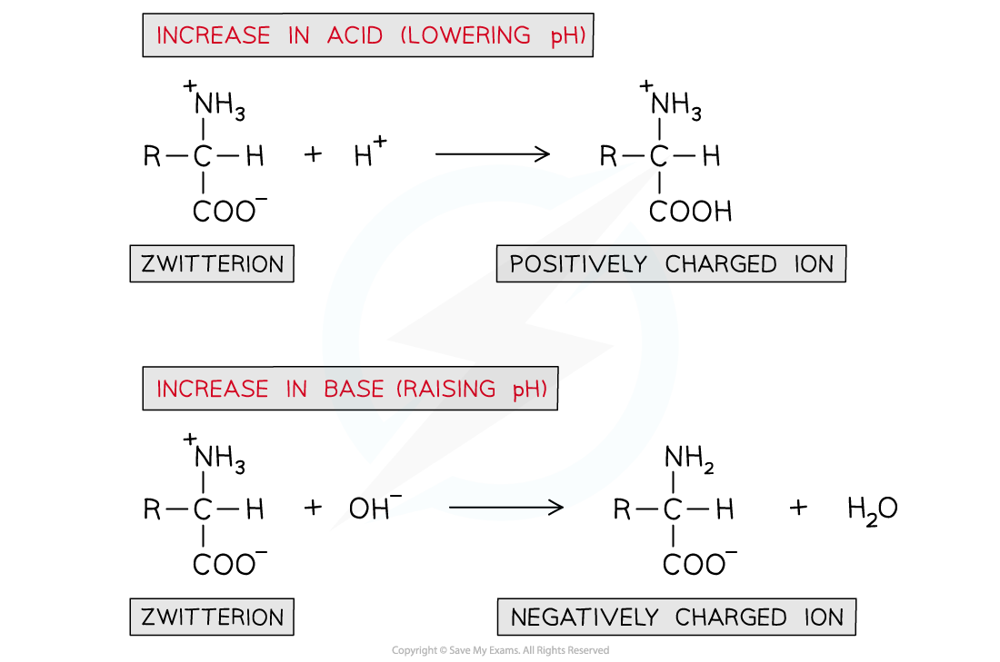
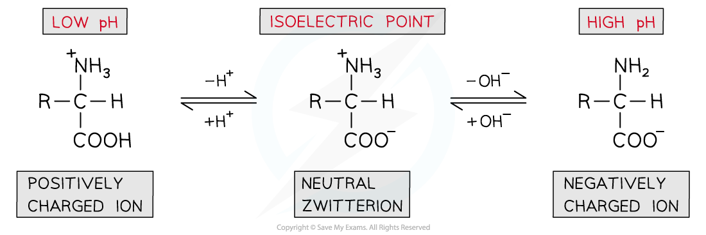
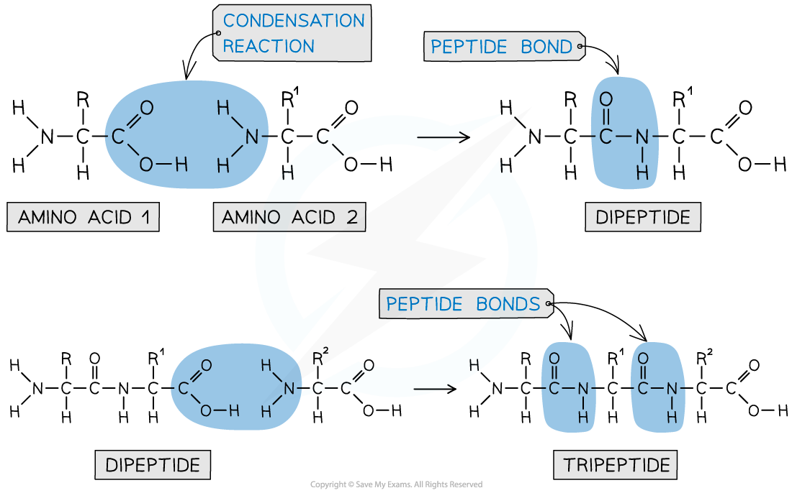
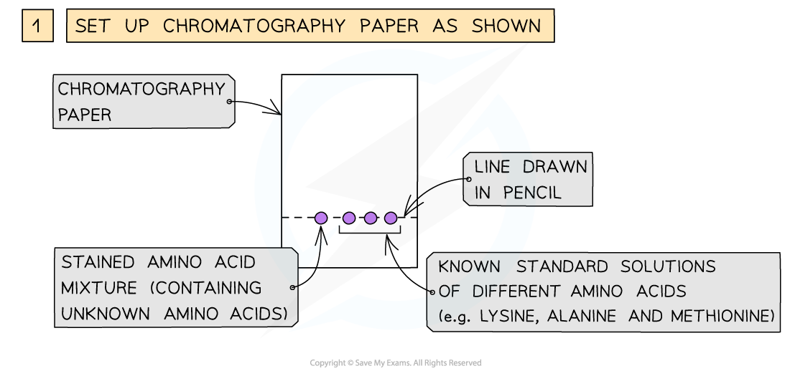
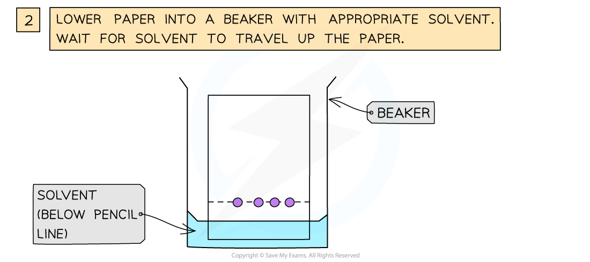

Properties of 2-Amino Acids
---------------------------

#### Acid / base properties of amino acids

* Amino acids will undergo most reactions of amines and carboxylic acids including acid-base reactions of:

  + Amines with acids
  + Carboxylic acids with bases
* However, they can also interact <b>intramolecularly</b> (within themselves) to form a <b>zwitterion</b>
* A zwitterion is an ion with both a <b>positive </b>(-NH3+) and a <b>negative </b>(-COO-) charge
* Because of these charges in a zwitterion, there are <b>strong intermolecular forces of attraction</b> between amino acids

  + Amino acids are therefore <b>soluble crystalline solids</b>

<i><b>An amino acid molecule can interact within itself to form a zwitterion</b></i>

#### Isoelectric point

* A solution of amino acids in water will exist as <b>zwitterions </b>with both <b>acidic </b>and <b>basic </b>properties
* They act as <b>buffer solutions</b> as they resist any changes in pH when <b>small </b>amounts of acids or alkali are added
* If an acid is added (and thus the pH is <b>lowered</b>):

  + The -COO- part of the zwitterion will <b>accept</b> an H+ ion to reform the -COOH group
  + This causes the zwitterion to become a <b>positively charged ion</b>
* If a base is added (and thus the pH is <b>raised</b>):

  + The -NH3+ part of the zwitterion will <b>donate </b>an H+ ion to reform the -NH2 group
  + This causes the zwitterion to become a <b>negatively charged ion</b>

<i><b>A solution of amino acids can act as a buffer solution by resisting any small changes in pH</b></i>

* The pH can be slightly adjusted to reach a point at which neither the <b>negatively charged </b>or <b>positively charged </b>ions dominate and the amino acid exists as a <b>neutral zwitterion</b>

  + This is called the <b>isoelectric point </b>of the amino acid

<i><b>The isoelectric point of amino acids is the pH at which the amino acid exists as a neutral zwitterion</b></i>

#### Reactions of the amine group

* The amine group is basic and reacts with acids to make salts
* For example, a general amino acid reacts with hydrochloric acid to form the ammonium salt:

<b>H</b><b>2</b><b>NCHRCOOH + HCl ⇌ H</b><b>3</b><b>N</b><b>+</b><b>CHRCOOH + Cl</b><b>-</b><b> </b>

#### Reactions of the carboxylic acid group

<b>Reaction with aqueous alkalis</b>

* An amino acid reacts with aqueous alkali such as sodium or potassium hydroxide to form a salt and water
* For example, a general amino acid reacts with sodium hydroxide to form a sodium salt:

<b>H</b><b>2</b><b>NCHRCOOH + NaOH ⇌ H</b><b>2</b><b>NCHRCOO</b><b>-</b><b> Na</b><b>+</b><b> + H</b><b>2</b><b>O</b>

<b>Esterification with alcohols</b>

* Amino acids, like carboxylic acids, can be esterified by heating with alcohol in the presence of concentrated sulfuric acid
* The carboxylic acid group is esterified whilst the basic amine group is protonated due to the acidic conditions:

<b>H</b><b>2</b><b>NCHRCOOH + C</b><b>2</b><b>H</b><b>5</b><b>OH + H</b><b>+</b><b> ⇌ H</b><b>3</b><b>N</b><b>+</b><b>CHRCOOC</b><b>2</b><b>H</b><b>5</b><b>  + H</b><b>2</b><b>O</b>

#### Optical activity

* Almost all 2-amino acids contain a chiral centre (the C of the CH group), and so are optically active

  + The only exception is glycine, which has a CH2 group instead
* Aqueous solutions of the enantiomers rotate the plane of polarisation of plane-polarised light

  + Dextrorotatory (+)
  + Laevorotatory (-)
* If an amino acid is synthesised in the lab, a racemic mixture is formed

The Peptide Bond
----------------

* Each amino acid contains an amine (-NH2) and carboxylic acid (-COOH) group
* The new <b>amide bond </b>between two amino acids is also called a <b>peptide link </b>or <b>peptide bond</b>
* The -NH2 group of <b>one amino acid </b>can react with the -COOH group of <b>another amino acid </b>in a <b>condensation reaction</b> to form a <b>dipeptide</b>
* Since this is a condensation reaction, a small molecule (in this case H2O) is <b>eliminated</b>
* The <b>dipeptide </b>still contains an -NH2 and -COOH group at each end of the molecule which can again participate in a condensation reaction to form a <b>tripeptide</b>

<i><b>A peptide bond is an amide bond between two amino acids</b></i>

* A <b>polypeptide </b>is formed when <b>many </b>amino acids join together to form a long chain of molecules

#### Hydrolysing Proteins

* The polypeptide chains in a protein can be broken down into their individual amino acids by prolonged heating with concentrated hydrochloric acid.
* This breaks the peptide bonds between amino acids
* Due to the acidic environment the amino acids formed will have their NH2 groups protonated as +NH3 groups

#### Using Chromatography

* The amino acids produced by hydrolysis can be identified using simple chromatography
* Using a suitable solvent, the individual amino acids will rise to different heights on the chromatography paper
* As the amino acids are colourless, the chromatogram is sprayed with a developing agent so that the amino acid positions can be seen
* Once the positions of the amino acids have been established, their R<i>f</i> values can be calculated

<i><b>How chromatography can be used to separate a mixture of amino acids and identify the individual components</b></i>

#### Examiner Tips and Tricks

Remember that separating amino acids using chromatography depends on the relative solubilities of the amino acids in the mobile and stationary phases.

It <b>does not</b> depend on the size of the amino acids.