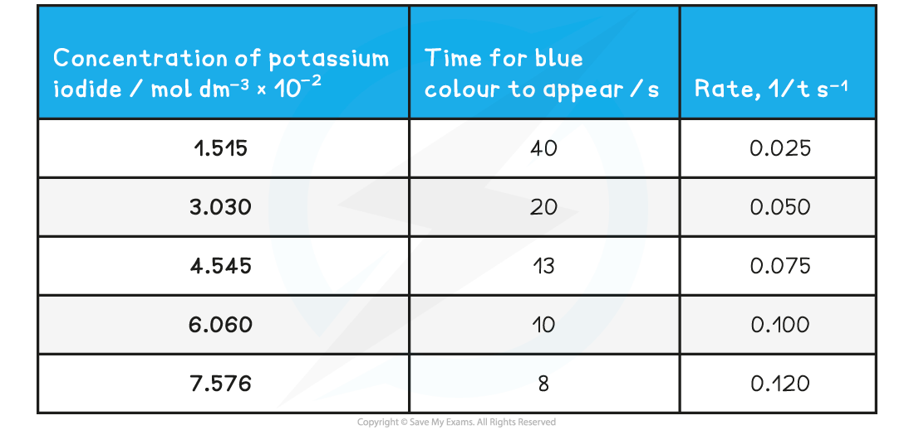

Core Practical 13a: Titrimetric Methods
---------------------------------------

* The reaction between iodine in an acidic solution and propanone is

<b>CH</b><b>3</b><b>COCH</b><b>3 </b><b>(aq) + I</b><b>2</b><b> (aq) → CH</b><b>3</b><b>COCH</b><b>2</b><b>I (aq) + H</b><b>+</b><b> (aq) + I</b><b>- </b><b>(aq) </b>

* We can follow the rate of this reaction by using a continuous monitoring method and therefore we will be able to deduce the order of reaction with respect to a substance using a concentration line graph
* We can calculate the order of reaction with respect to iodine as the propanone and acid are in a large excess so their concentration do not change during the reaction
* Once a portion of the reaction mixture has been removed, we stop the reaction by adding sodium hydrogencarbonate
* Performing a titration again sodium thiosulfate(VI) solution and using starch as an indicator is used to determine the concentration of iodine

<b>2S</b><b>2</b><b>O</b><b>3</b><b>2-</b><b> (aq) + I</b><b>2</b><b> (aq) → 2I</b><b>-</b><b> (aq) + S</b><b>4</b><b>O</b><b>6</b><b>2- </b><b>(aq) </b>

<b>Steps in the procedure</b>

* Mix 25 cm3 of 1.0 mol dm-3 aqueous propanone with 25 cm3 of 1.0 mol dm-3 sulfuric acid in a beaker
* Add 50 cm3 of 0.02 mol dm-3 iodine solution
* <b>Start the stop clock as soon this is added to the beaker</b>
* Using a pipette, withdraw 10 cm3 portion of the reaction mixture and transfer this to a conical flask

  + Stop this portion of the reaction by adding a spatula of sodium hydrogen carbonate
* Titrate this sample against 0.01 mol dm-3 sodium thiosulfate(VI) solution using starch as an indicator

  + Record your result
* Withdraw 10 cm3 of the reaction mixture every 3 minutes and repeat the process of stopping the reaction and titrating against the sodium thiosulfate(VI) solution

<b>Practical tips</b>

* Note the time at which the sodium hydrogencarbonate is added to the withdrawn portions of reaction mixture as this is when the reaction will be stopped and the concentration of iodine can be calculated accurately
* Keep the clock running and note the time throughout the practical rather than stopping the clock
* Have everything ready and set up before beginning the procedure

<b>Results</b>

<b>Sample Data from the Reaction</b>

* This graph is a straight line graph

  + As the gradient is constant, the rate of reaction is constant, and therefore independent of the concentration of the iodine solution
  + This means <b>the reaction is zero order with respect to the iodine</b>
  + The rate equation for the reaction is

    - <b>Rate = k[CH</b><b>3</b><b>COCH</b><b>3 </b><b>(aq)] [H</b><b>+ </b><b>(aq)]</b>

<i><b>Concentration-time graphs of a zero-order reaction</b></i>

Core Practical 13b: Investigating a Clock Reaction
--------------------------------------------------

* Clock reactions are so called because they show a sharp dramatic colour change after a period of time has elapsed
* They make ideal reactions for studying kinetics
* Iodine clock reactions come in a number of variations, but they generally all use starch to show a sudden purple-black colour at the end of the reaction
* A common iodine clock reaction uses the reaction between hydrogen peroxide and iodine

<b>H</b><b>2</b><b>O</b><b>2</b><b> (aq) + 2I</b><b>-</b><b> (aq) + 2H</b><b>+</b><b>(aq) → I</b><b>2</b><b> (aq) + 2H</b><b>2</b><b>O (l)</b>

* Adding sodium thiosulfate to the reaction mixture uses up the iodine and acts as the reaction timer

<b>2S</b><b>2</b><b>O</b><b>3</b><b>2- </b><b>(aq) + I</b><b>2</b><b> (aq) → 2I</b><b>-</b><b> (aq) + S</b><b>4</b><b>O</b><b>6</b><b>2- </b><b>(aq)</b>

* The amounts chosen are such that the iodine produced is in <b>excess</b> compared to the other reagents

  + Therefore, as soon as the iodine is in excess the blue-black colour of iodine in starch is seen

<i><b>The iodine clock reaction provides a good way to study reaction kinetics</b></i>

<b>Steps in the procedure</b>

* The solutions are measured in burettes and placed in a small beaker
* The sulfuric acid is in excess so can be measured in a measuring cylinder rather than burette
* The reaction is started by adding 1cm3 of 0.25 mol dm-3 hydrogen peroxide and starting a timer
* The timer is stopped when the blue black colour appears
* Suitable volume compositions to use could be as follows:

<b>Iodine Clock Volume Compositions Table</b>

<b>Practical tips</b>

* Hydrogen peroxide is typically found in 'volume' concentrations, based on the volume of oxygen given of when it decomposes:

<b>2H</b><b>2</b><b>O</b><b>2</b><b> (aq)  → O</b><b>2</b><b> (g) +  2H</b><b>2</b><b>O (l)</b>

* For example in school laboratories, a suitable concentration of hydrogen peroxide may be listed as 3% or '10 vol'

  + '10 vol' means that when 1cm3 of hydrogen peroxide decomposes it generates 10 cm3 of oxygen
  + '10 vol' or 3% hydrogen peroxide has a concentration of 0.979 mol dm3

<b>Specimen Results</b>

* Here is a set of typical results for the iodine clock reaction

<b>Specimen Results for the Iodine Clock Reaction Table</b>

<b>Analysis</b>

* The time of reaction is converted to rate of reaction by calculating the reciprocal value
* A graph is plotted of rate versus concentration

<i><b>A rate- concentration graph for the iodine clock reaction</b></i>

* From this graph we can see that the rate of reaction is directly proportional to the concentration of potassium iodide:

  + As concentration doubles; the rate of reaction also doubles
* This tells us that the reaction is first order with respect to potassium iodide