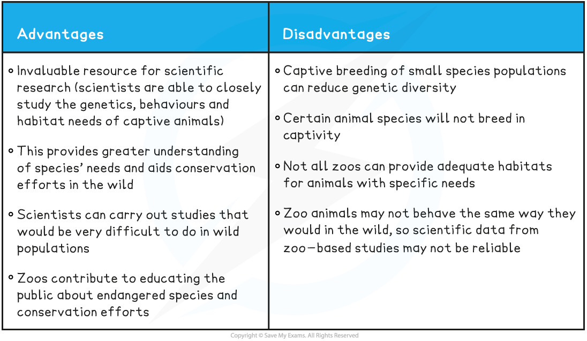

Conservation of Biodiversity
----------------------------

* When species go extinct it leads to an overall <b>decrease in biodiversity</b>
* In recent times many species have already gone extinct, while others are <b>endangered</b>
* An endangered species is a <b>species that is being threatened with extinction</b>
* It is therefore important that these species are <b>conserved</b> to prevent them from going extinct
* Conservation of endangered species can be approached in several different ways
* Ideally a species should be <b>kept in their natural habitat</b>, as all the support systems they need to maintain life already exist there

  + National parks and marine parks are examples of conservation methods that do this
* When it is not possible to do this endangered species can be captured and placed in <b>captivity</b> for conservation efforts

  + <b>Zoos</b> and<b> botanic gardens</b> take part in conservation programmes
* Scientists have also come up with several methods to try and ensure the <b>long-term survival </b>of endangered species through frozen zoos and seed banks
* <b>Conservation</b> of species refers to <b>protecting</b> and <b>managing</b> them for future generations

#### Seed banks

* A <b>seed bank</b> is a facility that conserves plant diversity by drying and storing seeds in a temperature-controlled environment
* Usually, seeds of the same species are collected from different sites to <b>maintain genetic diversity</b>
* If the plant species goes extinct then the seeds can be used to grow them again
* Seeds can only be stored for so long. After a certain period of time the stored seeds are grown into plants and fresh seeds for storage are taken from those plants
* The <b>Svalbard Global Seed Vault </b>in Norway has almost 1 million species of plant seed. It is located in the Arctic Circle, within ideal environmental conditions
* Many organisations send seeds from crop plants to be stored there for safekeeping
* Some plants have <b>seeds that cannot be frozen</b> such as coffee and cocoa plants

  + In order to preserve the genetic diversity of these plants successive generations must be grown or tissue cultures taken
* There are <b>advantages</b> and <b>disadvantages</b> of using seed banks
* Seed banks make valuable contributions to <b>scientific research</b>

  + It provides an opportunity to investigate how to <b>successfully grow</b> plants from seeds
  + They <b>provide a stock </b>of endangered plants that could be useful to humans (e.g. medicinal plant species, crop plant species) taking pressure off of wild populations
* It is important to note, however, that data gathered from seed banks may not be representative of wild populations due to the small, genetically limited, sample size
* Seed banks also educate people about endangered species and increase interest in conserving these species

  + For example, people can be trained to set up local seed banks, which involves the community

<b>Advantages & Disadvantages of Seed Banks Table</b>

#### Zoos

* <b>Zoos</b> can also contribute to the conservation of endangered animal species
* <b>Captive breeding</b> programmes can breed individuals of a species so their offspring can be <b>released into the wild</b>
* Zoos are an invaluable resource for <b>scientific research</b>

  + Scientists are able to closely study animal’s <b>genetics</b>, <b>behaviours</b> and <b>habitat needs</b>
* There are some <b>problems with zoos</b> and their role in conservation:

  + Captive breeding of small species populations can <b>reduce genetic diversity</b>
  + Certain animal species will <b>not breed in captivity</b>
  + Not all zoos can provide <b>adequate habitats</b> for animals with specific needs
  + Many people question the <b>ethics</b> of keeping animals in <b>captivity</b>
* There are stories of both <b>success and failure</b> when it comes to zoos and conservation:

  + The oryx is an antelope-like species that was saved from extinction and reintroduced into the wild in Africa thanks to zoos and captive breeding programmes
  + Pandas have been in captive breeding programs for over 60 years and not a single panda has been reintroduced into the wild
* Zoos make a valuable contribution to <b>scientific research</b> in a variety of ways:

  + They provide information about the<b> specific needs</b> (behavioural, physiological, nutritional) of different animal species, which <b>aids</b> <b>conservation efforts in the wild</b>
  + They can carry out studies that would be very difficult to do in <b>wild populations</b>
* Animals in zoos <b>may not behave the same</b> way they would in the wild, so this raises questions about the <b>reliability of the data </b>from some <b>zoo-based studies</b>
* Zoos contribute to <b>educating people </b>about endangered species by bringing them close to these organisms and <b>increasing public enthusiasm </b>for,<b> </b>and <b>public engagement </b>with, conservation efforts

<b>Advantages & Disadvantages of Zoos Table</b>

#### Reintroduction back into the wild

* Plants and animals from these facilities can be released back into their natural habitat, which holds certain <b>benefits</b>:

  + This will help <b>prevent </b>them from <b>going extinct</b> in the wild
  + <b>Organisms that rely </b>on these plants and animals for food or habitat may also benefit from their presence
  + This contributes toward <b>restoring lost or degraded habitats</b>
* Reintroduction may have some <b>negative effects</b> too:

  + These organisms may carry <b>new diseases</b> that will harm other organisms living in that habitat
  + Reintroduced animals may <b>lack the ability </b>to <b>find food</b> or <b>communicate</b> effectively with members of their own species