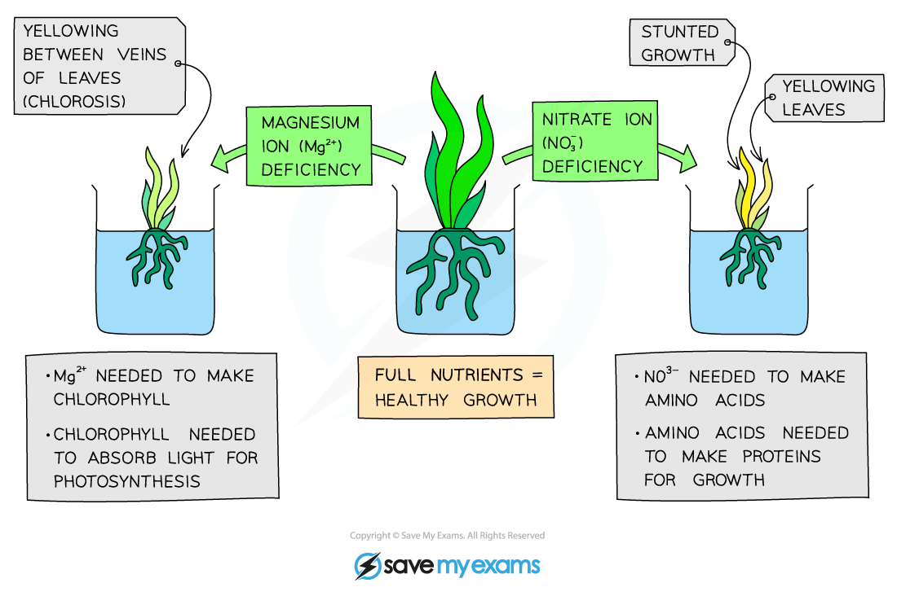

Importance of Water & Inorganic Ions to Plants
----------------------------------------------

* Plant cells perform a variety of different functions
* In order to perform these functions efficiently, the plant requires<b> water</b> and <b>inorganic ions</b> (minerals)
* They are absorbed through the <b>root hairs</b> on the root and travel up the stem in <b>xylem vessels</b>
* A plant will show certain <b>symptoms</b> (e.g. yellow leaves, stunted growth) when there is a <b>deficiency</b> in any one of these substances

#### Water

* Important component required for <b>photosynthesis</b>
* Provides a <b>transport medium</b> for minerals
* Maintains <b>turgidity</b> in plant cells though pressure in cell vacuoles
* <b>Regulates temperature</b> - to ensure that enzymes can function at their optimum rate

#### Magnesium ions

* Important requirement for the <b>production of chlorophyll</b>
* This provides the green colour of stems and leaves and is essential for photosynthesis

#### Nitrate ions

* Without nitrate ions, the plant would be unable to s<b>ynthesise DNA</b>, <b>proteins</b> and <b>chlorophyll</b>

  + <b>Enzymes</b> are important proteins for which nitrate ions are needed
* These molecules are essential for <b>plant growth</b>, as well as the production of <b>fruit</b> and <b>seeds</b>

#### Calcium ions

* These form important <b>cell wall components</b>
* Plants require calcium ions for proper <b>growth</b>

<i><b>Diagram showing the importance of magnesium and nitrate ions for plants</b></i>

Practical: Investigating Plant Mineral Deficiencies
---------------------------------------------------

* The following experiment could be done with any one of the mineral ions mentioned earlier
* For this example, the focus will be on investigating the effect of a <b>calcium deficiency</b> on plants

#### Apparatus

* Nutrient broths
* Test tubes
* Seedlings
* Aluminium foil
* Mass balance

#### Method

* Prepare three nutrient broths containing every mineral that a plant requires, but with different concentrations of <b>calcium ions</b> in each (<b>high</b>, <b>medium</b> and <b>low</b>)

  + Label three test tubes for each of the nutrient broths (three 'high', three 'medium' and three 'low' = nine in total)
* Take <b>nine seedlings</b>, ensuring that they are from the same plant and are the same age, and <b>record the mass</b> of each
* Place one seedling on top of each test tube, <b>suspending the roots</b> in the nutrient broth
* Cover the test tubes with aluminium foil to <b>keep light away</b> from the broth
* Place the test tubes near a <b>source of light</b> and leave them for a few days
* Remove each plant from the broth and carefully blot it dry before <b>measuring the mass </b>again
* Record the end mass and use that to<b> calculate the mean change in mass</b> of the plants for each of the different nutrient broths
* Make a note of any <b>physical differences</b> between the plants of the different groups

#### Variation of the practical

* Another variation of the experiment mentioned above, is to investigate the effect on plant growth when the mineral is <b>completely lacking</b>
* In this experiment you would have broths that contains all of the minerals, except the one that is being investigated
* There would also need to be two <b>control broths</b>

  + One would contain all the minerals
  + The other would contain no minerals