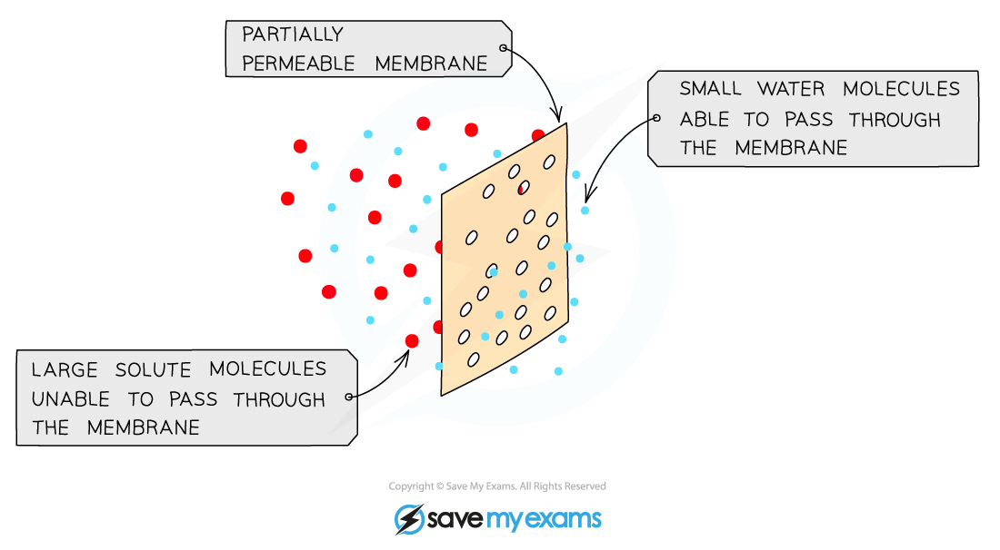
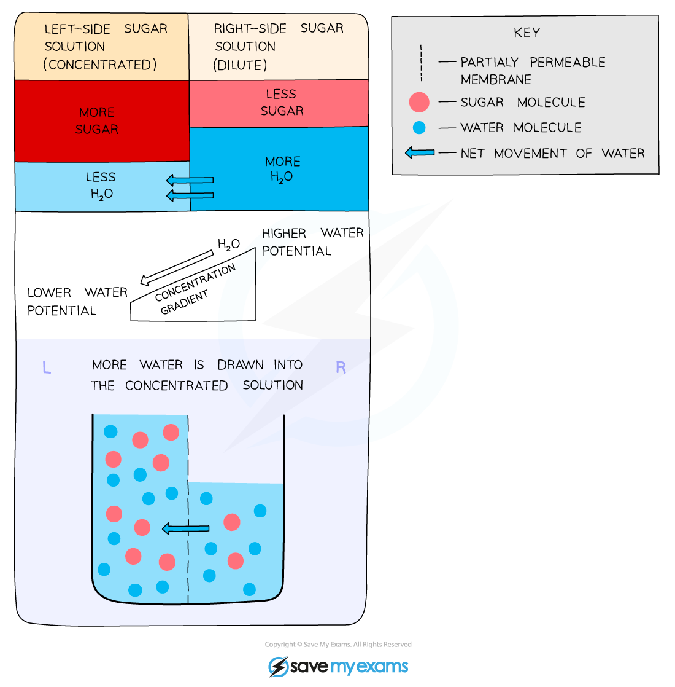

Osmosis
-------

* All cells are surrounded by a cell surface membrane which is <b>partially permeable</b>
* Water can move in and out of cells across the cell surface membrane by a process called <b>osmosis</b>

  + Osmosis is the <b>net movement of water molecules</b> from a region of <b>lower solute concentration </b>to a region of <b>higher solute concentration</b> through a partially permeable membrane

    - Water molecules move from a dilute solution to a concentrated solution
* In doing this, water is <b>moving down its concentration gradient</b>, so osmosis is a specialised form of diffusion

  + Water molecules will move from an area of <b>more free water molecules</b> to an area of <b>fewer free water molecules</b>

    - Water molecules are considered 'free' when they are <b>not surrounding substances in a solution</b>; when a substance dissolves it becomes surrounded by water molecules; such water molecules are <b>no longer free </b>and <b>cannot move through a membrane</b> readily
* Cell membranes are partially permeable, allowing small molecules like water through but not larger molecules such as solutes

  + Although water molecules are polar they can still pass through the bilayer because of their small size.

<i><b>Osmosis is the movement of water molecules from a dilute to a concentrated solution through a partially permeable membrane</b></i>

<i><b>Osmosis is the movement of water molecules down their concentration gradient. Note that 'water potential' is a term used to describe the number of free water molecules present.</b></i>

* Osmosis is important because it constantly affects the <b>cells </b>of living organisms

  + Cell cytoplasm consists of <b>water and dissolved substances</b>
  + Cells<b> lose or take on water </b>depending on the number of free water molecules in their surroundings in comparison to their cytoplasm
* When cells are placed in pure water, which has the highest possible number of free water molecules, water <b>moves into the cells by osmosis</b> and the cells <b>swell</b>

  + In animal cells this could lead to cell <b>bursting</b>
  + In plant cells the <b>cell wall prevents bursting</b>
* When cells are placed into a solution that has a smaller number of free water molecules than their cytoplasm, e.g. a concentrated glucose solution, water moves <b>out of the cells by osmosis</b> and the cells <b>shrink</b>

  + In animal cells the entire cell <b>shrivels</b>
  + In plant cells the vacuole and cytoplasm shrink but the <b>cell wall maintains the overall shape of the cell</b>