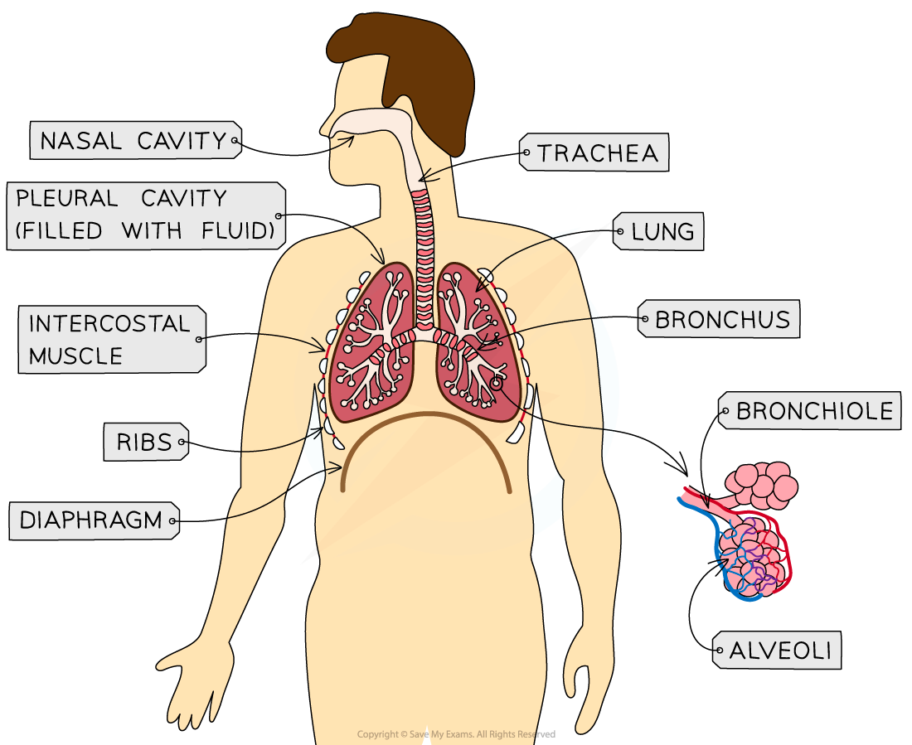

The Mammalian Lung: Structure & Function
----------------------------------------

* The <b>lungs</b> of air-breathing animals provide an ideal exchange surface for the diffusion of gases

  + The lungs are located in the <b>thorax</b>, or chest cavity
  + Some animals rely entirely on their lungs for gas exchange, while amphibians use lungs alongside gas exchange across the skin
* The role of lungs is to <b>maximise gas exchange</b> while <b>minimising the loss of water</b> across the exchange surface
* Mammals have very <b>efficient</b> gas exchange structures in their lungs

<i><b>The lungs are located in the thorax, and enable efficient gas exchange</b></i>

* <b>Trachea</b>

  + The trachea is the <b>tube</b> that allows air to travel to the lungs
  + It contains c-shaped rings of <b>cartilage</b> that ensure that the tube <b>remains open</b> at all times and does not collapse

    - The c-shape prevents any friction from rubbing with the oesophagus located close behind, as well as providing increased flexibility when food is being swallowed
  + There is a layer of <b>mucus</b> covering the lining of the trachea that helps to <b>trap dust and pathogens</b>, preventing them from entering the lungs where they could cause infection

    - Tiny hairs called <b>cilia</b> are also found on the lining of the airways, where they <b>waft mucus</b> towards the top of the trachea, removing any trapped particles and pathogens from the airways
* <b>Bronchi</b>

  + Bronchi (singular bronchus) have a similar structure to the trachea but they have <b>thinner walls</b> and a <b>smaller diameter</b>
  + The cartilage rings in the bronchi are full circles rather than c-shaped
* <b>Bronchioles</b>

  + Bronchioles are narrow, self-supporting tubes with thin walls
  + There is a <b>large number of bronchioles</b> present in the gas exchange system
  + Each one varies in size, getting smaller as they get closer to the alveoli
  + The larger bronchioles possess <b>elastic fibres and smooth muscle </b>that enable adjustment of the size of the airway to increase or decrease airflow

    - The smallest bronchioles do not have any smooth muscle but they do have elastic fibres
* <b>Alveoli</b>

  + Groups of alveoli are located at the ends of the bronchioles
  + The <b>alveolar wall</b> consists of a <b>single layer of flattened</b>, or <b>squamous</b>, <b>epithelium</b>

    - The squamous epithelium forms the alveolar wall and is very <b>thin and permeable</b> for the <b>easy diffusion</b> of gases
    - The alveoli are surrounded by<b> elastic fibres</b>, allowing them to <b>stretch during inhalation</b>
  + Alveoli are surrounded by an extensive capillary network

    - <b>Carbon dioxide diffuses out of the capillaries and into the alveoli</b> to be exhaled, while <b>oxygen diffuses from the alveoli and into the capillaries</b> to be carried around the body
  + A layer of moisture lines the alveoli, facilitating the diffusion of gases

    - Oxygen and carbon dioxide are able to <b>dissolve</b> in the layer of moisture, so exchange occurs <b>in solution </b>rather than with the air inside the alveoli

<i><b>Human alveoli are adapted for efficient gas exchange</b></i>

#### Examiner Tips and Tricks

When describing the features of the alveoli, be careful to refer to the alveolar epithelium as the 'wall of the alveoli' or the 'alveolar wall', and not as a 'cell wall'; cell walls are only found in plants!