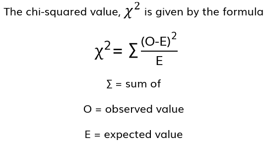
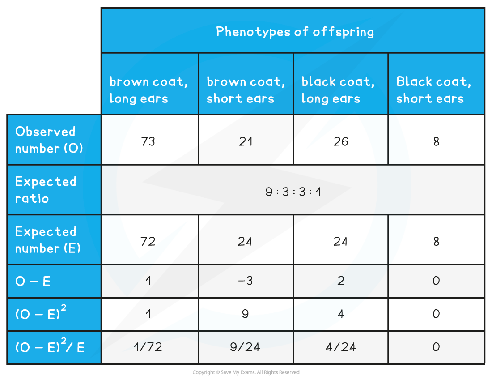
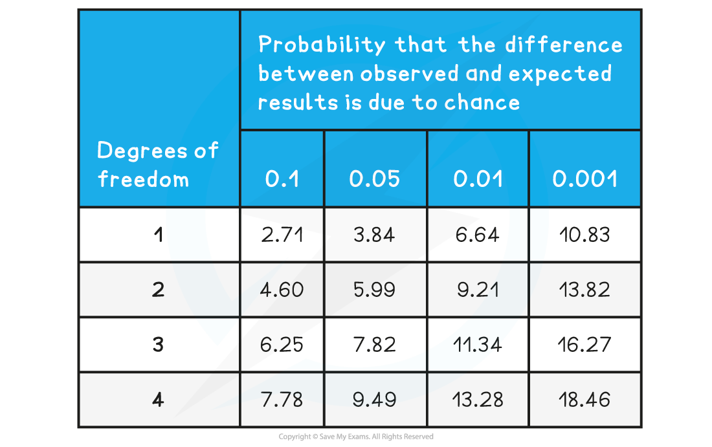

Chi-squared Test
----------------

* The <b>difference between expected and observed results</b> in experiments can be statistically significant or insignificant (happened by chance)
* If the difference between results is statistically significant it can suggest that <b>something else is happening</b> in the experiment that isn’t being accounted for

  + For example linkage between genes
* A statistical test called the <b>chi-squared test</b> determines whether there is a significant difference between the observed and expected results in an experiment
* The chi-squared test is completed when the data is categorical (data that can be grouped)
* It is important to formulate a <b>null hypothesis</b> - this states that there is no significant difference between the observed and expected results

#### Calculating chi-squared values

* Obtain the expected and observed results for the experiment
* Calculate the difference between each set of results
* Square each difference (as it is irrelevant whether the difference is positive or negative)
* Divide each squared difference by the expected value and get a sum of these answers to obtain the chi-squared value

#### Analysing chi-squared values

* To work out what the chi-squared value means we need to compare the chi-squared value to a <b>critical value</b>
* The critical value is read from a table of critical values and depends on the <b>probability level</b> used and the<b> degrees of freedom</b>

  + Biologists generally use a probability level of <b>0.05 </b>or <b>5 %</b>

    - This means that there is only a 5 % probability that any difference between O and E has occurred by chance
  + The degrees of freedom takes into account the number of comparisons made, and is calculated  as follows:

<b>degrees of freedom = number of classes - 1</b>

* E.g. if there are 2 phenotypes then 2 - 1 = 1 and there is 1 degree of freedom
* When the chi-squared value is compared to the critical value conclusions are drawn as follows:

  + If the chi-squared value is <b>greater than</b>, or equal to, the critical value then <b>there is a significant difference</b> between observed and expected results

    - A factor other than chance is causing the difference
    - The null hypothesis can be rejected
  + If the chi-squared value is <b>smaller than</b> the critical value then<b> there is no significant difference </b>between observed and expected values

    - Any differences are due to chance
    - The null hypothesis is accepted
* It is possible to use the critical values table to make an assessment of the probability level at which any difference between observed and expected valued becomes significant, e.g.

  + A chi-squared value might be smaller than the critical value at a probability level of 0.05, but larger than the critical value at a probability level of 0.1

    - This would indicate that the probability that any difference is due to chance is between 5 -10 %
  + A chi-squared value might be larger than the critical value at a probability level of 0.001

    - This indicates that there is a less than 0.1 % probability that any difference between O and E is due to chance

#### Worked Example

An experiment was carried out into inheritance of two genes in rabbits; one for coat colour and one for ear length. In this dihybrid cross the expected ratio of phenotypes was 9 : 3 : 3 : 1.

Rabbits with the heterozygous genotype were bred together and the phenotypes of all the offspring were recorded.

Complete a chi-squared test to determine whether the difference between observed and expected offspring ratios is significant.

<b>Step 1: complete a table like the one below</b>

Note that the expected values can be calculated as follows:

9 + 3 + 3 + 1 = 16

128 (total number of rabbits) ÷ 16 = <b>8</b>

3 x 8 = <b>24</b>

9 x 8 = <b>72</b>

<b>Step 2: use the table contents to calculate the chi-squared value</b>

1 ÷ 72 = 0.014

9 ÷ 24 = 0.375

4 ÷ 24 = 0.167

 chi-squared value = ∑(O - E)2 ÷ E

= 0.014 + 0.375 + 0.167 + 0

= <b>0.56</b>

<b>Step 3: compare the chi-squared value to the critical value</b>

The degrees of freedom can be calculated as follows:

* In this example there are 4 phenotypes:

4 - 1 = <b>3 degrees of freedom</b>

We are biologists so we work at a <b>probability level of 0.05</b>

<b>The critical value is therefore</b> <b>7.82</b>

<b>Step 4: draw conclusions</b>

* The chi-squared value of 0.56 is<b> smaller than</b> the critical value of<b> </b>7.82
* This means that there is <b>no significant difference</b> between the expected and observed results and any differences that do occur are <b>due to chance</b>

  + 0.56 would be located somewhere to the left-hand side of the table, indicating that there is a higher than 10 % probability that the difference between O and E is due to chance
* A null hypothesis can be accepted

#### Examiner Tips and Tricks

When calculating a chi-squared value it is very helpful to create a table like the one seen in the worked example. This will help you with your calculations and make sure you don’t get muddled up!

You should also be prepared to suggest reasons why results might be significantly different. For example, there could be <b>linkage</b> between the genes being analysed.