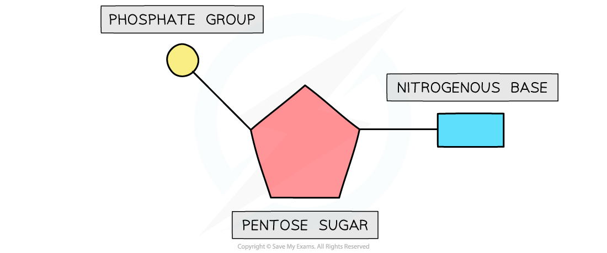
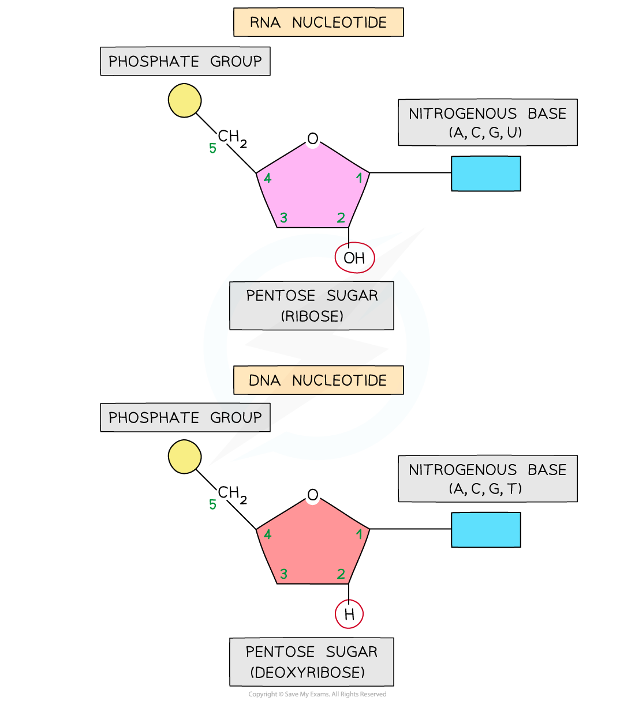
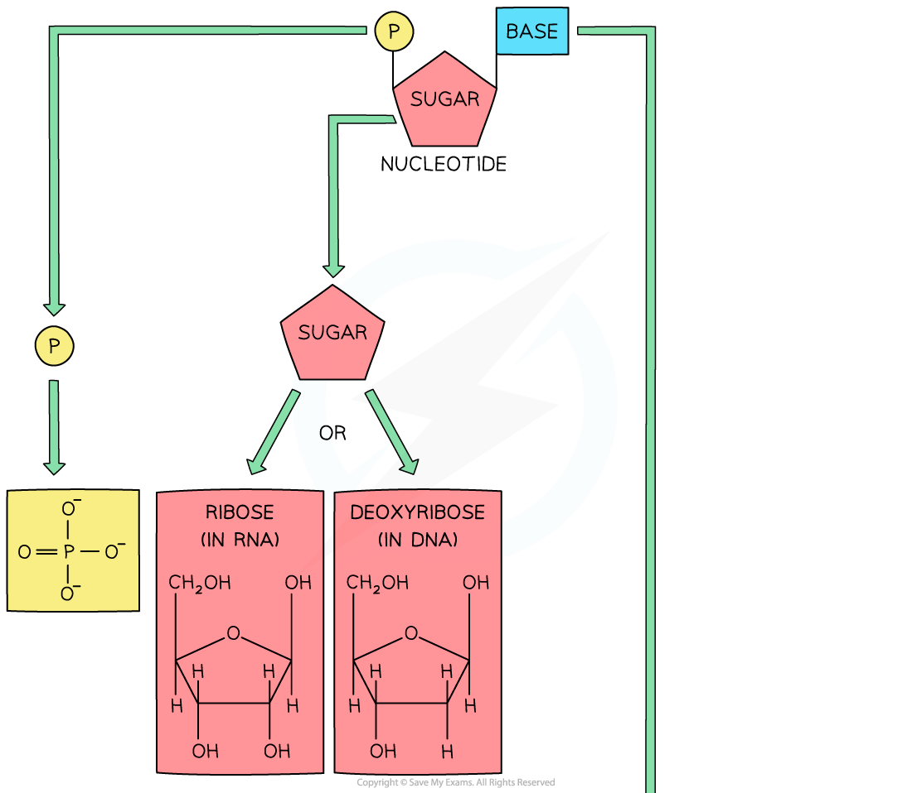
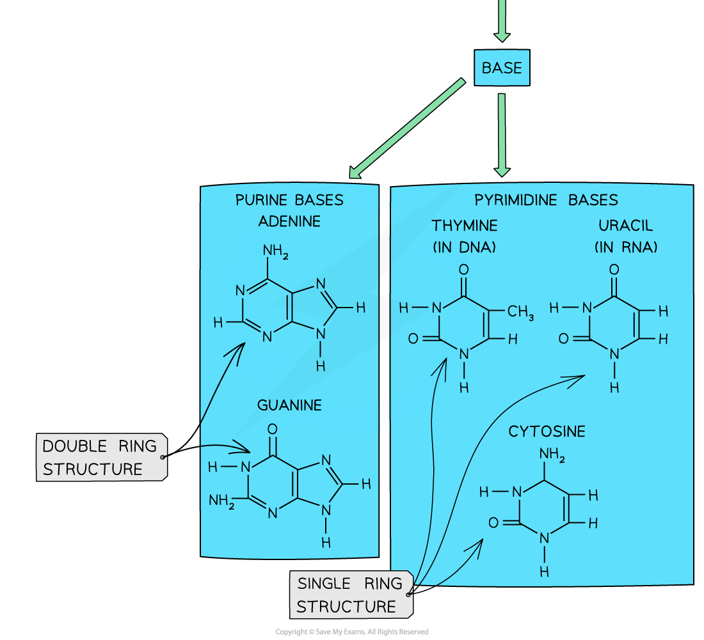
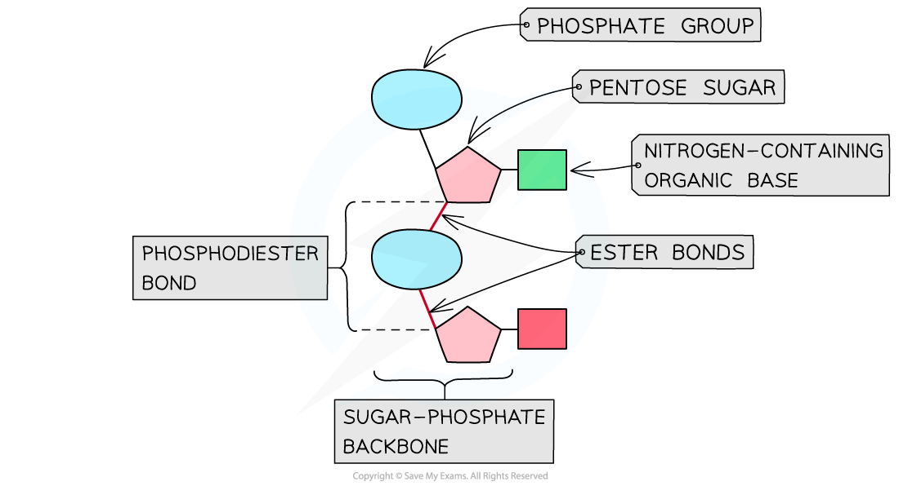

Mononucleotides: Structure
--------------------------

* Both DNA and RNA are <b>polymers</b> that are made up of <b>many repeating units</b> called <b>nucleotides</b>
* Each nucleotide is formed from:

  + A <b>pentose sugar</b> (a sugar with 5 carbon atoms)
  + A nitrogen-containing <b>organic base</b>
  + A <b>phosphate group</b>

<i><b>The basic structure of a mononucleotide</b></i>

#### DNA nucleotides

* The components of a DNA nucleotide are:

  + A <b>deoxyribose</b> sugar with <b>hydrogen</b> at the 2' position
  + A phosphate group
  + One of four nitrogenous bases - adenine (A), cytosine(C), guanine(G) or thymine(T)

#### RNA nucleotides

* The components of an RNA nucleotide are:

  + A<b> ribose</b> sugar with a hydroxyl (OH) group at the 2' position
  + A phosphate group
  + One of four nitrogenous bases - adenine (A), cytosine(C), guanine(G) or <b>uracil (U)</b>
* The presence of the <b>2' hydroxyl group</b> makes <b>RNA more susceptible to hydrolysis</b>

  + This is why DNA is the storage molecule and RNA is the transport molecule with a shorter molecular lifespan

<i><b>RNA nucleotide compared with an DNA nucleotide</b></i>

#### Purines & Pyrimidines

* The <b>nitrogenous base</b> molecules that are found in the nucleotides of DNA (A, T, C, G) and RNA (A, U, C, G) occur in <b>two structural forms</b>: <b>purines</b> and <b>pyrimidines</b>

  + The bases <b>adenine</b> and <b>guanine</b> are <b>purines</b> – they have a <b>double ring structure</b>
  + The bases <b>cytosine</b>, <b>thymine</b> and <b>uracil</b> are <b>pyrimidines</b> – they have a <b>single ring structure</b>

<i><b>The molecular structure of each base is different, depending on whether they are a purine or pyrimidine</b></i>

The Phosphodiester Bond
-----------------------

* DNA and RNA are polymers (<b>polynucleotides</b>), meaning that they are made up of many nucleotides joined together in long chains
* Separate <b>nucleotides are joined via condensation reactions</b>

  + These condensation reactions occur between the <b>phosphate group</b> of one nucleotide and the <b>pentose sugar</b> of the next nucleotide
* A condensation reaction between two nucleotides forms a <b>phosphodiester bond</b>

  + It is called a phospho<b>di</b>ester bond because it consists of a phosphate group and <b>two</b> ester bonds (phosphate with double bond oxygen attached - oxygen - carbon)
* The chain of alternating phosphate groups and pentose sugars produced as a result of many phosphodiester bonds is known as the <b>sugar-phosphate backbone</b> (of the DNA or RNA molecule)

<i><b>A section of a polynucleotide showing a single phosphodiester bond (and the positioning of the two ester bonds and the phosphate group that make up the phosphodiester bond)</b></i>

#### Examiner Tips and Tricks

Although DNA and RNA nucleotides are very similar, make sure you know the <b>key differences</b> between them: unlike DNA, <b>RNA nucleotides never contain the nitrogenous base thymine</b> (in place of this they contain the nitrogenous base <b>uracil</b>) and unlike DNA, RNA nucleotides contain the pentose sugar <b>ribose</b> (instead of deoxyribose).