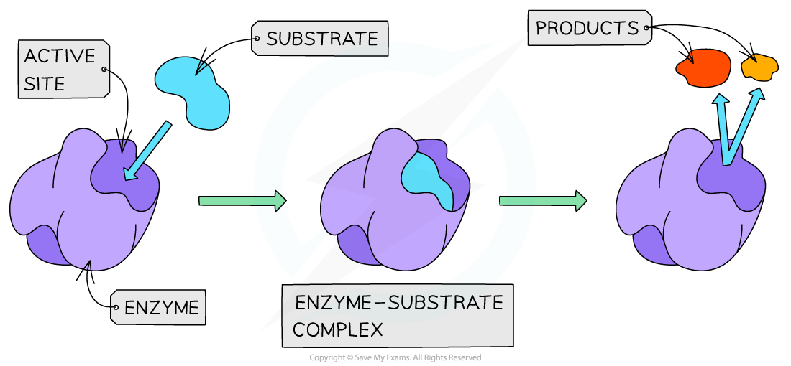
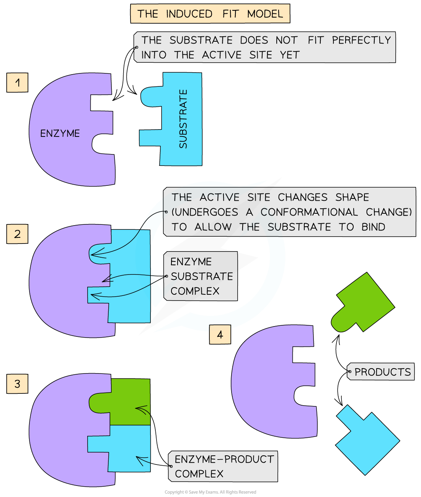

Mode of Enzyme Action
---------------------

* Enzymes are <b>globular proteins</b>
* This means their <b>3D shape</b> (as well as the shape of the <b>active site</b> of an enzyme) is determined by the complex tertiary structure of the protein that makes up the enzyme and is therefore <b>highly specific</b>
* Enzymes have a unique <b>active site</b> where <b>specific substrates bind </b>forming an <b>enzyme-substrate complex</b>
* The <b>active site</b> of an enzyme has a <b>specific shape</b> to fit a <b>specific substrate</b>
* Extremes of <b>heat</b> or <b>pH</b> can alter the protein structure and <b>change the shape</b> of the active site, <b>preventing</b> substrate binding – this is called <b>denaturation</b>
* Substrates <b>collide</b> with the enzymes active site and this must happen at the <b>correct orientation and speed</b> in order for a reaction to occur

<i><b>The active site of an enzyme has a specific shape to fit a specific substrate (when the substrate binds an enzyme-substrate complex is formed)</b></i>

#### Enzyme specificity

* The <b>specificity</b> of an enzyme is a result of the <b>complementary nature</b> between the <b>shape</b> of the <b>active site</b> on the enzyme and its <b>substrate</b>(s)
* Only <b>one specific substrate will fit into one specific active site</b>
* The shape of the active site (and therefore the specificity of the enzyme) is determined by the <b>complex tertiary structure</b> of the <b>protein</b> that makes up the enzyme:

  + Proteins are formed from chains of amino acids held together by peptide bonds
  + The order of amino acids determines the shape of an enzyme
  + If the order is altered, the resulting three-dimensional shape changes
* If the <b>tertiary structure of the protein is altered</b> in any way, the shape of the <b>active site will change </b>and the substrate will no longer fit the active site
* This means that an enzyme-substrate complex will not be able to form and the product(s) will not be produced: <b>the enzyme will not be able to carry out its function</b>

<i><b>An example of enzyme specificity </b></i>

#### The lock-and-key hypothesis

* In the 1890’s the first model of enzyme activity was described by Emil Fischer:

  + He suggested that both enzymes and substrates were <b>rigid structures</b> that <b>locked</b> into each other very <b>precisely</b>, much like a key going into a lock
  + This is known as the ‘<b>lock-and-key hypothesis</b>’

<i><b>The Lock and Key hypothesis </b></i>

#### The induced-fit hypothesis

* The lock-and-key model was later <b>modified</b> and adapted to our current understanding of enzyme activity, permitted by advances in techniques in the molecular sciences
* The <b>modified</b> <b>model</b> of enzyme activity (first proposed in 1959) is known as the ‘<b>induced-fit hypothesis</b>’
* Although it is very similar to the lock and key hypothesis, in this model the enzyme and substrate <b>interact</b> with each other:

  + The enzyme and its active site (and sometimes the substrate) can <b>change shape</b> slightly as the substrate molecule enters the enzyme
  + These changes in shape are known as <b>conformational changes</b>
  + The conformational changes ensure an <b>ideal binding arrangement</b> between the enzyme and substrate is achieved
  + This <b>maximises the ability of the enzyme to catalyse the reaction</b>

<i><b>The Induced Fit model of enzyme action</b></i>