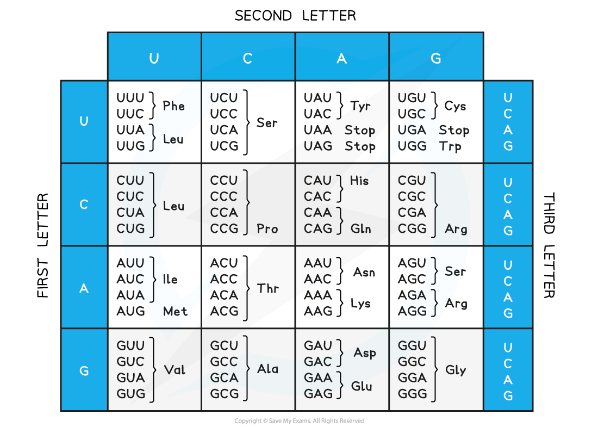
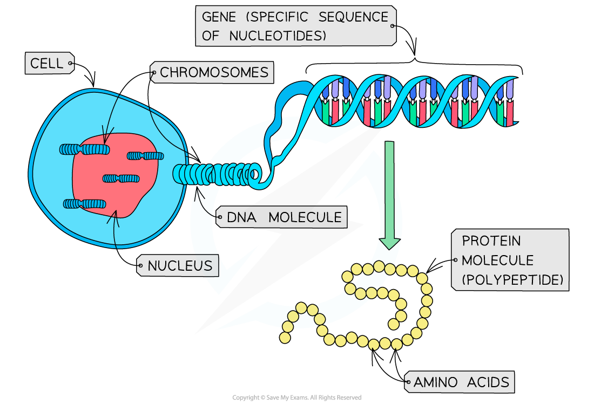

Nature of the Genetic Code
--------------------------

#### The triplet code

* The sequence of DNA nucleotide bases found within a gene is determined by a <b>triplet</b> (three-letter) <b>code</b>
* Each sequence of <b>three bases</b> (i.e. each triplet of bases) in a gene codes for <b>one amino acid</b>
* These <b>triplets codes for different amino acids</b> – there are 20 different amino acids that cells use to make up different proteins
* For example:

  + CAG codes for the amino acid valine
  + TTC codes for the amino acid lysine
  + GAC codes for the amino acid leucine
  + CCG codes for the amino acid glycine
* Some of these triplets of bases code for <b>start </b>(AUG – methionine) <b>and stop signals</b>
* These start and stop signals <b>tell the cell where individual genes start and stop</b>
* As a result, the cell <b>reads the DNA correctly</b> and <b>produces the correct sequences of amino acids</b> (and therefore the correct protein molecules) that it requires to function properly

#### The genetic code is non-overlapping

* The non-overlapping nature of the genetic code means that each base is <b>only read once</b>
* <b>The adjacent codons do not overlap</b>
* A non-overlapping code means that the same letter is not used for two different codons; in other words, no single base can take part in the formation of more than one codon

#### The genetic code is degenerate

* There are <b>four bases</b>, so there are <b>64</b> different codons (triplets) possible (43 = 64), yet there are only 20 amino acids that commonly occur in biological proteins

  + This is why the code is said to be <b>degenerate</b>: multiple codons can code for the same amino acids
  + The degenerate nature of the genetic code can <b>limit</b> the effect of <b>mutations</b>

<i><b>The mRNA codons and their amino acids, showing the degenerate nature of the genetic code</b></i>

#### The genetic code is universal

* The genetic code is also <b>universal</b>, meaning that almost every organism uses the <b>same code</b> (there are a few rare and minor exceptions)
* The <b>same triplet codes code for the same amino acids in all living things</b> (meaning that genetic information is transferable between species)

  + The universal nature of the genetic code is why genetic engineering (the transfer of genes from one species to another) is possible

#### Examiner Tips and Tricks

You will not be required to memorise specific codons and the amino acids for which they code.

Definition of a Gene
--------------------

* A <b>gene</b> is a <b>sequence of nucleotides </b>that forms part of a DNA molecule (one DNA molecule contains many genes)
* This sequence of nucleotides (the gene) <b>codes for the production of a specific polypeptide</b> (protein)
* Protein molecules are made up of a series of <b>amino acids</b> bonded together
* The <b>shape</b> and <b>behaviour</b> of a protein molecule depends on the <b>exact sequence </b>of these amino acids (the initial sequence of amino acids is known as the <b>primary structure</b> of the protein molecule)
* The <b>genes in DNA molecules, therefore, control protein structure</b> (and as a result, protein function) as <b>they determine the exact sequence in which the amino acids join together</b> when proteins are synthesised in a cell

<i><b>A gene is a sequence of nucleotides that codes for the production of a specific protein molecule (polypeptide)</b></i>