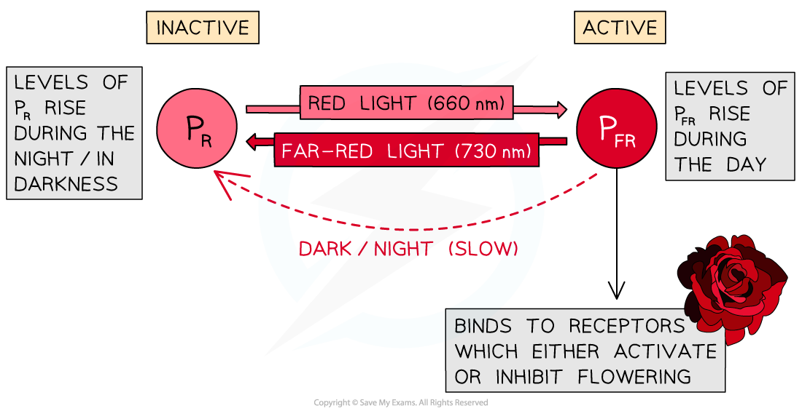

Phytochrome
-----------

* Flowering in plants is controlled by the <b>stimulus</b> of night length

  + Nights are shorter during the spring and summer and longer in the autumn and winter
  + Some plants flower when nights are short and some flower when nights are long
* When the nights reach a certain length, genes that control flowering may be <b>switched on or off, </b>leading to the<b> activation or inhibition of flowering</b>

  + Genes that are switched on <b>are </b><b>expressed</b>, leading to <b>production of the polypeptides</b> for which they code, while genes that are switched off <b>are not expressed</b>, so the polypeptides for which they code <b>are not produced</b>
* The length of night can be detected by a plant because it determines the quantities of different forms of a pigment called <b>phytochrome </b>in the leaf

#### Phytochrome

* The phytochrome pigment exists in two forms

  + <b>P</b><b>R</b><b> </b>is the <b>inactive form</b> of phytochrome, it absorbs light from the <b>red</b> part of the spectrum (wavelength 660 nm)
  + <b>P</b><b>FR</b> is the <b>active form</b> of phytochrome, it absorbs light from the <b>far red</b> part of the spectrum (wavelength 730 nm)
* Absorption of different wavelengths of light causes a <b>reversible</b> <b>conversion between the P</b><b>R</b><b> and P</b><b>FR</b> forms of phytochrome

  + When <b>P</b><b>R</b><b> absorbs red light</b> (660 nm) <b>it is converted into P</b><b>FR</b>
  + When <b>P</b><b>FR</b><b> absorbs far red light</b> (730 nm)<b> it is converted back into P</b><b>R</b>
  + In the <b>absence of red light, </b>the unstable <b>P</b><b>FR</b><b> gradually converts back into P</b><b>R</b>
* <b>During the day </b>levels of <b>P</b><b>FR</b> rise

  + Sunlight contains more wavelengths at 660 nm than 730 so the conversion from PR to PFR occurs more rapidly in the daytime than the conversion from PFR to PR
* <b>During the night </b>levels of <b>P</b><b>R </b>rise

  + Red light wavelengths are not available in the darkness and PFR converts slowly back to PR

<i><b>PR is converted to PFR in a reversible reaction which controls flowering</b></i>

#### E.g. long day plants

* Long day plants flower when the nights are <b>short </b>e.g. in summer

  + When nights are short, the <b>day length is longer</b>, hence the term 'long day plants'
* In <b>long day plants</b> high levels of the <b>active form of phytochrome activate flowering</b>
* Flowering occurs due to the following process

  + Days are long so <b>P</b><b>R </b><b>is converted to P</b><b>FR </b><b>at a greater rate</b> than PFR is converted to PR
  + The <b>active form of phytochrome</b>, PFR, is present at <b>high levels</b>
  + High levels of PFR <b>activate flowering </b>

    - PFR activates expression of genes that stimulate flowering
    - The active gene is transcribed and translated
    - The resulting protein causes flowers to be produced rather than stems and leaves