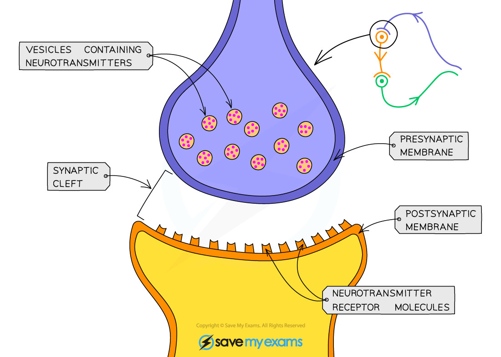

Action of Drugs on Synapses
---------------------------

* The chemicals in <b>drugs</b> can have a major impact on the <b>functioning of the brain and nervous system</b>
* Some prescription drugs can have a <b>beneficial effect</b> on those suffering from neurological disorders while recreational drugs can have a <b>damaging</b> or even fatal effect
* Many drugs impact the nervous system by altering the events that occur at a <b>synapse</b>
* Drugs can <b>increase transmission</b> of impulses at a synapse by

  + Causing more neurotransmitter to be <b>produced</b> in the synaptic knob
  + Causing more neurotransmitter to be <b>released</b> at the presynaptic membrane
  + Imitating the effect of a neurotransmitter by <b>binding to and activating receptors</b> on the postsynaptic membrane
  + <b>Preventing the breakdown</b> of neurotransmitters by enzymes
  + <b>Preventing the reuptake</b> of neurotransmitters by the presynaptic cell
* Drugs can <b>decrease transmission</b> of impulses at a synapse by

  + <b>Preventing production</b> of neurotransmitter in the presynaptic knob
  + <b>Preventing the release</b> of neurotransmitter at the presynaptic membrane
  + Enabling neurotransmitter to gradually leak out of the presynaptic knob so there is little left when an action potential arrives

    - The neurotransmitter that leaks out of the cell is <b>destroyed by enzymes</b>
  + Binding to receptors on the postsynaptic membrane and so <b>preventing neurotransmitters from binding</b>

<i><b>Drugs can influence the transmission of nerve impulses at synapses</b></i>

#### MDMA

* MDMA is a <b>recreational drug</b> that is also known as ecstasy

  + Its use and sale are criminal offences in most parts of the world
* MDMA effects multiple neurotransmitters, most notably <b>serotonin</b>

  + MDMA <b>inhibits the reuptake </b>of serotonin into the presynaptic neurone by <b>binding to the specific proteins that enable serotonin reuptake</b>, located on the presynaptic membrane; this increases the amount of serotonin present in the brain

    - Serotonin is usually reabsorbed into the <b>presynaptic neurone to be recycled</b> for future action potentials
  + MDMA also triggers the<b> release of further serotonin</b> from presynaptic neurones, further adding to the increase
* Serotonin can affect people in many ways including their <b>mood</b>, anxiety and sleep
* When an individual takes MDMA they may feel <b>extreme euphoria</b> and enhanced touch and bodily sensations

#### L-dopa

* L-dopa is a drug used to treat the symptoms of <b>Parkinson's disease</b>
* It has a very <b>similar structure to dopamine;</b> a neurotransmitter present at lower levels than usual in the brains of those who suffer from Parkinson's disease
* L-dopa is transported from the blood into the brain, where it is <b>converted into dopamine</b> in a reaction catalysed by the <b>enzyme</b> dopa-decarboxylase
* The effect is to <b>increase levels of dopamine in the brain</b>

  + Note, dopamine cannot be given directly to those who have Parkinson's disease as it cannot cross the barrier between the blood and the brain
* Increased levels of dopamine mean that <b>more nerve impulses are transmitted </b>in parts of the brain that control movement, giving sufferers better control over their movement and lessening the symptoms of Parkinson's disease