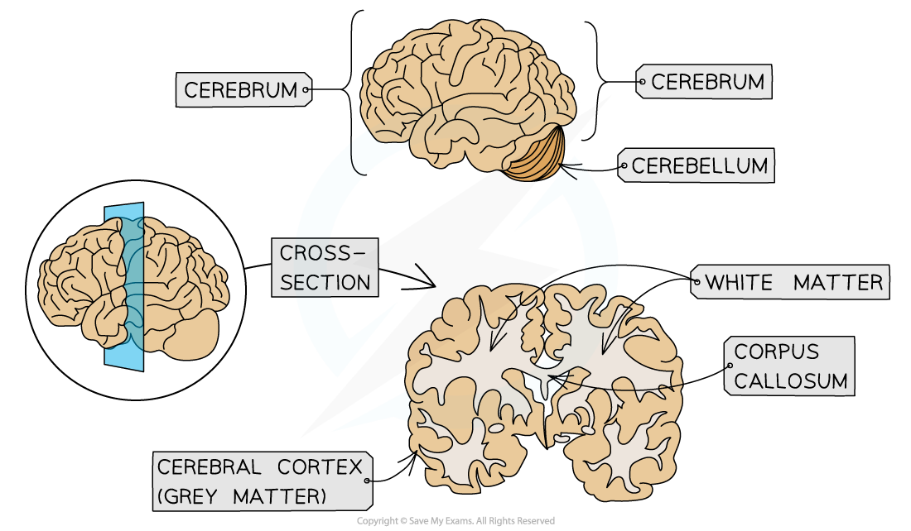

Brain: Structure & Function
---------------------------

* The brain, alongside the spinal cord, is part of the <b>central nervous system </b>(CNS)
* The brain is made of billions of<b> interconnected neurones </b>
* Within the brain are<b> different regions</b> that carry out<b> different functions</b>

<i><b>Different regions of the brain carry out different functions</b></i>

* You need to know the functions of the following brain regions

#### The cerebrum

* The cerebrum is the<b> largest part</b> of the brain in humans, accounting for about 80% of the total mass of the brain
* It carries out a large<b> variety of functions</b> involved with <b>conscious activities</b>, including:

  + Vision
  + Hearing
  + Speech
  + Thinking
  + Memory
* The cerebrum is divided into<b> two halves</b> known as the <b>cerebral hemispheres</b>

  + The hemispheres are joined together by a <b>band of nerve fibres</b> known as the <b>corpus callosum</b>
  + The <b>right hemisphere</b> controls the <b>left side of the body</b> and the <b>left</b> one controls the <b>right side</b>
* The cerebrum has a <b>thin outer layer</b> known as the<b> cerebral cortex</b> or '<b>grey matter</b>'

  + The cerebral cortex consists of the <b>cell bodies of neurones</b>
  + It is<b> highly folded</b>, which <b>increases its surface area</b> and allows it to contain a <b>greater number of neurones</b>

    - With more neurones in the brain, <b>more neurone connections</b> can be made
    - This is important, as the more connections between neurones in the brain, the <b>greater the ability of the brain to carry out more complex behaviours</b>
* Beneath the cerebral cortex or grey matter layer is the '<b>white matter'</b>

  + The white matter consists of the <b>myelinated axons of neurones</b>

<i><b>The cerebrum consists of two hemispheres joined by the corpus callosum</b></i>

#### The hypothalamus

* The hypothalamus monitors <b>the blood</b> as it flows through the brain and, in response, <b>releases hormones</b> or<b> </b>stimulates<b> </b>the<b> </b>neighbouring<b> pituitary gland</b> to release hormones

  + The hypothalamus plays an important role in some homeostatic<b> mechanisms</b>
* Hypothalamus functions include

  + <b>Regulating body temperature</b>

    - The hypothalamus <b>monitors blood temperature </b>and initiates a homeostatic response if this temperature gets too high or too low
  + <b>Osmoregulation</b>

    - Cells in the hypothalamus <b>monitor the water balance of the blood</b> and releases the hormone ADH if the blood becomes too concentrated

      * ADH increases absorption of water in the kidneys
  + <b>Regulating digestive activity</b>

    - The hypothalamus regulates the hormones that control appetite as well as the secretion of digestive enzymes
  + <b>Controlling endocrine functions</b>

    - The hypothalamus causes the pituitary gland to release hormones that control a variety of processes e.g. metabolism, growth and development, puberty, sexual functions, sleep, and mood

#### The cerebellum

* The cerebellum <b>coordinates movement</b>

  + This includes <b>balance;</b> a highly complex function that requires coordination between multiple parts, including the eyes, semicircular canals in the ears, and many muscles

#### The medulla oblongata

* Also known as the <b>medulla</b>
* The medulla contains co-ordination centres that control different functions e.g.

  + <b>The cardiac centre</b> controls heart rate
  + <b>The respiratory centre</b> controls breathing rate