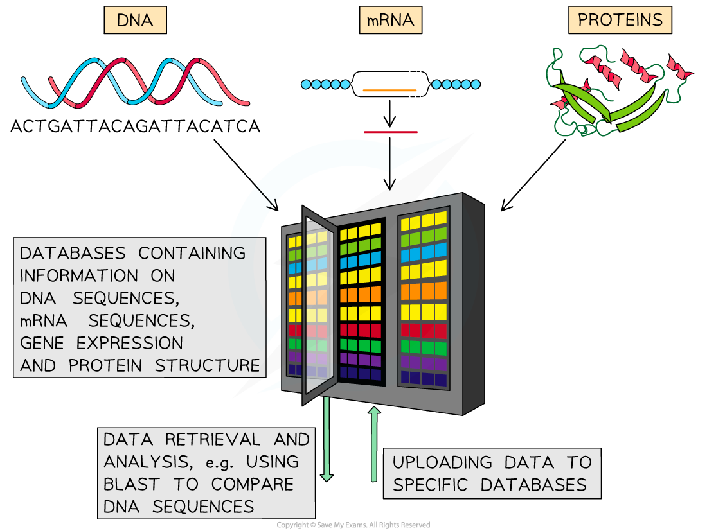

Personalised Medicine
---------------------

* Personalised medicine involves the development of <b>targeted</b> <b>drugs</b> to treat a variety of human diseases in <b>individuals with different </b>genotypes

  + Such drugs can be tested on <b>synthetic tissues</b>; groups of cells <b>cultured in a lab</b> that are <b>genetically identical</b> to certain groups of patients
* Information gathered from genome projects like the Human Genome Project (HGP) can be used to develop <b>genomic medicine, </b>which uses information about the <b>genes </b>to design medical treatments

  + The HGP involved the <b>sequencing</b> of the entire human genome
  + The information gained during the HGP is stored in <b>databases</b>, within which <b>genes that code for certain proteins can be found and analysed</b>
  + Knowing the sequence and structure of proteins involved in disease allows the <b>development of drugs that target specific proteins</b>

    - E.g. if an enzyme is involved with disease, a drug that acts as an <b>enzyme inhibitor</b> can be developed
* By combining information about the genome with other clinical and diagnostic information, patterns can be identified that can help to determine an individual's <b>risk of developing disease</b>

  + Genetic screening allows individuals with a high chance of developing specific diseases to be identified and means that <b>preventative</b> measures can be taken e.g.

    - Certain genetic mutations are known to increase the risk of an individual developing breast cancer, so those who know that they have such a mutation can have surgery in advance to reduce their risk
    - An individual may be able to make certain life choices regarding diet and lifestyle based on knowledge of their genetic risk of cancers and heart disease
* Doctors can also use an individual's genome to work out <b>how well they might respond</b> to specific treatments, allowing treatments to be selected on the basis of an individual's genotype

<i><b>Databases can be used to store information on gene and protein sequences that can then be used to design drugs or determine the most effective treatment for a patient</b></i>

#### Social, moral and ethical issues

* <b>Increased research costs</b> for drug companies could increase the price of new medicines and mean that<b> only wealthier people have access</b> to personalised medicine
* There is fear that insurance companies and employers may use personalised medical data against individuals to <b>unfairly discriminate against them</b> e.g. insurance costs might increase for people with certain genetic variants
* <b>Some patients may be refused personalised medicine </b>if it is not predicted to be that effective for them, even if there are no other treatment options
* Knowing that the only medication available may not work could be very distressing<b> </b>for the individual being treated and their families