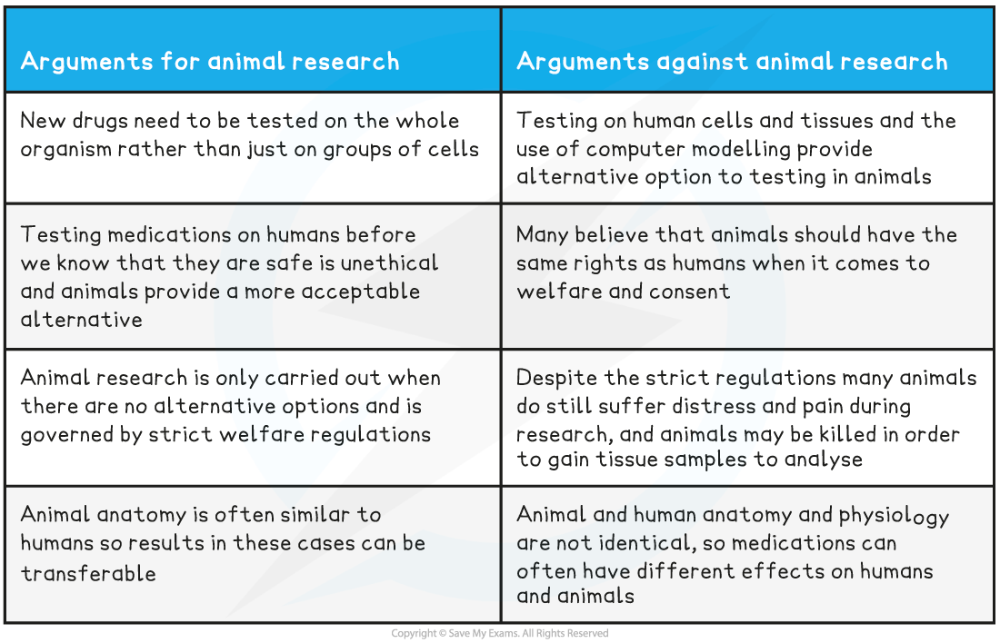

The Role of Animal Models in Research
-------------------------------------

* The human brain is very <b>difficult to study</b>

  + The brain is<b> complex</b> and its tissues are<b> delicate</b> meaning that it is <b>easy to cause damage</b> during a surgical examination
  + Different regions work together to bring about brain function so often <b>cannot be studied in isolation</b>
* For this reason, <b>animal models</b> have historically been used in brain research

  + Some animals have <b>similar brain structure</b> to humans, so the findings from such models can <b>reasonably be applied to the human brain</b>
  + Many consider experimenting on animals for medical reasons to be <b>more ethically acceptable</b> than experimenting on humans
* Note that a <b>model in science</b> is something that provides a <b>representation of real events</b> e.g.

  + <b>Computer modelling</b> can be used to predict the future of global warming
  + Balls can be used to <b>represent the molecules</b> of a solid, liquid, or gas
  + <b>Scaled down models</b> of vehicles can be used in design and safety testing

#### The work of Hubel and Wiesel

* Hubel and Wiesel carried out research into the<b> brain's visual systems </b>during the 1960s and 1970s
* They studied the <b>long-term impact of depriving various animal models of vision in one eye</b>, and in doing so learned about the <b>development of the brain's visual cortex</b>

  + The visual cortex is the <b>region of the cerebral cortex</b> in which <b>visual information</b> is processed
* Hubel and Wiesel began their research using <b>kittens as animal models</b>

  + They stitched one of a subject's eyes closed soon after birth, meaning that as the kitten grew it could <b>only see out of one eye</b>
  + After 3 months they found that the <b>kittens were blind in the eye that had been stitched shut</b>
  + When they studied the <b>activity of the neurones</b> in the kittens' visual cortexes using <b>electrodes,</b> they found that the <b>ocular dominance columns</b> corresponding to the stitched shut eye were <b>smaller than in normal kittens</b> while the columns corresponding to the open eye were <b>larger than normal</b>

    - Ocular dominance columns are <b>groups of neurones</b> in the visual cortex that <b>respond only to input from one eye or the other</b>

      * Right ocular dominance columns receive information from the <b>right eye</b> while left columns receive information from the <b>left eye</b>
  + They concluded that the ocular dominance columns for the blinded eye were able to <b>redistribute</b> in order to correspond to the normal eye; they had <b>switched dominance</b>
* The research was then repeated using <b>adult cat models</b>

  + They found that <b>no blindness</b> resulted from the 3-month loss of vision, and <b>no changes</b> took place to the distribution of the ocular dominance columns
* They were able to <b>replicate these results</b> in young and adult monkeys, demonstrating the <b>essential nature of light stimulation</b> to the visual cortex during the <b>early months of development</b>

  + Without early stimulation to both eyes the ocular dominance columns in the visual cortex are <b>unable to develop normally</b>

<i><b>Ocular dominance columns are stripes of neurones in the visual cortex that receive information from either the left or right eye</b></i>

Moral & Ethical Issues Relating to Animals in Research
------------------------------------------------------

* The use of animals in medical research is common as it allows for the <b>testing of new medications</b> and <b>research into</b> <b>anatomy</b> and <b>physiology</b> without endangering the lives of humans
* Despite this, the use of animals in scientific research is <b>highly controversial</b>

<b>Animal Research Ethical Arguments Table</b>

