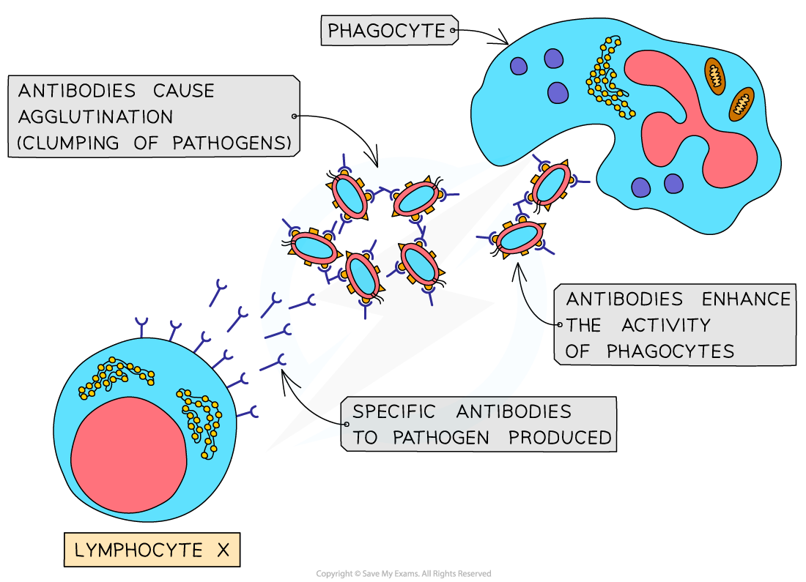

The Role of Antigens & Antibodies
---------------------------------

#### Antigens

* Every cell in the human body has <b>markers</b> on its cell surface membrane that <b>identify</b> it
* Microorganisms such as bacteria and viruses also have their own unique markers
* These markers are called <b>antigens</b> and they allow <b>cell-to-cell recognition</b>

  + Antigens are found on cell surface membranes, bacterial cell walls, or the surfaces of viruses
  + Some glycolipids and glycoproteins on the outside of cell surface membranes act as antigens
* Antigens can be either <b>self antigens</b> or <b>non-self antigens</b>

  + Antigens <b>produced by the organism's own body cells</b> are known as <b>self antigens</b>

    - Self antigens <b>do not </b>stimulate an immune response
  + Antigens <b>not produced by the organism’s own body cells </b>are known as <b>non-self antigens</b>

    - Non-self antigens<b> stimulate an immune response</b>
    - E.g. the antigens found on pathogenic bacteria and viruses, or on the surface of a transplanted organ
* After pathogens are engulfed by phagocytosis, phagocytes transfer the antigens of the digested pathogen to their cell surface membrane, becoming <b>antigen presenting cells</b>

  + Antigen presenting cells such as macrophages <b>activate the specific immune response</b>

    - This occurs when the white blood cells of the specific immune response, known as lymphocytes, <b>bind to the presented antigens</b> with specific receptors on their cell surface membranes
    - Note that <b>macrophages are a type of phagocytic white blood cell</b>

#### Antibody structure

* Antibodies are Y-shaped molecules sometimes known as<b> immunoglobulins</b>
* Antibodies consist of <b>four polypeptide chains;</b> <b>two ‘heavy’</b> chains attached by <b>disulfide bonds</b> to <b>two ‘light’</b> chains

  + 'Heavy' chains are long while 'light' chains are short
* Each polypeptide chain has a <b>constant region</b> and <b>variable region</b>

  + The <b>constant regions</b> <b>do not vary</b> within a class of antibody

    - There are 5 classes of mammalian antibodies, each with different roles
  + The amino acid sequences in the <b>variable region</b> are different for each antibody

    - The variable region is where the antibody binds to an antigen to form an <b>antigen-antibody complex</b>
    - At the end of the variable region is a site called the <b>antigen binding site</b>

      * The antigen binding sites <b>vary</b> greatly, giving the antibody its <b>specificity</b> for binding to <b>antigens</b>
* The <b>‘hinge’ region, </b>where the disulfide bonds join the heavy chains, gives flexibility to the antibody molecule, allowing the antigen binding site to be placed at different angles when binding to antigens

  + This region is not present in all classes of antibodies
* Antibodies can be either <b>membrane-bound</b> or <b>secreted directly</b> into the blood

  + Membrane-bound antibodies are <b>attached to the surface of lymphocytes</b>
  + The membrane-bound antibodies have an <b>extra section of polypeptide chain within their heavy chains</b> which forms the attachment to lymphocytes

    - This extra section of polypeptide is <b>not required </b>in antibodies that are not bound to lymphocytes
    - The gene which codes for the antibody heavy chains can undergo a process called <b>alternative splicing</b> to remove this extra section in non-bound antibodies

      * Splicing removes non-coding sections of mRNA called introns, while <b>alternative splicing removes coding sections called exons</b>; in this case the exons that <b>code for the the extra section</b> of the heavy chains are removed

<i><b>Antibodies are Y-shaped molecules consisting of four polypeptide chains. Note that the term epitope here refers to the part of the antigen that is recognised by the immune system; the variable regions of the antibody are </b></i><b>complementary </b><i><b>to the epitope of the antigen, allowing them to bind.</b></i>

#### Antibody function

* Antibodies bind to <b>specific antigens</b> that trigger the specific immune response
* Antibodies function to disable pathogens in several ways

  + Pathogens enter host cells by binding to them using receptors on their surface; antibodies can <b>bind to these receptors</b>, <b>preventing pathogens from infecting host cells</b>
  + Antibodies can act as <b>anti-toxins</b> by binding to toxins produced by pathogens, e.g. the bacteria that cause diphtheria and tetanus; this neutralises the toxins
  + Antibodies cause pathogens to clump together, a process known as <b>agglutination</b>; this reduces the chance that the pathogens will spread through the body and makes it possible for phagocytes to engulf a number of pathogens at one time

<i><b>Antibodies cause agglutination, which makes it difficult for the pathogens to infect host cells. This also makes it easier for the phagocytes to engulf the trapped pathogens</b></i>