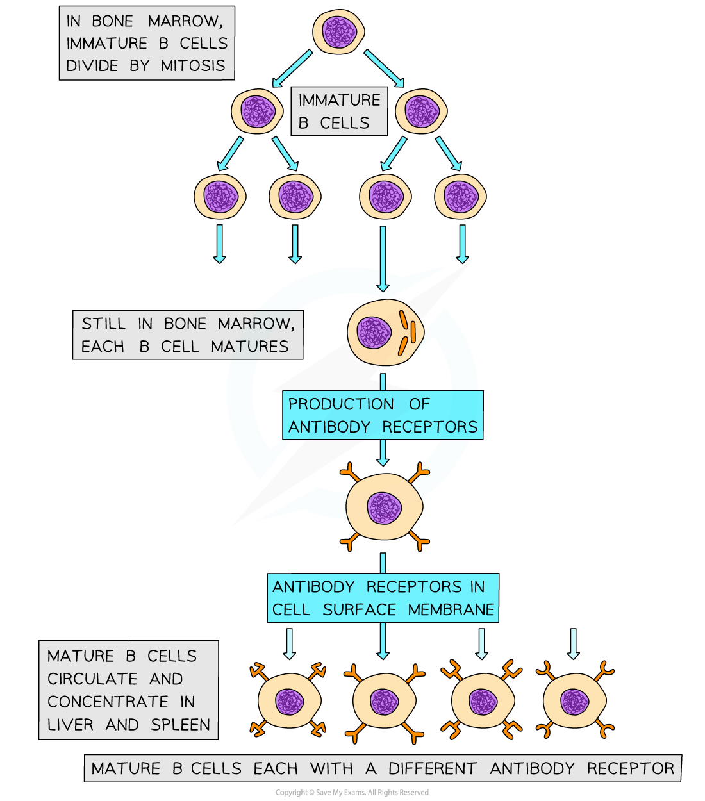
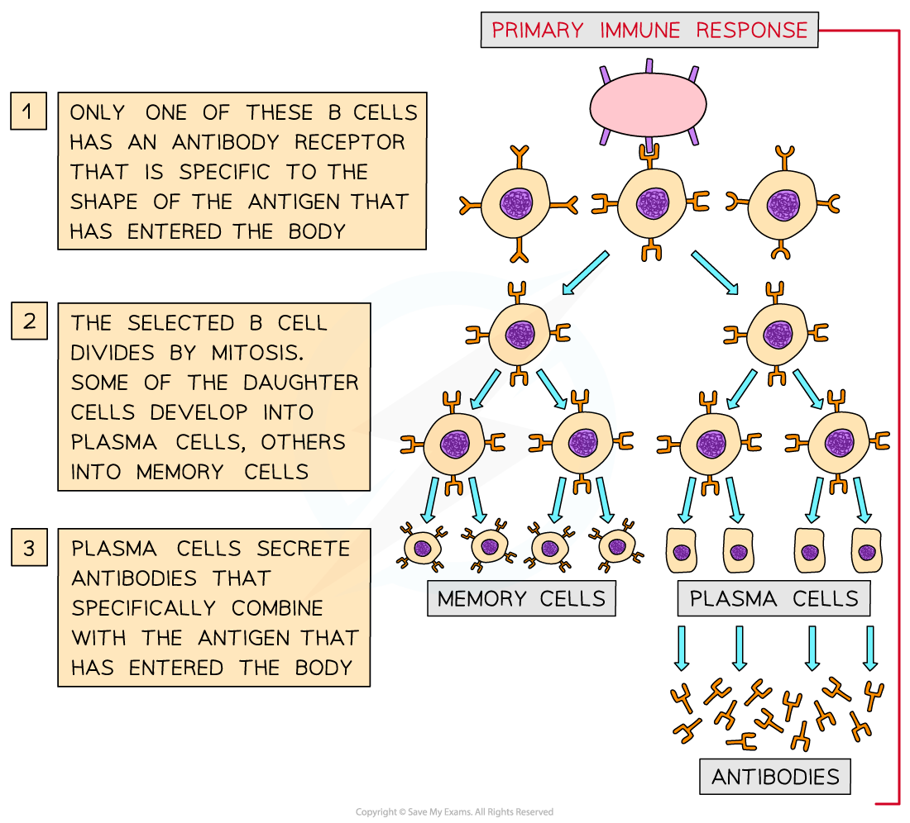

B Cell Response
---------------

* <b>B cells,</b> also known as B lymphocytes, are a second type of white blood cell in the specific immune response

  + B cells remain in the <b>b</b>one marrow as they mature, hence the <b>B</b> in their name
* B cells have many <b>specific receptors</b> on their cell surface membrane

  + The receptors are in fact <b>antibodies</b>, and are known as <b>antibody receptors</b>
  + Each B cell has a <b>different type of antibody receptor</b>, meaning that each B cell can <b>bind to a different type of antigen</b>

<i><b>Mature B cells each have different types of antibody receptors on their cell surface membrane</b></i>

* If the corresponding antigen enters the body, B cells with the correct cell surface antibodies will be able to <b>recognise</b> it and bind to it

  + When the B cell binds to an antigen it forms an <b>antigen-antibody complex</b>
* The <b>binding of the B cell to its specific antigen</b>, along with the <b>cell signalling molecules produced by T helper cells</b>, <b>activates</b> the B cell
* Once activated the B cells divide repeatedly by mitosis, producing many clones of the original activated B cell
* The daughter cells differentiate into <b>two main types of cells</b>

  + <b>Effector cells, </b>which go on to form <b>plasma</b> <b>cells</b>

    - Plasma cells produce specific antibodies to combat non-self antigens
  + <b>Memory cells</b>

    - Remain in the blood to allow a faster immune response to the same pathogen in the future

<i><b>During a primary immune response B cells divide by mitosis to form plasma cells and memory cells. Note that a primary response occurs the first time an individual comes into contact with a particular pathogen</b></i>