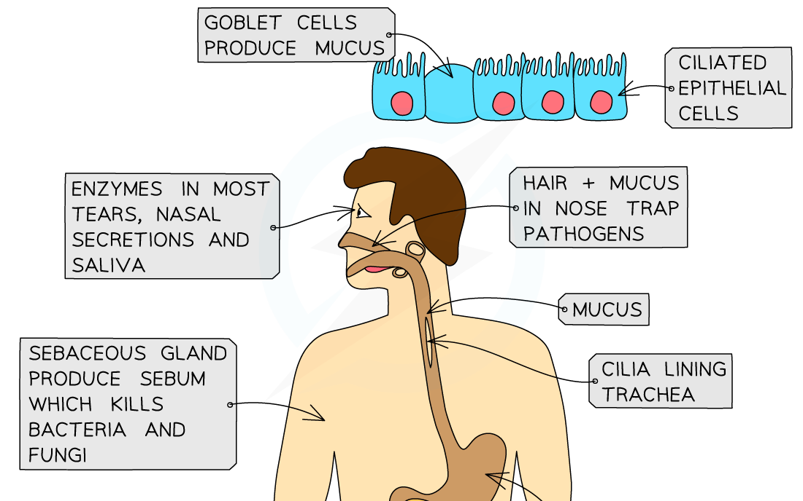

Entry Routes of Pathogens
-------------------------

* In order for pathogens to cause disease they need to enter the body
* There are four main ways in which pathogens can enter

  + <b>Broken skin</b>

    - This provides direct access to the tissues and bloodstream
  + The <b>digestive system</b>

    - When we consume contaminated food and drink
  + The <b>respiratory system</b>

    - Every time we inhale
  + <b>Mucosal surfaces</b>

    - The lining of body cavities e.g. inside of nose, mouth, genitals

#### Barriers to infection

* Skin

  + This provides a <b>physical barrier</b> against infection
  + If the skin is damaged it leaves the exposed tissue beneath vulnerable to pathogens
  + The <b>blood clotting mechanism</b> of the body plays an important role in preventing pathogen entry in the case of damage to the skin
  + Blood clotting takes time, however, so a few pathogens may still enter before a clot forms
* Microorganisms of the gut and skin

  + Collectively these <b>harmless</b> microorganisms are known as the <b>gut </b>or <b>skin</b> <b>flora</b>
  + They <b>compete</b> with pathogens for resources, thereby <b>limiting</b> their numbers and therefore their ability to infect the body
* Stomach acid

  + The <b>hydrochloric acid</b> that makes up a large part of the gastric juices in the stomach creates an <b>acidic environment</b> that is <b>unfavourable </b>to many pathogens present on food and drink
  + Sometimes a few of these pathogens may survive and make their way to the intestines where they infect the gut wall cells and cause disease
* Lysozyme

  + Secretions of the <b>mucosal surfaces, </b>e.g. tears, saliva, and mucus, contains an enzyme called <b>lysozyme</b>
  + This enzyme will <b>damage bacterial cell walls</b>, causing them to burst, or lyse

<i><b>The body has physical defences that prevent the entry of pathogens</b></i>