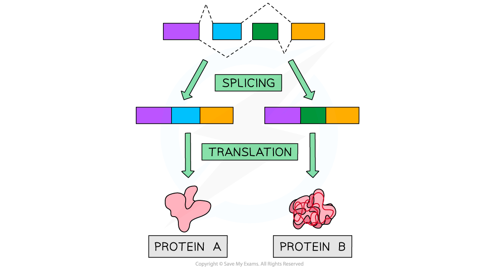

Post-transcriptional Modification
---------------------------------

* Antibody molecules consist primarily of <b>protein</b>
* They contain four separate polypeptide chains, two of which are longer, <b>heavy chains</b>, and two of which are shorter, <b>light chains</b>
* The structure of the heavy chain determines whether an antibody will be <b>bound to the membrane of a white blood cell</b>, or <b>secreted directly</b> into the blood
* Some heavy chains contain an <b>extra section which allows the antibody to bind to the surface</b> of a white blood cell
* White all heavy chains are <b>coded for by the same gene</b>, post-transcriptional modification determines whether or not this <b>extra section of protein</b> is present in the heavy chain of an antibody
* <b>Post transcriptional modification</b> mechanisms include

  + Splicing
  + Alternative splicing

#### Splicing

* Polypeptides are made during the process of protein synthesis, during which the DNA base code is transcribed and translated
* The DNA code within eukaryotic cells contains many <b>non-coding sections</b>
* Non-coding DNA can be found within genes; these sections are called <b>introns, </b>while<b> </b>sections of coding DNA are called <b>exons</b>
* During transcription eukaryotic cells transcribe both introns and exons to produce<b> pre-mRNA </b>molecules
* Before the pre-mRNA exits the nucleus, a process called <b>splicing</b> occurs

  + The non-coding intron sections are removed
  + The coding exon sections are joined together
  + The resulting mRNA molecule contains <b>only the coding sequences</b> of the gene
* Since these modifications are made after transcription occurred, they are called <b>post-transcriptional modifications</b>

<i><b>Pre-mRNA is spliced before it exits the nucleus</b></i>

#### Alternative splicing

* The exons of genes can be spliced in many different ways to produce <b>different mature mRNA</b> molecules through <b>alternative splicing</b>
* This means that a single eukaryotic gene can code for <b>more than one</b> polypeptide chain

  + E.g. depending on the exons that are removed from the gene coding for the antibody heavy chain, it can produce either a membrane-bound or a directly secreted antibody

<i><b>Alternative splicing of a gene can produce more than one type of protein</b></i>