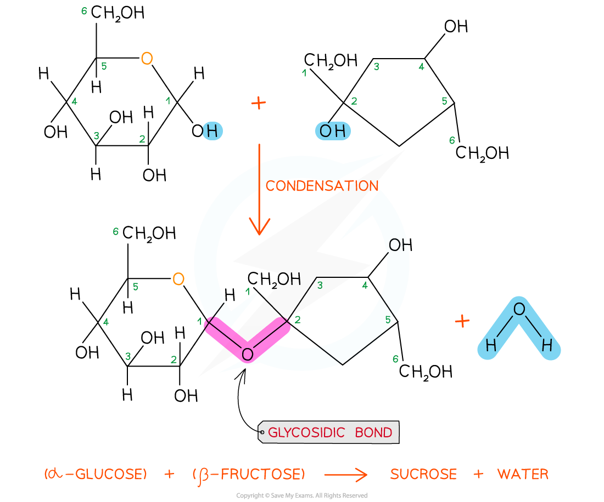

Disaccharides: Structure
------------------------

* <b>Two monosaccharides</b> can join together via <b>condensation reactions</b> to form <b>disaccharides</b>

  + A condensation reaction is one in which two molecules join together via the formation of a new chemical bond, with a <b>molecule of water</b> being <b>released</b> in the process
  + The new chemical bond that forms between two monosaccharides is known as a <b>glycosidic bond</b>

* Common examples of disaccharides include

  + <b>Maltose </b>

    - Contains two molecules of glucose linked by a 1,4 glycosidic bond

      * This means that the glycosidic bond is located between carbon 1 of one monosaccharide and carbon 4 of the other
  + <b>Sucrose</b>

    - Contains a molecule of glucose and a molecule of fructose linked by a 1,2 glycosidic bond

      * This means that the glycosidic bond is located between carbon 1 of one monosaccharide and carbon 2 of the other
  + <b>Lactose</b>

    - Contains a molecule of glucose and a molecule of galactose linked by a 1,4 glycosidic bond

<i><b>Sucrose is a disaccharide formed from a molecule of glucose (left) and a molecule of fructose (right) joined together by a 1,2 glycosidic bond</b></i>

Disaccharides: Function
-----------------------

* The function of disaccharides is to <b>provide the body with a quick-release source of energy</b>

  + Disaccharides are made up of two sugar molecules so they're easily broken down by enzymes in the digestive system into their respective monosaccharides and then absorbed into the bloodstream
* Due to the presence of a large number of hydroxyl groups, <b>disaccharides are easily soluble in water</b>

  + These hydroxyl groups form hydrogen bonds with the water molecules when dissolved in aqueous solutions
* Just like monosaccharides they are <b>sweet in taste</b>

  + Sucrose, also known as table sugar, is an example