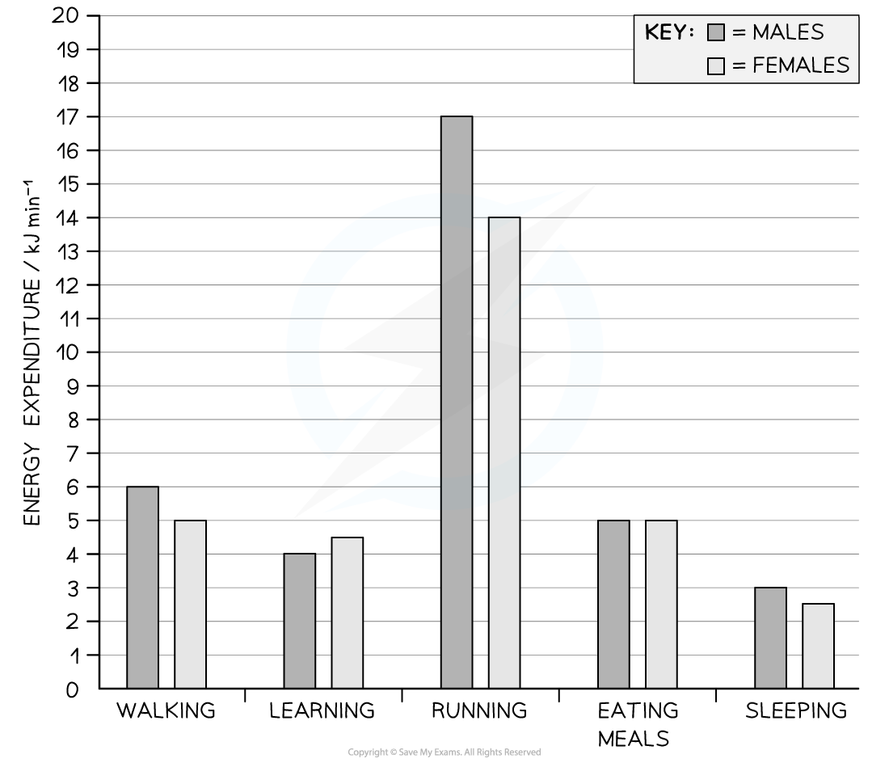

Energy Budgets & Diet
---------------------

* Every cell needs a <b>constant supply of energy</b> to fuel metabolic processes; this energy is released during the process of respiration
* Organisms therefore need to take in enough food to fuel respiration

  + Food contains <b>stored energy</b> in the form of biological molecules such as carbohydrates and lipids
* The term <b>energy budget</b> describes the <b>amount of energy taken in </b>by an organism minus the <b>amount of energy the organism transfers </b>during life processes such as growth, movement, reproduction, and respiration

  + The transfer of energy to the environment during the life process is sometimes referred to as energy 'used'

#### Analysing data on energy budgets and diet

* Data on energy budgets may be given in<b> Calories, kilocalories</b>, or <b>kilojoules </b>

  + A Calorie (Cal) is the same as a kilocalorie (kcal)

    - The average adult needs around 2 000 kcals per day to maintain a healthy weight
  + A kilojoule (kJ) is an alternative energy unit

    - The average adult needs about 8 700 kJ a day to maintain a healthy weight
* Energy budget can be calculated in the following way

<b>energy input - energy output = energy budget</b>

#### Worked Example

A student's recommended daily intake of energy is 12 400 kJ.

Mark is a male student who takes in the recommended daily intake of energy; he is in school for six hours a day, goes for a run for an hour after school, sleeps for eight hours a night, and spends two hours a day eating meals.

Use the graph below to calculate his energy budget over a 24 hour period.

<b>Answer:</b>

<b>Step 1: Use the graph to find the energy expenditure for each activity for males</b>

School = 4 kJ/min

Running = 17 kJ/min

Sleep = 3 kJ/min

Meals = 5 kJ/min

<b>Step 2: Convert values into the number of hours the student spends on each activity</b>

School = (4 x 60) x 6 = 1 440 kJ in 6 hrs

Running = 17 x 60 = 1 020 kJ in 1 hr

Sleep = (3 x 60) x 8 = 1 440 kL in 8 hrs

Meals = (5 x 60) x 2 = 600 kJ in 2 hrs

<b>Step 3: Add up the energy expenditures to find the energy output</b>

1440 + 1020 + 1440 + 600 = 4 500 kJ

<b>Step 4: Substitute numbers into the energy budget equation</b>

 energy input - energy output = energy budget

12 400 - 4 500 = 7 900 kJ

This tells us the student has an excess of 7 900 kJ of energy every day

Consequences of Energy Imbalance
--------------------------------

#### Energy imbalances can affect weight gain

* <b>Energy budgets should be balanced</b>

  + The amount of energy taken in should equal the amount of energy used, or transferred
* A difference in energy taken in and energy used will affect an individual's weight
* <b>Weight gain</b>

  + If <b>energy intake is higher than the energy output </b>excess energy will be converted into fats by the body so the person will <b>gain weight</b>
  + If the energy output remains less than intake over a sustained period of time the individual may become overweight and eventually obese
* <b>Weight loss</b>

  + If <b>energy intake is less than energy output </b>the body will need to take energy from elsewhere and fat reserves will be converted into energy, the person will<b> lose weight</b>
  + If the energy difference is large over a sustained period of time the individual may become underweight
* Just as an aside here; current research suggests that 'not all calories are equal', so the balancing of the energy budget in the way described here is likely to be more complicated in reality

  + The body is thought to process different foods in different ways, e.g. fats vs sugars, sucrose vs fructose, etc.