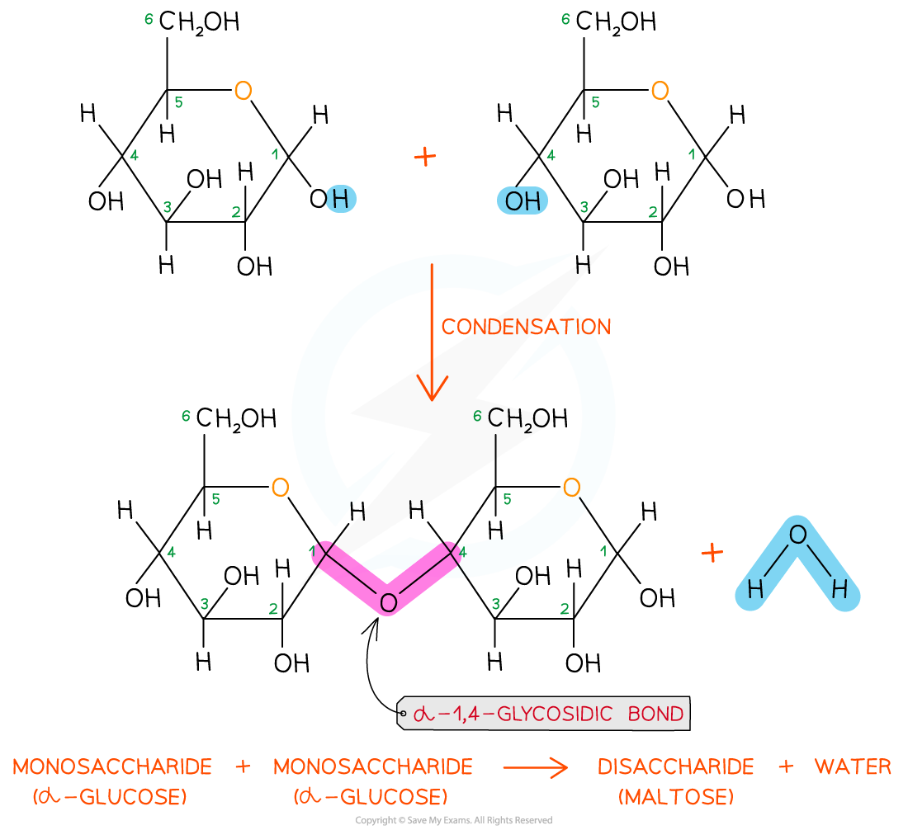
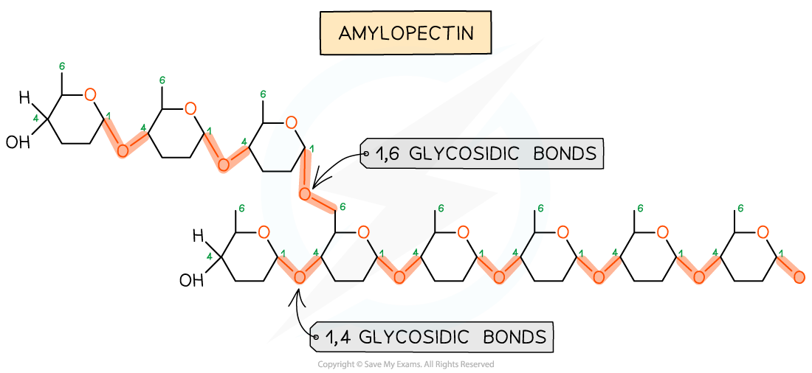
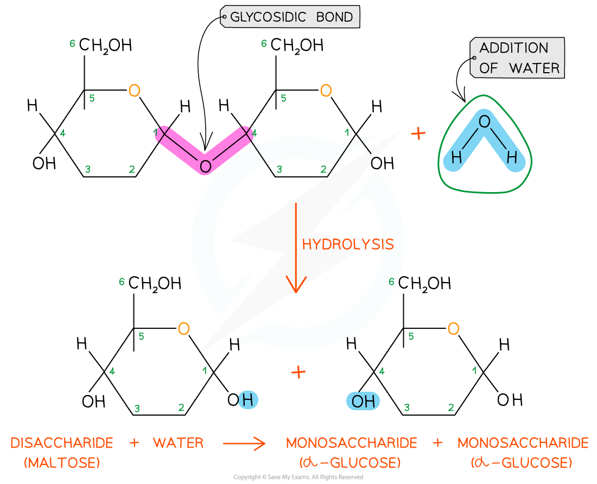

The Glycosidic Bond
-------------------

* To make monosaccharides more suitable for storage they are bonded together to form <b>disaccharides</b> and <b>polysaccharides</b>

  + Polysaccharides are insoluble so have less influence on the process of osmosis
* Disaccharides and polysaccharides are formed when <b>two hydroxyl (OH) groups</b> on different monosaccharides interact to form a <b>strong covalent bond</b> called a <b>glycosidic bond</b>
* The name of the glycosidic bond that forms depends on the <b>location of the OH groups</b> on the monosaccharides concerned, e.g.

  + If the OH groups are located on carbon 1 of one monosaccharide and carbon 4 of the other, a <b>1,4 glycosidic bond forms</b>
  + If the OH groups are located on carbon 1 of one monosaccharide and carbon 6 of the other, a <b>1,6 glycosidic bond forms</b>
* Every glycosidic bond results in <b>one water molecule being released</b>, thus glycosidic bonds are formed by a <b>condensation reaction</b>

<i><b>Glycosidic bonds form through condensation reactions, during which a water molecule is released. When two glucose molecules are joined by a glycosidic bond, the resulting disaccharide is maltose.</b></i>

<i><b>Glycosidic bonds can link monosaccharides together to form polysaccharides such as amylopectin, a form of starch. Amylopectin contains 1,4 and 1,6 glycosidic bonds.</b></i>

* There are many different types of monosaccharide, which join together to form <b>different disaccharides, </b>e.g.

  + Two molecules of glucose join to form <b>maltose</b>
  + Glucose joins with the monosaccharide fructose to form <b>sucrose</b>
  + Glucose joins with the monosaccharide galactose to form <b>lactose</b>

#### Breaking the glycosidic bond

* The glycosidic bond is broken when <b>water is added </b>in a<b> hydrolysis reaction</b>

  + Hydro = water
  + Lysis = to break
* Examples of hydrolytic reactions include the <b>digestion of food</b> in the alimentary tract and the <b>breakdown of stored carbohydrates</b> in muscle and liver cells for use in cellular respiration

<i><b>Glycosidic bonds are broken when water is added in a hydrolysis reaction</b></i>