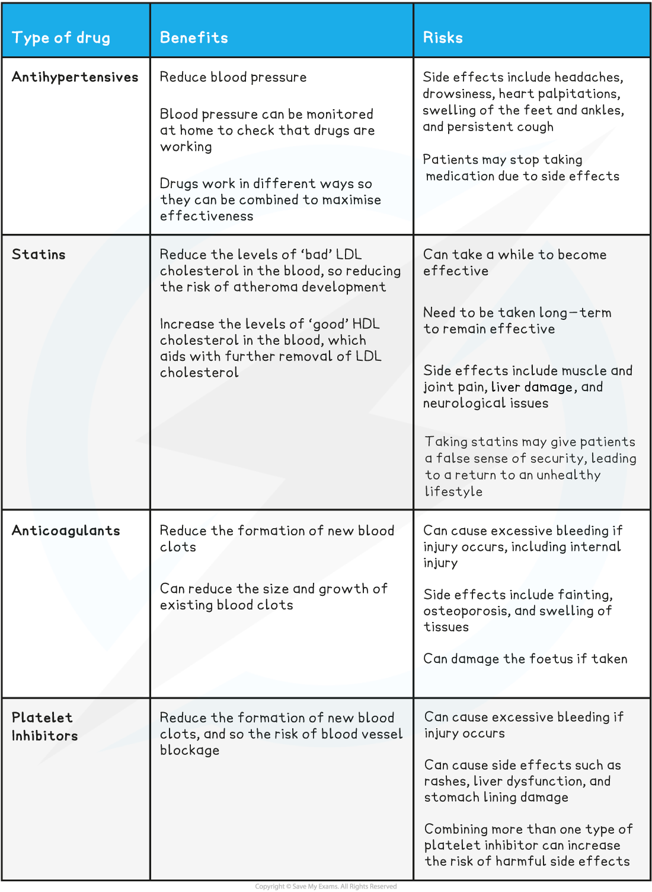

Treatment of CVD
----------------

* While reducing the risk factors and lowering the risk of developing cardiovascular disease (CVD) is the best option, CVD is still very common and treatment options are needed
* There are a number of different <b>treatment options</b> for cardiovascular disease, many of which involve taking <b>medication</b>
* Types of medication for the treatment of CVD include

  + Antihypertensives
  + Statins
  + Anticoagulants
  + Platelet inhibitors

#### Antihypertensives

* These drugs work by <b>lowering blood pressure</b>

  + High blood pressure is also known as <b>hypertension</b>
* Lowering blood pressure <b>reduces the risk of arterial endothelial damage </b>and therefore reduces the risk of atheromas and thrombosis
* <b>Beta blockers,</b> <b>vasodilators</b> and<b> diuretics</b> act as antihypertensives

  + Beta blockers prevent increases in heart rate
  + Vasodilators increase the diameter of the blood vessels
  + Diuretics reduce blood volume by decreasing the amount of sodium reabsorbed into the blood by the kidneys, therefore decreasing the volume of water reabsorbed into the blood

#### Statins

* These drugs work by <b>lowering blood cholesterol </b>

  + They block an enzyme in the liver which is needed to make cholesterol
* This <b>lowers the LDL concentration</b> in the blood therefore reducing the risk of atheroma formation

  + LDLs are sometimes known as 'bad' cholesterol; at high levels they increase the risk of atheromas forming

#### Anticoagulants

* These drugs <b>reduce blood clotting</b>

  + Blood clotting can be referred to as blood coagulation
* Reduced formation of blood clots <b>decreases the likelihood of thrombosis</b> and therefore reduces the risk of blood vessels being blocked by blood clots

#### Platelet inhibitors

* These are also substances which <b>reduce blood clotting</b>

  + Platelet inhibitors are a type of anticoagulant
* They prevent the clumping together of <b>platelets, </b>so preventing the formation of blood clots
* <b>Aspirin</b> is an example of a platelet inhibitor

<b>Benefits and Risks of Cardiovascular Disease Drugs Table</b>

#### Examiner Tips and Tricks

You need to know these four examples and their associated benefits and risks.  Be sure to be specific on how each medication type prevents CVD.