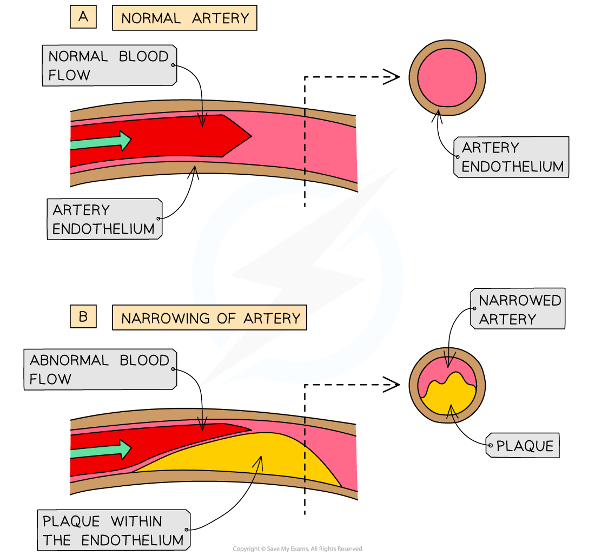

Atherosclerosis
---------------

* There are a number of diseases of the heart, or cardiovascular diseases, that can affect blood vessels in different ways
* <b>Atherosclerosis, </b>also known as hardening of the arteries, is caused primarily by damage to the delicate endothelium of an artery followed by an <b>inflammatory response</b>

  + It is a progressive disease, meaning that it can worsen over time
* In a healthy artery the <b>endothelium</b> is smooth and unbroken to reduce friction between blood and the inside if the artery
* The steps involved in atherosclerosis are

  + <b>Damage</b>, e.g. by high blood pressure,<b> </b>is caused to the <b>endothelium</b>

    - Damage can also occur as a result of high levels of certain types of cholesterol, smoking, diabetes, obesity, and old age
  + An <b>inflammatory response</b> occurs and white blood cells such as macrophages accumulate in the damaged area
  + <b>Lipids</b> and <b>cholesterol </b>clump together with the macrophages <b>under the endothelium</b> and form <b>fatty streaks</b>

    - This is one of the first signs of atherosclerosis
  + <b>Platelets</b> can also add to the fatty deposit

    - Platelets are fragments of red blood cells involved in the blood clotting process
  + The collection of cholesterol, lipids, macrophages and platelets accumulate under the endothelium

    - The structure forms a<b> plaque</b> known as an <b>atheroma</b>
  + The atheroma narrows the lumen of the artery, reducing and restricting blood flow and thereby <b>raising blood pressure</b>
  + Over time, the plaque can <b>calcify and harden</b>, reducing elasticity of the artery wall and further increasing blood pressure

<i><b>Atherosclerosis is the process by which atheroma plaques form in the endothelium of arteries</b></i>