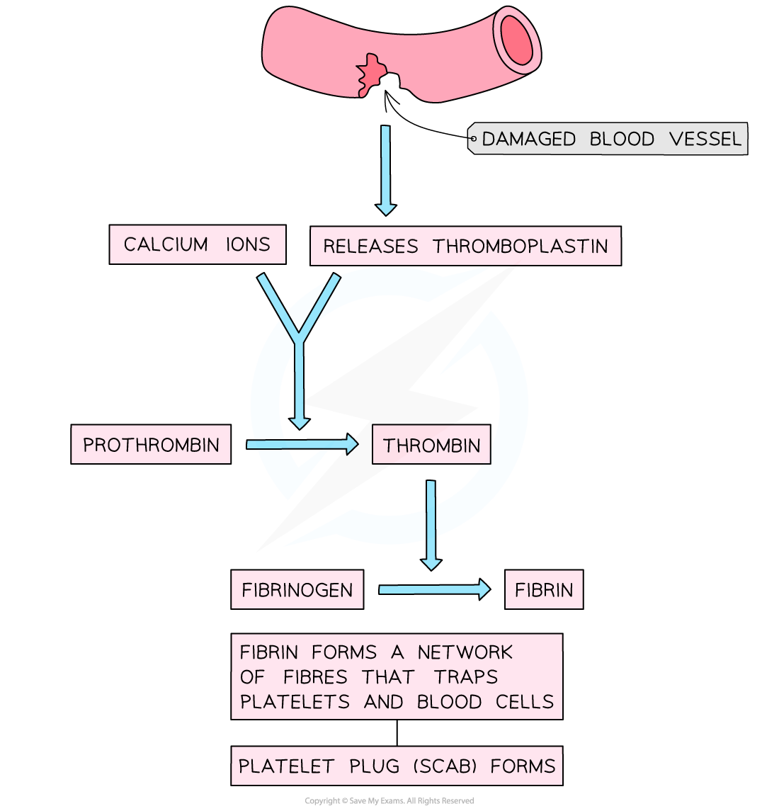

Blood Clotting
--------------

* Blood clotting is an important process; it prevents excess blood loss, the entry of pathogens, and provides a barrier, or scab, under which wound healing can occur
* A break in the mucous membranes or skin membranes causes the release of molecules that trigger a <b>chemical cascade</b> which results in blood clotting

  + The process of blood clotting is known as <b>thrombosis</b>
* The chemical cascade involves a large number of steps and several plasma proteins

* The process of thrombosis involves

  + The damaged blood vessel releases a protein called <b>thromboplastin</b>
  + <b>Calcium ions</b> from the plasma, along with thromboplastin, trigger the conversion of soluble <b>prothrombin</b> protein into the enzyme <b>thrombin</b>
  + Thrombin<b> </b>catalyses the conversion of the <b>soluble protein</b> <b>fibrinogen </b>to the<b> insoluble protein fibrin</b>
  + Fibrin fibres mesh and tangle together, <b>trapping platelets and red blood cells</b>
  + A blood clot is formed

<i><b>Blood clotting, or thrombosis, is brought about by a cascade of chemical reactions</b></i>

#### Blood clots and atheromas

* <b>Atheromas </b>can<b> increase the risk </b>of<b> </b>blood clotting

  + The <b>plaque deposit</b> of an atheroma can <b>rupture through the endothelium </b>of the artery, damaging the endothelium and forming a rough surface
  + The damage to the endothelium triggers the process of thrombosis
* The combination of atheromas and blood clotting can be dangerous to the health of an individual

  + The blood clot that forms can <b>completely block the artery</b>

    - Blood clots reduce blood flow which <b>restricts the movement of oxygen</b> in the blood, therefore <b>reducing respiration </b>of the surrounding cells, tissues and organs
  + The blood clots can dislodge and travel to different blood vessels in the body; if they reach the brain this can cause a <b>stroke</b> to occur
* Blood clotting can also lead to

  + <b>Heart attack</b>
  + <b>Deep vein thrombosis</b>

#### Stroke

* A stroke is a <b>sudden loss of brain function</b> in a localised area due to <b>disruption of blood flow</b> to the brain

  + A blood clot leads to a <b>blockage of the arteries</b> supplying the brain
  + This leads to <b>reduced blood flow and delivery of oxygen </b>to the cells of the brain, reducing respiration
  + Cells in the affected part of the brain cannot produce ATP and their function is reduced
* A stroke caused by a blood clot is called an <b>ischemic stroke</b>

#### Heart attack

* <b>Coronary heart disease (CHD)</b> is caused by the formation of atheromas and blood clots in the<b> coronary arteries</b>

  + The coronary arteries flow over the surface of the heart, supplying the heart muscle itself with blood
* <b>Blood flow to certain areas of the heart is restricted </b>and delivery of oxygen to the affected cells decreases, thereby <b>reducing respiration</b> in these cells

  + The cells can no longer produce ATP
  + The cells can no longer contract, <b>reducing the force generated by the heart </b>when it beats
  + The cells can die, causing permanent damage to heart tissue
* This leads to a <b>myocardial infarction,</b> also known as a heart attack
* <b>Complete heart failure</b> may occur if large areas of the heart are affected by blood clots; this can be fatal
* <b>Symptoms</b> of a heart attack include

  + Chest pain
  + Shortness of breath
  + Sweating

<i><b>Atheroma and blood clots in the coronary arteries can restrict blood flow to the heart muscle, leading to a heart attack</b></i>

#### Deep vein thrombosis

* If a blood clot forms in a vein deep inside the body, it is known as <b>deep vein thrombosis (DVT)</b>
* This is most common in the <b>veins of the legs</b>
* Causes include

  + Prolonged inactivity
  + Old age
  + Some medications