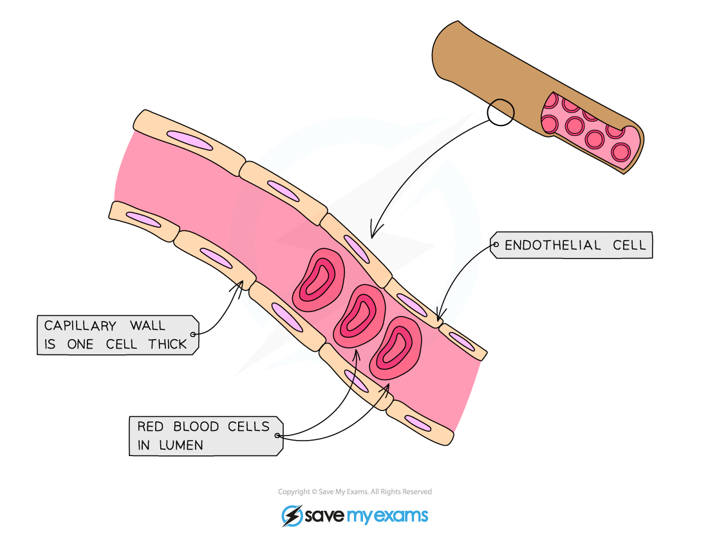

Blood Vessels: Structure & Function
-----------------------------------

* The body contains several different types of blood vessel

  + <b>Arteries</b>: transport blood away from the heart, usually at high pressure, to the tissues

    - Remember; <b>a</b>rteries carry blood <b>a</b>way from the heart
  + <b>Arterioles</b>: arteries branch into narrower blood vessels called arterioles which transport blood into capillaries
  + <b>Veins</b>: transport blood to the heart, usually at low pressure

    - Remember; ve<b>in</b>s carry blood <b>in</b>to the heart
  + <b>Venules</b>: these narrower blood vessels transport blood from the capillaries to the veins
  + <b>Capillaries:</b> microscopic blood vessels that carry blood to the cells
* Blood flows through the lumen of a blood vessel; the size of the lumen varies depending on the type of blood vessel

  + Arteries have a narrow lumen and the veins a wider lumen
* The walls of each type of blood vessel have a <b>structure that relates to the function</b> of the vessel

<i><b>The blood vessels form a continuous network; the structure of each allows it to carry out its function</b></i>

#### Arteries

* Artery walls consist of three layers

  + The <b>endothelium</b>, sometimes referred to as the tunica intima

    - The endothelium is one cell thick and lines the lumen of all blood vessels.
    - It is very smooth and <b>reduces friction</b> for free blood flow
    - In arteries the endothelium is <b>highly folded</b>, enabling it to expand under high pressure
  + <b>Smooth muscle</b> and <b>elastic tissue</b>, sometimes referred to as the tunica media

    - This layer is thick in arteries
    - The layer of muscle cells strengthen the arteries so they can <b>withstand high pressure</b>
    - It also enables them to constrict and narrow the lumen for reduced blood flow

      * <b>Contraction</b> of the muscle causes constriction of the lumen
      * This is useful for diverting blood flow away from certain locations e.g. away from the digestive system during exercise
    - The elastic tissue helps to <b>maintain blood pressure</b> in the arteries

      * It stretches and <b>recoils</b> to even out any fluctuations in pressure
  + The outer wall, sometimes referred to as the tunica adventitia, or tunica externa<b> </b>

    - Contains the structural protein <b>collagen</b>
    - Collagen is a strong protein that <b>protects blood vessels</b> from damage by over-stretching
* Arteries have a <b>narrow lumen</b> which helps to maintain a high blood pressure
* A pulse is present in arteries as they stretch to accommodate an increased volume of blood with each heartbeat

#### Veins

* Veins return blood to the heart
* They receive blood that has passed through capillary networks, so the blood pressure is very low
* Veins contain the same layers as arteries but in different proportions

  + The <b>smooth muscle and elastic layer</b> is much thinner in veins

    - There is no need for a thick muscular layer as veins don't have to withstand high pressure
* The <b>lumen</b> of the vein is much wider than that of an artery

  + A larger lumen helps to ensure that blood returns to the heart at an adequate speed
  + A large lumen reduces friction between the blood and the endothelium of the vein

    - The rate of blood flow is slower in veins but a larger lumen means the volume of blood delivered per unit of time is equal to that of arteries
* Veins contain <b>valves</b>

  + These prevent the backflow of blood, helping return blood to the heart
* A <b>pulse is absent</b> in veins due to the increased distance from the heart

<i><b>Arteries have a thick layer of elastic and muscle tissue and a narrow lumen, while veins have a thin layer of elastic and muscle tissue and a wide lumen</b></i>

#### Capillaries

* Capillaries have thin walls which are permeable, allowing substances to leave the blood to reach the body’s tissues
* They can form networks called <b>capillary beds</b> which are very important <b>exchange surfaces</b> within the circulatory system

  + A <b>large number</b> of capillaries <b>branch between cells</b>

    - Substances can diffuse between the blood and cells quickly as there is a short diffusion distance
* Capillaries have a lumen that is very<b> narrow in diameter</b>

  + Red blood cells need to pass through the capillaries in single file
  + This forces the blood to travel slowly which provides more time for <b>diffusion</b> to occur
* The <b>wall of the capillary is a single layer of endothelial cells</b>

  + This layer also lines the lumen in arteries and veins
  + The wall is only one cell thick; this <b>reduces the diffusion distance</b> for oxygen and carbon dioxide between the blood and the tissues of the body
  + The cells of the wall have gaps called <b>pores</b> which allow blood plasma to leak out and form tissue fluid
  + <b>White blood cells</b> can combat infection in affected tissues by squeezing through the pores in the capillary walls

<i><b>Capillaries have a narrow lumen and walls that are one cell thick</b></i>

#### Examiner Tips and Tricks

You need to know about the <b>structure</b> and <b>function</b> of arteries, veins and capillaries; for “explain” questions remember to pair a description of a structural feature to an explanation of how it helps the blood vessel to function. For example, “Capillary walls are one-cell thick, which enables quick diffusion of substances due to the short diffusion distance.”

Remember that muscle tissue <b>contracts</b> and elastic tissue <b>recoils.</b>

Remember that <b>capillary walls</b> are one cell thick; they do <b>not</b> have cell walls