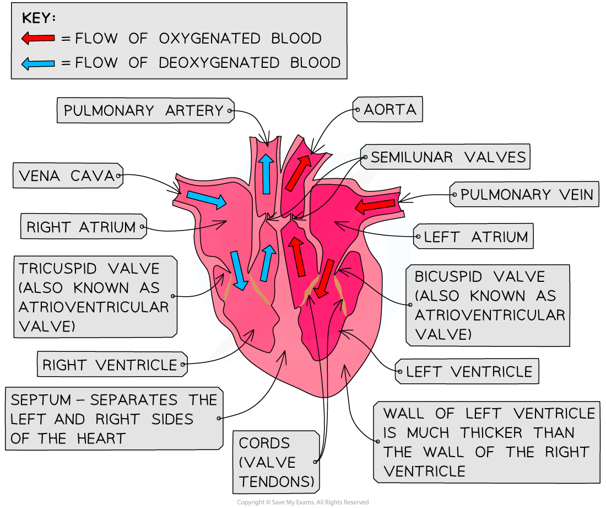

Mammalian Heart: Structure & Function
-------------------------------------

* Circulatory systems are systems which <b>transport fluids</b> containing materials needed by the organism, as well as waste materials that need to be removed
* <b>Circulatory systems</b> are described as being either <b>open or closed</b>

  + In a closed circulatory system blood is pumped around the body and is always contained within a network of blood vessels
  + In an open circulatory system the blood, or blood equivalent, is inside the body cavity and bathes the organs
* Circulatory systems can also be either <b>double or single</b>

  + Double circulatory systems have two loops; one to the lungs and one to the body
  + Single circulatory systems have one loop that includes the lungs and the body
* <b>Humans have a closed, double circulatory system;</b> in one complete circuit of the body blood passes through the heart twice

  + The <b>right side</b> of the heart pumps blood <b>deoxygenated</b> blood to the lungs for gas exchange; this is the <b>pulmonary circulatory system</b>
  + Blood then returns to the <b>left side</b> of the heart, so that <b>oxygenated</b> blood can be pumped at high pressure around the body; this is the <b>systemic circulatory system</b>

#### Heart structure

* The human heart has a mass of around 300 g and is roughly the size of a closed fist
* The heart is a hollow, muscular organ located in the chest cavity
* It is protected in the chest cavity by the <b>pericardium</b>, a tough and fibrous sac
* The heart is divided into four chambers

  + The two top chambers are <b>atria</b>
  + The bottom two chambers are <b>ventricles</b>
* The left and right sides of the heart are separated by a wall of muscular tissue called the <b>septum</b>

  + The septum is very important for ensuring blood doesn’t mix between the left and right sides of the heart

<i><b>The human heart is adapted for pumping blood around the body</b></i>

<i><b>The heart is a muscular organ; the muscle itself is supplied with blood by the coronary arteries, enabling it to pump blood via a series of major blood vessels</b></i>

#### Valves in the heart

* Valves are important for keeping blood flowing forward in the<b> right direction</b> and for maintaining the correct pressure in the chambers of the heart

  + The right atrium and right ventricle are separated by an <b>atrioventricular (AV) valve</b> known as the <b>tricuspid valve</b>

    - Remember; the <b>ri</b>ght side of the heart has a t<b>ri</b>cuspid valve
  + The left atrium and left ventricle are separated by another AV known as the <b>bicuspid valve</b>
  + The right ventricle and the pulmonary artery are separated by a <b>semilunar (SL) valve</b> known as the <b>pulmonary valve</b>
  + The left ventricle and aorta are separated by another SL valve known as the <b>aortic valve</b>
* Valves in the heart

  + Open when the pressure of blood behind them is greater than the pressure in front of them
  + Close when the pressure of blood in front of them is greater than the pressure behind them
* The valves are attached to the heart walls by <b>valve tendons, </b>or <b>cords</b>; these prevent the valves from flipping inside out under high pressure

<b>Adaptations of the Structures of the Heart Table</b>

#### Blood vessels and the heart

* There are two blood vessels bringing blood into the heart; the <b>vena cava</b> and <b>pulmonary vein</b>

  + The vena cava brings blood from the body
  + The pulmonary vein brings blood from the lungs
* There are two blood vessels taking blood away from the heart; the <b>pulmonary artery</b> and <b>aorta</b>

  + The pulmonary artery takes blood to the lungs
  + The aorta takes blood to the body
* The muscle of the heart itself is supplied with blood by a series of blood vessels known as the <b>coronary arteries</b>

  + The coronary arteries can be seen running across the surface of the heart

#### Examiner Tips and Tricks

When looking at a diagram of a heart remember that the right side of the heart will appear on the left of the diagram, as if you are looking at someone else's heart in front of you