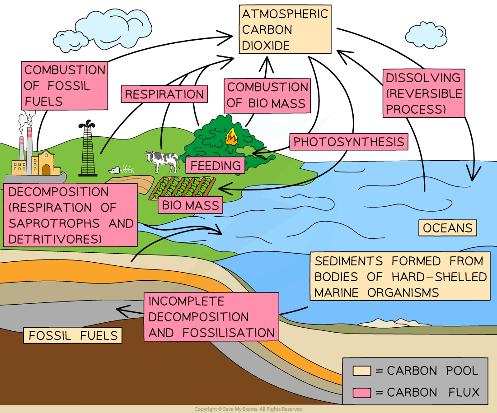

Carbon Cycle & Reduction of Atmospheric Carbon Dioxide
------------------------------------------------------

* The atmospheric carbon dioxide that contributes to the greenhouse effect is part of the global carbon cycle
* The term <b>carbon cycle</b> refers to the many processes by which carbon is transferred and stored, e.g.

  + Carbon is found in the biomass of living organisms e.g. in <b>carbohydrates</b> and <b>proteins</b>
  + Carbon is transferred when one organism <b>consumes and digests</b> another
  + Carbon is found in the <b>atmosphere</b> as <b>carbon dioxide</b> and in the <b>oceans</b> as e.g. <b>hydrogen carbonate ions</b>
  + Carbon in <b>fossil fuels</b> is present in the form of hydrocarbons

#### The carbon cycle

* The following events occur during the carbon cycle

  + Carbon is present in the <b>atmosphere</b> in the form of <b>carbon dioxide</b>
  + Carbon dioxide is removed from the atmosphere by <b>producers</b> during <b>photosynthesis</b>

    - Producers incorporate carbon into their biomass in the form of <b>carbohydrates</b> and other biological molecules
  + Carbon is transferred to and between consumers as a result of <b>feeding</b>
  + Carbon is transferred back into the atmosphere by both plants and animals as a result of<b> respiration</b>

    - Respiration releases carbon dioxide as a product
  + Carbon dioxide can also be removed from the atmosphere by <b>dissolving in the oceans</b>
  + <b>Dissolved carbon </b>can be taken in by marine plants when they <b>photosynthesise</b> or by other marine organisms as they<b> build calcium carbonate exoskeletons</b>
  + When living organisms die their tissues are broken down by <b>decomposers</b> such as bacteria and fungi

    - When these organisms <b>respire</b>, they too <b>release carbon dioxide</b> back into the atmosphere
  + Any living tissue that is not fully decomposed can go towards the <b>formation of peat or fossil fuels</b> over millions of years; carbon can be stored in these <b>sinks</b> for long periods
  + The <b>combustion</b> of peat and fossil fuels releases carbon dioxide back into the atmosphere

    - The combustion of biomass such as wood also returns carbon to the atmosphere

<i><b>The carbon cycle includes the locations in which carbon is stored, shown here as 'carbon pools', and the processes by which it is transferred, shown here as 'carbon fluxes'</b></i>

* A good understanding of the carbon cycle is essential in the fight against global warming

  + It is possible to see the points at which carbon enters the atmosphere; <b>reducing the carbon transfer</b> at these points will prevent further increases in atmospheric carbon dioxide e.g.

    - Reducing the <b>combustion of fossil fuels</b>
    - Reducing the <b>combustion of biomass</b>
    - Reducing <b>disturbance of carbon pools</b> such as soils and peat bogs
  + We can also see the points at which carbon is removed from the atmosphere; <b>increasing the transfers</b> here could help to reduce the greenhouse effect e.g.

    - Increasing <b>rates of photosynthesis</b> by planting trees