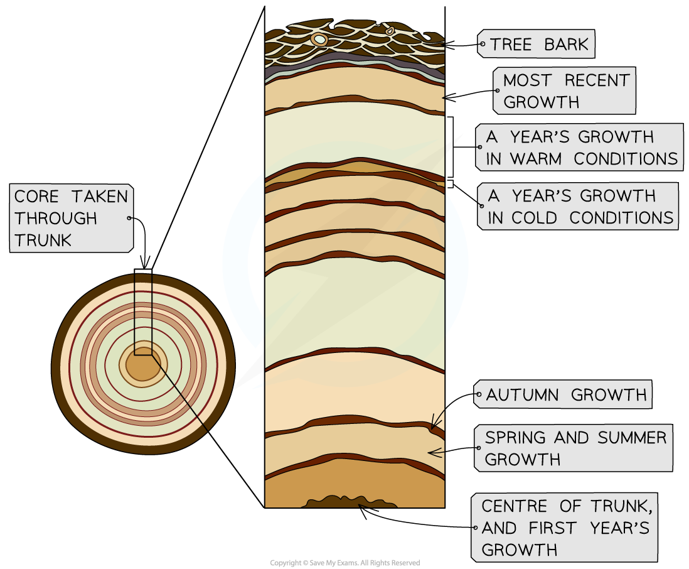

Evidence for the Causes of Climate Change
-----------------------------------------

* Scientists have long hypothesised that

  + Climate change in the form of <b>global warming is currently taking place</b>
  + <b>Human activities</b> that increase the concentrations of greenhouse gases in the atmosphere are <b>responsible for climate change</b>
* Several different types of evidence can be used to support these hypotheses

  + Records of <b>atmospheric carbon dioxide</b> levels
  + Records of <b>average global temperatures</b>
  + Records of changing plant communities gained from sampling of <b>pollen grains preserved in peat </b>over time
  + Records of <b>tree growth </b>gained by analysing the rings in the trunks of trees; known as <b>dendrochronology</b>

#### Atmospheric carbon dioxide

* Atmospheric carbon dioxide levels have <b>fluctuated throughout Earth's history</b> due to events such as volcanic eruptions and the weathering of limestone rocks

  + Scientists know this from having analysed the gas composition of <b>bubbles formed in ancient ice cores</b>

    - Ice is deposited as water freezes over time, so the deeper into the ice you go, the older it is
* Since the <b>industrial revolution</b>, however, atmospheric carbon dioxide levels have <b>risen to their highest in Earth's history</b>
* Prior to the industrial revolution, the highest atmospheric carbon dioxide concentration was around 300 parts per million (ppm), and it is currently above 400 ppm

<i><b>Atmospheric carbon dioxide levels have fluctuated throughout earth's history, but recent increases have been faster and greater than ever before</b></i>

* Data show a <b>correlation</b> between changing atmospheric carbon dioxide levels and temperature over thousands of years

  + Note that carbon dioxide in the atmosphere is not thought to be the only factor affecting climate; it is known that events such as solar winds and sun spots can affect the climate on Earth, but scientists think that the effects of such events are small in comparison to that of atmospheric carbon dioxide
* <b>Correlation does not equal causation</b>, but together with what scientists know about carbon dioxide as a greenhouse gas, this is <b>strong evidence</b> that <b>carbon dioxide released by human activities since the industrial revolution is causing increasing global temperatures</b>

<i><b>There is a correlation between atmospheric carbon dioxide concentrations and average antarctic temperatures over time</b></i>

#### Average global temperatures

* <b>Thermometers</b> can be used to measure air temperature, and thermometer records from <b>different places</b> around the world over <b>extended periods</b> of time can be put together to show <b>average global temperature change over time</b>
* Records from the mid-1800s show an overall <b>trend of increasing average global temperatures</b>

  + There are some short time periods within this window during which temperatures have declined, but the overall trend is upwards
* The time period since the mid-1800s <b>corresponds with the time during which humans have been burning fossil fuels</b> and therefore releasing carbon dioxide into the atmosphere

<i><b>Average global temperature records show some temperature fluctuations but an overall trend of increasing temperatures over time</b></i>

#### Pollen grains preserved in peat bogs

* Under waterlogged and acidic conditions partly decomposed <b>dead plant matter accumulates</b> and becomes <b>compacted</b> under its own weight over time; this compacted, partially decomposed plant matter forms <b>peat</b>

  + The place where peat accumulates is known as a <b>peat bog</b>, or <b>peatland</b>
* Peat <b>builds up in layers</b>, meaning that layers of peat at the top of a bog are recently formed and the <b>peat become older as you dig down</b> into a bog
* <b>Peat cores</b> can be taken from a bog and the <b>layers can be analysed</b> to assess the pollen grains that have become trapped in the peat
* Pollen grains from peat samples can be observed under a microscope, and because the pollen grains of each plant species are unique to that plant, the <b>plant species that were growing around the bog at different points in time can be identified</b>
* Different plant species grow under different climatic conditions, so the <b>plants present at different times</b> can be used a <b>measure of the climate at that time</b>

  + E.g. an increase in the number of plant species that grow better in warmer climates combined with a decrease in the number of plant species that grow better in cooler climates <b>indicates a gradual warming of the climate</b>

#### Dendrochronology

* Tree trunks <b>grow in diameter</b> each growing season as they produce more vascular tissue
* This vascular tissue grows in a <b>ring</b> around the outside of the trunk
* <b>Light coloured rings</b> are produced by fast growth during <b>warmer spring and summer months</b> and <b>dark coloured rings</b> form as a result of <b>slow autumn growth</b>, meaning that one light ring and one dark ring together represent a full year's growth in a tree
* Trees grow faster when conditions are warmer, so the <b>rings that form during warm years are wider</b> than the rings that form during cool years
* Analysis of the width of tree rings can provide a <b>measure of climate during each year of growth</b>

  + Taking cores from the trunks of older trees can provide samples that go back over hundreds of years

<i><b>Dendrochronology uses the growth in a tree trunk each year as a measure of climate</b></i>