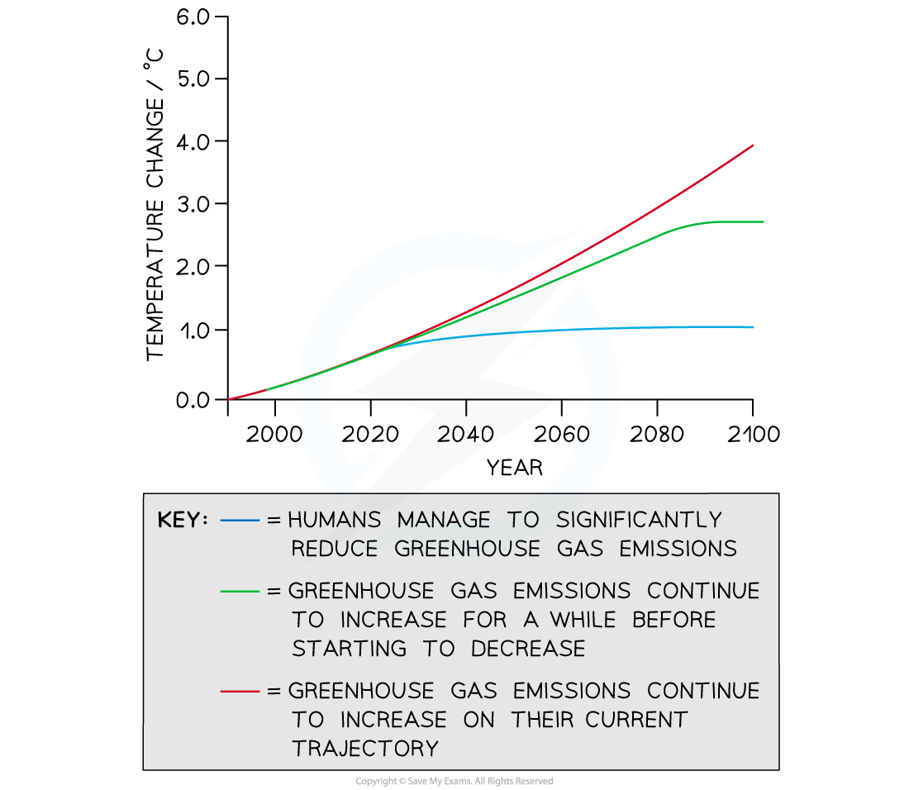

Models of Future Climate Change
-------------------------------

* It is possible to use existing data relating to global warming to <b>make predictions about global temperatures</b> in the future

  + Using data in this way is known as <b>extrapolating from data</b>
  + Extrapolated data can be used to <b>produce models </b>that show how the climate may change in the future
* Global warming predictions can be used to

  + <b>Plan</b> for the future e.g.

    - Building flood defences
    - Funding scientific research into climate change technologies
  + Encourage people to <b>change their activities</b> e.g.

    - Reduce the burning of fossil fuels
    - Increase the use of renewable energy sources such as solar and wind energy
    - Reduce meat consumption
* The Intergovernmental Panel on Climate Change, or IPCC, is a group of climate scientists around the world that has used existing data to <b>extrapolate </b>how global temperatures might change in the future<b> </b>under<b> different human activity scenarios</b> e.g.

  + If humans manage to immediately begin reducing fossil fuel use, global temperature change could be limited to around 1°C
  + If humans do nothing to change their fossil fuel use, global temperature increase may exceed 4°C
* The IPCC data can be added to other computer models on climate change to see how different parts of the world might be affected under the different scenarios

<i><b>Future predictions of temperature change can be modelled on a range of scenarios</b></i>

* There are <b>limitations to models based on extrapolated data</b>

  + The IPCC has produced models based on several emissions scenarios, and we <b>do not know which of these scenarios is most likely</b>

    - I.e. we don't know how successful humans will be at cutting greenhouse gas emissions
  + We do not know whether <b>future technologies</b> will be successful at removing greenhouse gases from the atmosphere e.g. carbon capture technologies may or may not be effective
  + It is unknown <b>exactly how</b> atmospheric gas concentrations might affect global temperatures
  + Global <b>climate patterns are complex</b> and therefore predictions are difficult

    - It is possible that a certain<b> tipping point </b>in global temperatures could lead to a sudden acceleration in global warming e.g. permafrost melting may cause a sudden increase in atmospheric methane

      * Permafrost is ground that is frozen all year round
  + We don't know exactly how <b>factors other than human activities</b> may affect climate in the future e.g. a volcanic eruption could increase ash in the atmosphere, reflecting radiation back into space and cooling the earth