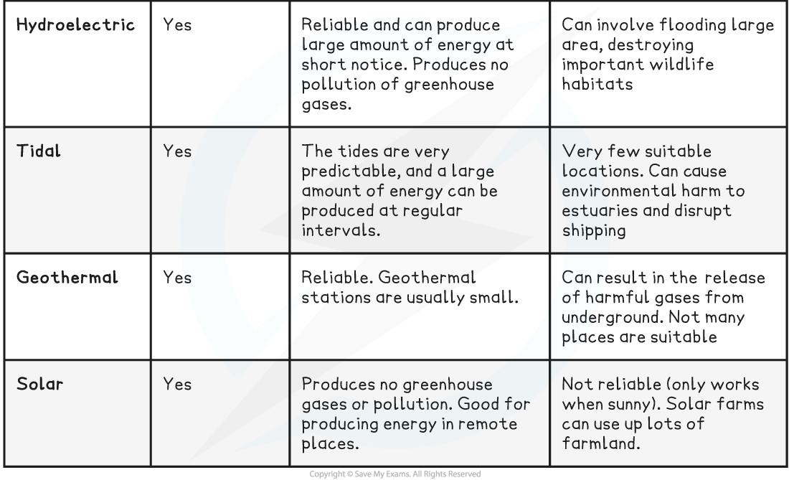

Reducing Climate Change
-----------------------

* The use of <b>extrapolation to model climate change</b> shows that the consequences of global warming could be<b> extremely serious</b> for humans and global biodiversity<b> if we continue </b>with current human activities
* If we want to limit the consequences of global warming it is essential that we act quickly to <b>reduce carbon emissions</b> and <b>increase the rate at which carbon is removed from the atmosphere</b>
* Our knowledge of the carbon cycle tells us that we can do these things in several ways

#### Reducing carbon emissions

* Carbon emissions can be reduced by <b>limiting the rate at which fossil fuels are burned</b>

  + This is challenging as so many of our <b>daily activities depend on the burning of fossil fuels </b>to release energy

    - Transport of people and goods
    - Electricity generation
    - Food production
* Two current ways of reducing carbon emissions are

  + Burning biofuels instead of fossil fuels
  + The use of other renewable energy resources

#### Biofuels

* These fuels are made from <b>recently living plant biomass</b> such as sugar cane
* Biofuels can be burned in the same way as fossil fuels, <b>releasing carbon dioxide</b> as they burn
* Arguments in support of biofuel use include

  + Biofuels are often cheaper than oil
  + It is argued that biofuels are <b>'carbon neutral'</b> meaning that they only release carbon that was recently removed from the atmosphere when the plants were alive

    - They do not release carbon that has been stored away for millions of years as with fossil fuels
  + Biofuels are a <b>renewable</b> source of energy, i.e. they can be regrown quickly
* There are several arguments against the use of biofuels

  + They do still release carbon dioxide into the atmosphere
  + The vast amounts of land required to grow biofuels <b>could otherwise have been used for food production</b>
  + Creating land for biofuel growth often involves the loss of other types of habitats e.g. rainforest; this is <b>bad for biodiversity</b>
  + Cutting down mature trees to create land for biofuel growth <b>reduces the removal of carbon from the atmosphere by photosynthesis</b>

#### Other renewable sources

* For example wind, solar, geothermal, and tidal energy
* Arguments in favour of such renewable resources include

  + These kinds of technologies are <b>advancing quickly</b> and are becoming <b>cheaper and more efficient </b>to use
  + <b>No carbon dioxide is released</b> when these technologies are used to generate electricity
* The current disadvantage of such renewable resources is that <b>no single source is perfect </b>e.g.

  + Geothermal energy can only be used when there is volcanic activity close to the earth's surface
  + Solar energy depends on sunshine hours
  + Wind energy depends on wind speeds and some conservationists are concerned about the impact of wind turbines on birds and bats

    - Some are also concerned about the visual impact of wind turbines on the landscape
  + Tidal energy can only be generated near the coast

<b>Comparing Energy Resources Table</b>

#### Increasing carbon removal

* There is much excitement over the future potential of new carbon capture technologies, but the reality is that the technology to remove vast quantities of carbon from the atmosphere and store it away <b>does not yet exist</b>
* We need to rely on <b>existing methods of carbon removal</b>, and the main existing mechanism is<b> photosynthesis</b>
* Humans can increase the global rates of photosynthesis by

  + <b>Stopping </b>the destruction of forests by <b>deforestation</b>
  + Planting trees, also known as <b>reforestation</b>

    - If trees are allowed to grow to maturity, they can <b>store huge amounts of carbon in their </b>biomass
    - Some countries around the world have shown that it is possible to restore lost areas of forest by carrying out reforestation, e.g. Costa Rica now plants seven times more trees than it cuts down

      * This kind of achievement requires huge government inputs in the form of benefits to landowners