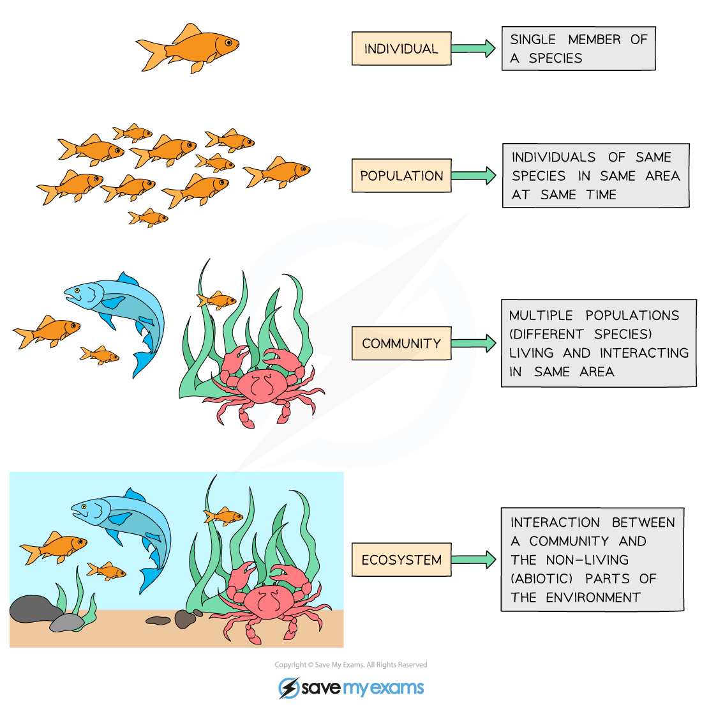

Ecosystems: Key Terms
---------------------

#### Habitat

* Species are adapted, or well-suited, to life in a particular habitat
* A habitat can be defined as <b>the place where an organism lives</b>

  + A habitat can be <b>large,</b> e.g. a desert, or <b>small,</b> e.g. an individual tree

    - Small habitats are sometimes referred to as <b>microhabitats</b>
  + Some species are habitat <b>specialists,</b> meaning that they can only survive in a very specific type of habitat, while others are <b>generalists</b> and can survive in a range of habitats

    - Generalists are more likely to be able to invade and take over a new habitat; such species are known as invasive species

      * Humans sometime release new species into a habitat, either accidentally or on purpose; these species can disrupt the normal species interactions in a habitat and cause serious problems

#### Population

* When a species is found in a habitat, that habitat is said to support a <b>population</b>
* A population can be defined as <b>all of the individuals of one species living in a habitat</b>

  + The size of a population can be measured; this is the <b>abundance</b> of a species in a habitat
  + The exact location of a population within a habitat is a species' <b>distribution</b> within that habitat

#### Community

* Species do not exist by themselves in their own isolated environment; they <b>interact</b> with <b>other species</b>, forming <b>communities</b>
* A community can be defined as <b>multiple populations living and interacting in the same area</b>

  + For example, a garden pond <b>community</b> is made up of populations of fish, frogs, newts, pond snails, damselflies and dragonflies and their larvae, pondweed, water lilies, and all other populations living in the pond

#### Ecosystem

* Communities interact with the <b>non-living components</b> of the <b>habitat </b>they live in, forming <b>ecosystems</b>
* An ecosystem can be defined as <b>a community and its interactions with the non-living parts of its habitat</b>

  + There is a<b> </b>flow of energy<b> </b>within an ecosystem and nutrients within it are recycled
  + There are both biotic and abiotic<b> components</b> within an ecosystem
  + Ecosystems <b>vary greatly in size and scale</b>

    - A small pond in a back garden and the open ocean could both be described as ecosystems
  + Ecosystems <b>vary in complexity</b>

    - A desert is a relatively simple ecosystem
    - A tropical rainforest is a very complex ecosystem
  + No ecosystem is completely self-contained as organisms from one ecosystem can often move to another

    - E.g. birds and aquatic animals are able to migrate long distances to feed from multiple ecosystems

<i><b>Individual members of a species together in a habitat form a population, populations interact within a community, and communities interact with each other and with non-living components of their habitat to form an ecosystem.</b></i>