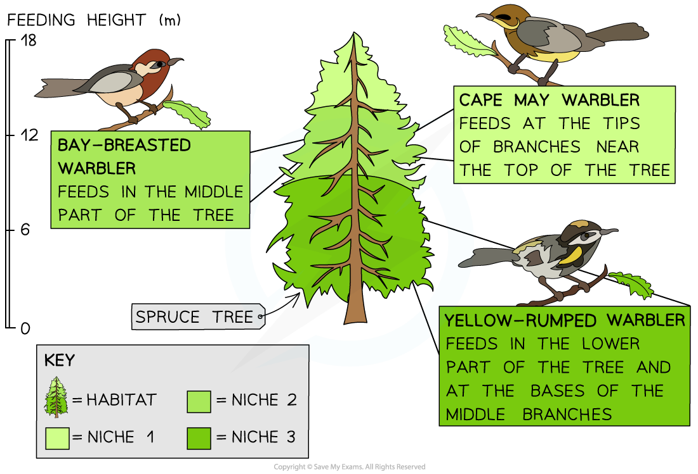

Niches: Distribution & Abundance
--------------------------------

* The place where a species lives is known as its <b>habitat</b>
* Species will occupy a specific <b>niche</b> within a habitat
* The term niche can be defined as <b>the role of a species within its habitat</b>
* The role of a species includes

  + What it eats
  + Which other species depend on it for food
  + What time of day a species is active
  + Exactly where in a habitat a species lives
  + Exactly where in a habitat a species feeds
* <b>No two species can fill the same niche within a habitat</b>; if this ever happens the two species will be in <b>direct competition</b> with each other for resources, and one of the two species will <b>out-compete</b> the other, causing it to die out in that particular habitat

  + It can sometimes seem as though species are occupying the same niche, but there will still be subtle differences in their role; e.g. they might feed at <b>different times of day</b>, or have <b>different food sources</b>
* The niche filled by a species determines its <b>abundance</b> within a habitat

  + The term abundance can be defined as <b>the number of individuals of a particular species living in a habitat</b>
  + If two species occupy a similar niche within a habitat, they will be <b>competing with each other</b>, so their <b>populations will be smaller</b>, and their <b>abundance will therefore be lower</b>
* The niche filled by a species determines its <b>distribution</b>

  + The term distribution can be defined as <b>where a species lives</b>
  + Species can only survive in habitats to which they are <b>well adapted</b>; if they are not well suited to a habitat's <b>biotic</b> and <b>abiotic</b> factors then they will move to a more suitable habitat and their <b>distribution</b> will change

<i><b>Feeding location is an example of a feature that may differ between niches.</b></i>