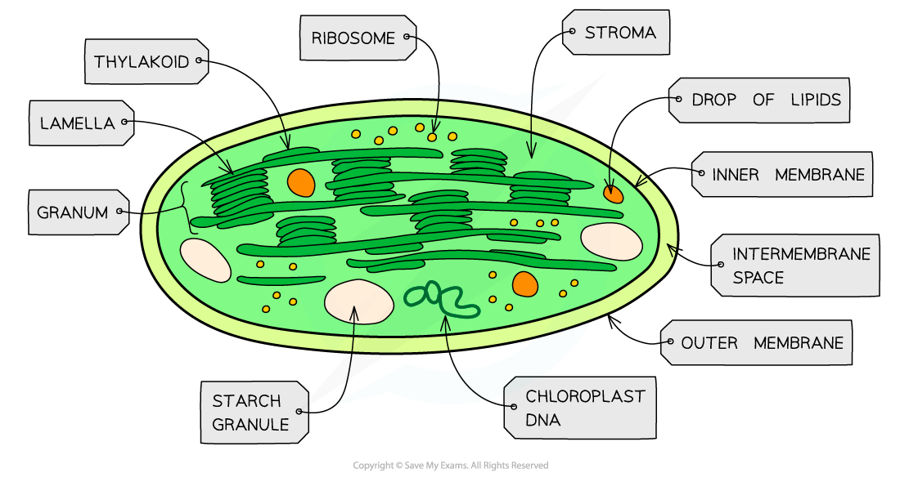

Chloroplasts: Structure & Function
----------------------------------

* Chloroplasts are the organelles in plant cells where <b>photosynthesis </b>occurs
* Each chloroplast is surrounded by a <b>double-membrane </b>known as the <b>chloroplast envelope</b>

  + Each of the envelope membranes is a phospholipid bilayer
* Chloroplasts are filled with a <b>cytoplasm-like</b> fluid known as the <b>stroma</b>

  + The stroma contains <b>enzymes</b> and <b>sugars</b>, as well as <b>ribosomes</b> and <b>chloroplast DNA</b>
  + If the chloroplast has been photosynthesising there may be <b>starch grains</b> or <b>lipid droplets</b> in the stroma
* A <b>separate system of membranes</b> is found in the stroma

  + This membrane system consists of a series of flattened fluid-filled sacs known as <b>thylakoids</b>, each surrounded by a <b>thylakoid membrane</b>
  + Thylakoids stack up to form structures known as <b>grana</b> (singular granum)
  + Grana are connected by membranous channels called <b>lamellae </b>(singular lamella), which ensure the stacks of sacs are connected but distanced from each other
* Several components that are essential for photosynthesis are<b> embedded in the thylakoid membranes</b>

  + <b>ATP synthase enzymes</b>
  + Proteins called <b>photosystems</b> contain <b>photosynthetic pigments</b> such as chlorophyll a, chlorophyll b, and carotene

<i><b>Chloroplasts are the site of photosynthesis</b></i>

#### Chloroplast structure is related to function

* <b>Chloroplast envelope</b>

  + The double membrane <b>encloses the chloroplast</b>, keeping all of the components needed for photosynthesis close to each other
  + The transport proteins present in the inner membrane control<b> </b>the flow of molecules between the stroma and cytoplasm
* <b>Stroma</b>

  + The gel-like fluid contains <b>enzymes </b>that catalyse the reactions of photosynthesis
* <b>DNA</b>

  + The chloroplast DNA contains <b>genes</b> that code for some of the proteins used in photosynthesis
* <b>Ribosomes</b>

  + Ribosomes enable the translation<b> of proteins </b>coded by the chloroplast DNA
* <b>Thylakoid membrane</b>

  + There is a space between the two membranes of this double membrane known as the <b>thylakoid space</b>, in which conditions can differ from the stroma e.g. a <b>proton gradient</b> can be established between the thylakoid space and the stroma
  + The space has a very small volume so a proton gradient can develop very <b>quickly</b>
* <b>Grana</b>

  + The grana create a <b>large surface area, </b>maximising the number of photosystems and allowing <b>maximum </b>light absorption
  + Grana also provide <b>more membrane area</b> for proteins such as electron carriers and ATP synthase enzymes, which together enable the <b>production of ATP</b>
* <b>Photosystems</b>

  + There are two types of photosystem; <b>photosystem I</b> and <b>photosystem II</b>, containing <b>different combinations of photosynthetic pigments</b> such as chlorophyll a, chlorophyll b, and carotene
  + Each photosystem absorbs<b> light of a different wavelength</b>, maximising light absorption e.g. photosystem I absorbs light at a wavelength of 700 nm while photosystem II absorbs light at a wavelength of 680 nm